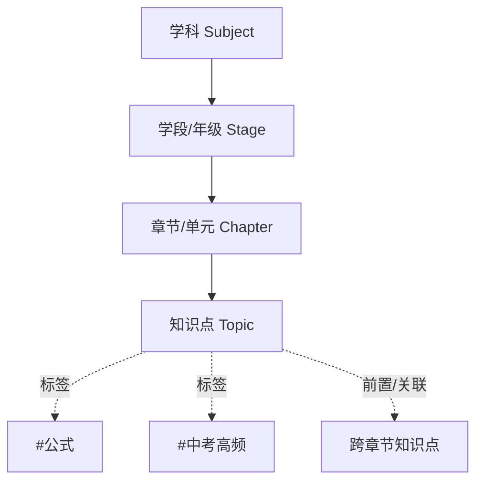

# 北京初高中私人学习网站 · 设计文档

> 为一个即将升入北京初中的孩子设计的**私人专属学习网站**。单用户、无需注册登录，覆盖北京市初中+高中全部学科资料。核心价值：**理清知识逻辑** + **快速查找资料**。

---

## 第一部分：产品设计

### 1. 信息架构

#### 1.1 组织模型：纵向树 + 横向网

采用**四层树状结构 + 横向标签网络**的混合模型。树负责「资料放在哪」，网负责「知识怎么连」。



**纵向主干（树）** —— 回答「这个知识属于哪里」：

```
学科（9+1 个）
└── 学段/年级（初一上 ~ 高三下，共 12 个学期）
    └── 章节/单元（对应教材目录）
        └── 知识点（最小学习单元）
```

- 学科清单：**语文、数学、英语、物理、化学、生物、道德与法治/政治、历史、地理**，另设「综合/选修」作为扩展位（如信息技术、劳技、校本选修）。
- 学段划分与北京学制对齐：物理从初二开始、化学从初三开始，其余学科按实际开课学期挂载章节。
- 教材版本作为**元数据字段**（如数学初中用人教版/北京版、高中用人教 A 版），不写死在结构里，换教材只改字段。

**横向网络（图）** —— 回答「知识之间什么关系」：

- 每个知识点可声明 `prerequisites`（前置知识，如「一元二次方程」前置「因式分解」）。
- 每个知识点可声明 `related`（跨章节/跨学科关联，如物理「浮力」关联数学「密度计算」）。
- 前端据此渲染**知识关系图**，让孩子看清「学 A 之前要先会 B」「A 和 C 其实是一回事」，这是「理清知识逻辑」的核心手段。

**知识点元数据**（每个 Topic 携带）：

| 字段 | 说明 | 示例 |
|---|---|---|
| `difficulty` | 难度 1–5 | 3 |
| `importance` | 重要度标记 | `中考必考` / `高考高频` / `了解即可` |
| `tags` | 全局标签 | `#易错` `#需背诵` |
| `prerequisites` | 前置知识点 id | `["math-7a-2-1"]` |
| `related` | 关联知识点 id | `["physics-8a-6-2"]` |
| 掌握状态 | 用户侧数据（存本地） | 未学 / 学习中 / 已掌握 / 需复习 |

#### 1.2 如何让知识逻辑清晰

1. **知识树默认视图**：可折叠大纲，一屏看清整个学科骨架，颜色标记掌握状态。
2. **关系图视图**：以当前知识点为中心，向左展开前置链、向右展开后继链，回答「我为什么学不会 → 因为前置没掌握」。
3. **章节思维导图**：每章一张思维导图（数据驱动自动生成），复习时先看图回忆、再点进细节。
4. **「学习路径」提示**：知识点详情页底部固定显示「学这个之前 →」「学完可以学 →」，形成链式导航。

### 2. 核心页面设计

共 6 个页面，路由规划如下：

| 页面 | 路由 | 定位 |
|---|---|---|
| 首页/仪表盘 | `/` | 每天打开的起点 |
| 学科导航 | `/subjects`、`/subject/:id` | 浏览入口 |
| 知识树 | `/subject/:id/tree` | 理清逻辑 |
| 知识点详情 | `/topic/:id` | 看资料的地方 |
| 搜索 | `/search` | 快速查找 |
| 进度 | `/progress` | 学习追踪 |

#### 2.1 首页 / 仪表盘 `/`

```
┌─────────────────────────────────────────────┐
│  🔍 搜索框（全局常驻，按 / 聚焦）              │
├─────────────────────────────────────────────┤
│  📖 继续学习：数学 > 初一上 > 有理数乘法 [进入] │
├──────────────────┬──────────────────────────┤
│  各学科进度环      │  🔔 需复习（标记为橙色的）  │
│  语 数 英 物 化…  │  ⭐ 我的收藏               │
├──────────────────┴──────────────────────────┤
│  🕐 最近浏览（最近 10 条，一键回到上次位置）     │
│  🔥 连续学习 5 天                             │
└─────────────────────────────────────────────┘
```

- **「继续学习」置顶**：孩子打开网站的第一诉求是接着上次学，一键直达。
- 各学科用**进度环**展示已掌握知识点占比，点击进入学科。
- 「需复习」区自动汇总标记为「需复习」的知识点，形成天然复习清单。

#### 2.2 学科导航页 `/subjects` 与 `/subject/:id`

- `/subjects`：9+1 学科卡片网格，每张卡片显示学科图标、总知识点数、掌握百分比。
- `/subject/:id`：左侧年级分栏（初一上 → 高三下），右侧该年级章节列表；每章显示「12/20 已掌握」的小进度条；顶部提供「查看知识树」「查看关系图」入口。

#### 2.3 知识树 / 章节详情页 `/subject/:id/tree`

两种视图，一键切换：

- **树视图（默认）**：可折叠大纲。年级 → 章节 → 知识点三级缩进；每个节点前有状态色点（灰/蓝/绿/橙）；支持「只看未掌握」「只看中考高频」过滤；点击知识点直接进详情。
- **关系图视图**：力导向图或分层图，节点=知识点、边=前置/关联关系；点击某节点高亮它的前置链与后继链。

#### 2.4 知识点 / 资料详情页 `/topic/:id`

```
┌─────────────────────────────────────────────┐
│ 面包屑：数学 > 初一上 > 第二章 > 有理数乘法     │
│ ⭐收藏  掌握状态：[未学|学习中|已掌握|需复习]   │
├─────────────────────────────────────────────┤
│ [📒笔记] [🧮公式] [✏️例题] [📄真题] [🧠导图]   │
├─────────────────────────────────────────────┤
│  （当前 Tab 的 Markdown 渲染正文）             │
│  例题的「解析」默认折叠，点击展开               │
├─────────────────────────────────────────────┤
│ ◀ 学这个之前：有理数加减法                     │
│ ▶ 学完可以学：有理数除法 / 乘方                │
└─────────────────────────────────────────────┘
```

- 正文 Markdown 渲染，数学公式用 KaTeX 渲染。
- 五类资料以 Tab 组织（见 §4），缺失的类型 Tab 置灰。
- 掌握状态是**一次点击**的分段按钮，改完立即存本地。

#### 2.5 搜索 / 检索页 `/search`

- 顶栏搜索框全局常驻，任意页面按 `/` 聚焦，输入即时联想（标题级）。
- 回车进入完整搜索页：结果按相关度排序，每条显示**所属路径**（数学 > 初一上 > 有理数）+ 命中片段高亮。
- 左侧筛选器：学科、年级、资料类型（笔记/公式/例题/真题/导图）、标签、掌握状态，可组合。
- 纯前端全文索引，无需联网请求后端。

#### 2.6 进度页 `/progress`

- 各学科掌握**热力图**（章节为格子，颜色深浅=掌握比例）。
- 学习记录时间线（哪天学了什么）。
- 收藏夹与「需复习」清单汇总。
- **导出/导入备份按钮**（进度数据存浏览器本地，防换设备/清缓存丢失）。

### 3. 交互设计要点（面向中学生）

| 原则 | 落地做法 |
|---|---|
| **三次点击可达** | 首页 → 学科 → 知识树 → 知识点，任何资料 ≤3 击 |
| **永不迷路** | 面包屑常驻每一页：`数学 > 初一上 > 第二章 > 有理数乘法` |
| **搜索优先** | 搜索框全局常驻，`/` 快捷聚焦，输入即联想 |
| **状态可视化** | 掌握程度四色：灰=未学、蓝=学习中、绿=已掌握、橙=需复习 |
| **零门槛操作** | 无登录；收藏=点星，改状态=点一下按钮，全部单击完成 |
| **轻激励不游戏化** | 只有进度百分比+连续学习天数；不做积分/等级/排行，避免分心 |
| **先想后看** | 例题解析默认折叠，鼓励先独立思考 |
| **设备友好** | 响应式布局兼容平板；大字号、大点击区（≥44px） |
| **护眼** | 暗色模式一键切换，晚间学习不刺眼 |
| **不打扰** | 无弹窗、无通知、无广告位，界面只有内容和导航 |

### 4. 内容组织策略

每个知识点下按**五类资料**组织。类型同时是详情页 Tab、搜索筛选维度、文件命名约定：

| 类型 | 文件 | 内容 | 呈现方式 |
|---|---|---|---|
| 📒 笔记 `note` | `note.md` | 概念讲解、推导过程、易错点提醒 | Markdown 正文，重点用引用块高亮 |
| 🧮 公式 `formula` | `formulas.md` | 公式/定理/定义卡片 | KaTeX 渲染；可逐条收藏，聚合成「我的公式本」 |
| ✏️ 例题 `example` | `examples.md` | 典型题 + 详细解析 | 解析默认折叠，先想后看 |
| 📄 真题 `exam` | `exams.md` | 北京中考/高考/区期中期末真题 | 标注年份与来源（如「2024 海淀一模」） |
| 🧠 导图 `mindmap` | `mindmap.md` | 章节级思维导图 | Markmap 由 Markdown 大纲自动渲染，可缩放交互 |

**全局标签体系**（跨学科统一，用于筛选与优先级排序）：

- 重要度：`#中考必考` `#中考高频` `#高考高频` `#了解即可`
- 属性：`#易错` `#需背诵` `#需大量练习`
- 难度定位：`#基础` `#提高` `#拔高`

标签支持组合筛选，例如「数学 + #中考高频 + #易错」= 考前重点清单。

### 5. 视觉风格（讲义风）

整体气质：**学术感、温暖、清晰、不花哨**（参照讲义式 UI 参考）。

| 元素 | 规范 |
|---|---|
| 底色 | 暖色纸张 `#FBFAF7`（暗色模式为深灰） |
| 卡片 | 白色 `#FFFFFF`，圆角 `14px`，浅描边 + 轻阴影 |
| 点缀色 | 金色 `#C08A3E`（链接、强调、要点框边线） |
| 学科主题色 | 每学科独立色系，如历史 `#9A5B2A` 棕、地理 `#16697A` 青、数学 `#2E5A9A` 蓝 |
| 字体 | 标题宋体（Songti SC），正文苹方（PingFang SC） |
| 组件 | 标签 `tag`、行内高亮 `mark/hl`、要点提示框 `key`、KV 键值对列表 `kv` |

以上均已落地为 Tailwind 主题配置（`tailwind.config.js`）与全局组件类（`src/index.css` 的 `@layer components`）。

### 6. Obsidian 兼容（content/ 即 vault）

`content/` 目录可直接作为 Obsidian 仓库打开维护：

1. **双向链接**：Markdown 中可写 `[[知识点名]]` 或 `[[知识点名|显示文本]]`，网站渲染前由 `src/lib/obsidian.ts` 解析为站内路由链接（`#/topic/:id`）；找不到目标时降级为纯文本，不产生死链。
2. **#标签**：正文中的 `#中考高频` 等标签与全局标签体系一致，渲染层可高亮、可提取用于筛选。
3. **文件夹结构 Obsidian 友好**：普通目录 + 普通 `.md`，无特殊命名规则。
4. `content/.obsidian/` 配置目录已加入 `.gitignore`，本地随意配置不污染仓库。


---

## 第二部分：技术方案

### 1. 技术栈选择

原则：**个人项目，纯静态，零服务器，写内容 = 写 Markdown**。

| 层面 | 选择 | 理由 |
|---|---|---|
| 构建/框架 | **Vite + React 18 + TypeScript** | 生态成熟、开发快、类型安全，组件化适合树/Tab/图等交互 |
| 样式 | **Tailwind CSS** | 快速出干净 UI，内置暗色模式方案 |
| 路由 | **React Router（HashRouter）** | Hash 路由使纯静态部署无需任何服务端配置 |
| Markdown 渲染 | `react-markdown` + `remark-gfm` | 表格、任务列表等 GFM 语法 |
| 公式渲染 | `remark-math` + `rehype-katex` | 数理化公式必备 |
| 思维导图 | `markmap-lib` + `markmap-view` | Markdown 大纲直接变可交互导图，无需画图 |
| 全文搜索 | **FlexSearch** | 纯前端索引，毫秒级检索，可配置 CJK 分词，无后端 |
| 进度存储 | **localStorage**（封装读写层） | 单用户足够；提供 JSON 导出/导入备份 |
| 不引入 | 数据库、后端、登录、状态管理库 | 单用户静态站不需要，减少维护负担 |

### 2. 项目结构

```
beijing-study-portal/
├── DESIGN.md                     # 本设计文档
├── index.html
├── package.json
├── vite.config.ts
├── tailwind.config.js
├── content/                      # ★ 内容源（非代码，日常只改这里）
│   ├── subjects.json             # 整棵知识树 + 元数据（结构见 §3）
│   └── {subject}/{grade}/{chapter}/{topic}/
│       ├── note.md               # 笔记
│       ├── formulas.md           # 公式
│       ├── examples.md           # 例题
│       ├── exams.md              # 真题
│       └── mindmap.md            # 思维导图（markmap 大纲格式）
│   # 示例：content/math/7a/ch2-rational-numbers/multiplication/note.md
├── scripts/
│   └── build-index.ts            # 扫描 content/ 生成 search-index.json
├── src/
│   ├── main.tsx
│   ├── App.tsx                   # 路由 + 全局布局（顶栏搜索、面包屑）
│   ├── pages/
│   │   ├── Dashboard.tsx         # 首页仪表盘
│   │   ├── Subjects.tsx          # 学科网格
│   │   ├── SubjectDetail.tsx     # 单学科年级/章节
│   │   ├── KnowledgeTree.tsx     # 知识树 + 关系图
│   │   ├── TopicDetail.tsx       # 知识点五 Tab 详情
│   │   ├── Search.tsx            # 搜索结果页
│   │   └── Progress.tsx          # 进度页
│   ├── components/
│   │   ├── SearchBar.tsx         # 全局搜索框（/ 快捷键）
│   │   ├── Breadcrumb.tsx
│   │   ├── TreeView.tsx          # 可折叠知识树
│   │   ├── RelationGraph.tsx     # 前置/关联关系图
│   │   ├── TopicTabs.tsx         # 五类资料 Tab
│   │   ├── MarkdownRenderer.tsx  # md + KaTeX + 折叠解析
│   │   ├── MindmapView.tsx       # markmap 容器
│   │   ├── ProgressRing.tsx      # 学科进度环
│   │   └── MasteryButton.tsx     # 掌握状态分段按钮
│   ├── lib/
│   │   ├── content.ts            # import.meta.glob 懒加载 md
│   │   ├── search.ts             # FlexSearch 封装
│   │   └── storage.ts            # localStorage 进度层 + 导出/导入
│   └── types/
│       └── index.ts              # Subject / Chapter / Topic / Progress 类型
└── public/
    └── images/                   # 插图、真题扫描图等静态资源
```

### 3. 数据存储方案

#### 3.1 知识结构：`content/subjects.json`

单一 JSON 描述整棵树，前端启动时加载（体量小，全学科结构预估 <500KB）：

```json
{
  "subjects": [
    {
      "id": "math",
      "name": "数学",
      "icon": "📐",
      "stages": [
        {
          "id": "7a",
          "name": "初一上",
          "textbook": "人教版",
          "chapters": [
            {
              "id": "ch2-rational-numbers",
              "name": "第二章 有理数的运算",
              "topics": [
                {
                  "id": "math-7a-2-3",
                  "name": "有理数乘法",
                  "difficulty": 2,
                  "importance": "中考必考",
                  "tags": ["#基础", "#易错"],
                  "prerequisites": ["math-7a-2-1"],
                  "related": [],
                  "materials": ["note", "formula", "example", "exam", "mindmap"]
                }
              ]
            }
          ]
        }
      ]
    }
  ]
}
```

#### 3.2 资料正文：Markdown 文件

- 全部资料是 `content/` 下的 `.md` 文件，路径即层级。
- 前端用 Vite 的 `import.meta.glob('/content/**/*.md')` 做**按需懒加载**：只有点开某知识点某 Tab 时才请求对应文件。
- 例题文件用约定分隔（`### 题目` / `### 解析`）实现解析折叠。
- **写内容 = 新建/编辑 md 文件**，无任何导入流程、零迁移成本；家长/孩子都能维护。

#### 3.3 搜索索引：构建时预生成

- `scripts/build-index.ts` 在 `npm run build` 前扫描 `content/`，抽取每篇资料的标题、标签、正文纯文本，生成 `search-index.json`。
- 前端首屏渲染后**异步加载**索引并喂给 FlexSearch，不阻塞打开速度。
- 开发模式下可实时重建，内容改动即时可搜。

#### 3.4 学习进度：localStorage

单 key 存一个 JSON：

```json
{
  "mastery":   { "math-7a-2-3": "mastered", "math-7a-2-4": "review" },
  "favorites": ["math-7a-2-3"],
  "recent":    [{ "topicId": "math-7a-2-3", "tab": "example", "ts": 1753588800000 }],
  "streak":    { "lastDate": "2026-07-27", "days": 5 }
}
```

- 封装在 `src/lib/storage.ts`，页面只调 `getMastery / setMastery / addRecent` 等方法。
- 进度页提供**「导出备份」**（下载 JSON）与**「导入恢复」**（选择文件），防清缓存/换设备丢失。

### 4. 部署方案

| 场景 | 方式 | 说明 |
|---|---|---|
| 开发/写内容 | `npm run dev` | 本地热更新，改 md 即时可见 |
| 本地日常使用 | `npm run build && npx serve dist` | 家里电脑离线可用 |
| **推荐：免费托管** | Vercel 或 GitHub Pages（私有仓库） | 孩子的平板/学校电脑都能访问；纯静态 + HashRouter，无服务器成本、无需运维 |

**内容更新流程**：编辑 `content/` 下 Markdown → `git push` → 托管平台自动重新构建部署，全程 1 分钟内。

**隐私说明**：这是私人网站，若担心公开访问，GitHub Pages 可配合私有仓库 + 简单的不公开链接策略；进度数据只存孩子设备本地，不上传任何服务器。

---

## 附录：从空仓库到可用的建设顺序（建议）

1. 初始化 Vite + React + TS + Tailwind 骨架，搭好 6 个页面路由与全局布局。
2. 定义 `subjects.json` Schema 与 TypeScript 类型，先填入**数学初一上**一个学期作为种子数据。
3. 实现知识树页 + 知识点详情页（Markdown/KaTeX 渲染 + 五 Tab）。
4. 实现搜索（构建脚本 + FlexSearch）与首页仪表盘。
5. 实现进度存储层与进度页（含导出/导入）。
6. 按「先当前学期、再全初中、后高中」的顺序逐步填充内容。
