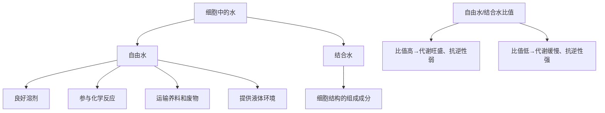

# 第2节 细胞中的无机物

## 概念定义

**自由水**：细胞中绝大部分以游离形式存在、可以自由流动的水，是良好的溶剂。

**结合水**：与细胞内其他物质相结合的水，是细胞结构的重要组成成分，约占细胞内全部水分的 4.5%。

**无机盐**：细胞中多以**离子**形式存在，含量很少但作用重要。

## 知识梳理

- 水在细胞中含量最多；代谢旺盛的细胞（如癌细胞、幼嫩组织）自由水比例高。
- 种子晒干失去的是自由水（仍能萌发），烘烤失去的是结合水（丧失活性）。

## 无机盐的功能表

| 功能类别 | 举例 |
| --- | --- |
| 构成化合物的成分 | Mg²⁺ 是叶绿素的成分；Fe²⁺ 是血红蛋白的成分；I 是甲状腺激素的成分；P 是磷脂、ATP、核酸的成分 |
| 维持细胞和生物体的生命活动 | 血钙过低引起抽搐；哺乳动物血钙过高则肌无力 |
| 维持细胞的酸碱平衡（缓冲） | $\text{HCO}_3^-/\text{H}_2\text{CO}_3$ 等缓冲对 |
| 维持细胞的渗透压 | Na⁺、Cl⁻ 维持细胞外液渗透压 |

## 典型例题

**例 1**：越冬植物体内自由水与结合水的比值如何变化？意义是什么？

**解**：比值**降低**（结合水相对增多）。结合水比例升高使植物代谢减缓、抗寒（抗逆）能力增强，有利于越冬。

**例 2**：某人手术后伤口愈合缓慢且伴有抽搐症状，可能缺乏哪种无机盐？说明理由。

**解**：可能缺**钙**。血钙含量过低会使神经、肌肉的兴奋性升高，引起抽搐；钙也是骨骼等结构的重要成分。可通过补充钙盐并配合维生素 D 促进吸收。

## 易错点

- 自由水与结合水可**相互转化**，比值随代谢状态改变，并非固定不变。
- 无机盐多以离子形式存在，但也有少数以化合物形式存在（如骨骼中的钙盐）。
- Mg 缺乏使叶绿素不能合成，叶片发黄，但 Mg 不是叶绿素功能的"催化者"而是**组成成分**。
- 缓冲物质维持 pH 稳定属于无机盐的功能，不能归于水的作用。

## 背记要点

1. 自由水功能四条：溶剂、参与反应、运输物质、提供液体环境。
2. 比值规律："自由水多则代谢旺，结合水多则抗性强"。
3. 无机盐三大功能：构成化合物、维持生命活动、维持渗透压与酸碱平衡。
4. 记忆组合：Mg—叶绿素，Fe—血红蛋白，I—甲状腺激素，Ca—骨骼与兴奋性。

## 自测题

1. 细胞内的水以____和____两种形式存在，其中含量较多的是____。
2. 血液中____离子含量过低时，动物会出现抽搐现象。
3. 种子萌发前晒种失去的主要是____水。
4. 叶绿素分子中含有的无机盐离子是____。

## 相关知识点

元素与化合物总览见 [[第1节 细胞中的元素和化合物]]；水在光合作用与呼吸作用中的角色见 [[第4节 光合作用与能量转化]] 和 [[第3节 细胞呼吸的原理和应用]]。
