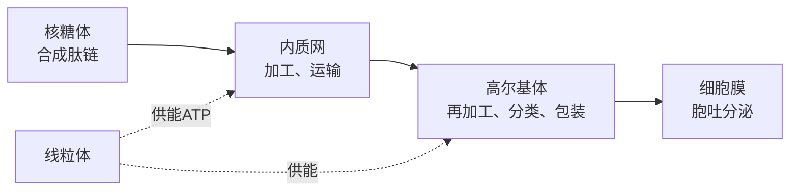

# 第2节 细胞器之间的分工合作

## 概念定义

**细胞器**：细胞质中具有特定形态结构和功能的结构单位，包括线粒体、叶绿体、内质网、高尔基体、核糖体、溶酶体、液泡、中心体等。

**生物膜系统**：细胞膜、细胞器膜和核膜等共同构成的膜结构体系，在组成成分和结构上相似，功能上紧密联系。

**分泌蛋白**：在细胞内合成后分泌到细胞外发挥作用的蛋白质，如消化酶、抗体、部分激素。

## 知识梳理

- 分泌蛋白运输依靠**囊泡**：内质网→高尔基体→细胞膜，膜面积变化为内质网减小、高尔基体基本不变、细胞膜增大。
- 研究分泌蛋白合成分泌途径的方法：**放射性同位素标记法**（³H 标记亮氨酸）。
- 分离细胞器的方法：**差速离心法**。

## 主要细胞器一览表

| 细胞器 | 膜结构 | 分布 | 主要功能 |
| --- | --- | --- | --- |
| 线粒体 | 双层膜 | 动植物 | 有氧呼吸主要场所，"动力车间" |
| 叶绿体 | 双层膜 | 植物叶肉细胞等 | 光合作用场所，"养料制造车间" |
| 内质网 | 单层膜 | 动植物 | 蛋白质加工运输、脂质合成"车间" |
| 高尔基体 | 单层膜 | 动植物 | 加工、分类、包装；植物细胞壁形成有关 |
| 溶酶体 | 单层膜 | 动植物 | "消化车间"，分解衰老细胞器、杀灭病原体 |
| 液泡 | 单层膜 | 主要在植物 | 调节渗透压，维持细胞坚挺 |
| 核糖体 | 无膜 | 所有细胞 | 合成蛋白质的场所 |
| 中心体 | 无膜 | 动物和低等植物 | 与有丝分裂有关 |

## 典型例题

**例 1**：用 ³H 标记的亮氨酸研究豚鼠胰腺腺泡细胞，放射性依次出现的结构是什么？

**解**：核糖体→内质网→高尔基体→细胞膜（分泌到细胞外）。该实验证明分泌蛋白的合成与运输途径，所需能量由线粒体提供。

**例 2**：判断"含叶绿体的细胞才能进行光合作用，含线粒体的细胞才能进行有氧呼吸"的正误。

**解**：错误。蓝细菌等原核生物无叶绿体也能进行光合作用，无线粒体的某些原核生物（如硝化细菌）也能进行有氧呼吸；场所与功能不能绝对绑定，但对真核细胞而言两者基本对应。

## 易错点

- 核糖体与中心体**无膜**；线粒体、叶绿体为**双层膜**；其余常见细胞器为单层膜。
- 并非所有植物细胞都有叶绿体（如根尖细胞）；低等植物细胞有中心体。
- 分泌蛋白经过的膜性细胞器只有内质网和高尔基体；核糖体不属于膜结构。
- 生物膜系统不等于生物膜：前者是细胞内所有膜结构的总称。

## 背记要点

1. 双膜：线粒体、叶绿体；无膜：核糖体、中心体；其余单膜。
2. 分泌蛋白路线：核糖体→内质网→高尔基体→细胞膜（囊泡运输，线粒体供能）。
3. 高尔基体在动物细胞与分泌物有关，在植物细胞与细胞壁形成有关。
4. 方法记忆：分离细胞器用差速离心法，追踪物质用同位素标记法。

## 自测题

1. 具有双层膜的细胞器是____和____。
2. 分泌蛋白从合成到分泌依次经过：核糖体→____→____→细胞膜。
3. 分离各种细胞器常用的方法是____。
4. 动物细胞和低等植物细胞中与有丝分裂有关的无膜细胞器是____。

## 相关知识点

膜结构基础见 [[第1节 细胞膜的结构和功能]]；细胞核与细胞质的协调见 [[第3节 细胞核的结构和功能]]；线粒体和叶绿体的功能详见 [[第3节 细胞呼吸的原理和应用]] 与 [[第4节 光合作用与能量转化]]。
