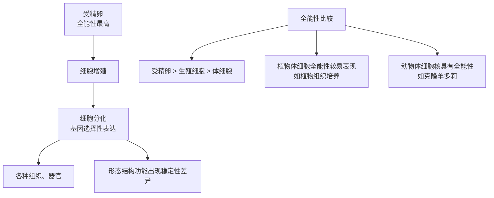

# 第2节 细胞的分化

## 概念定义

**细胞分化**：在个体发育中，由一个或一种细胞增殖产生的后代，在形态、结构和生理功能上发生**稳定性差异**的过程。分化具有持久性、稳定性（一般不可逆转）和普遍性。

**分化的实质**：基因的**选择性表达**——不同细胞中遗传信息相同，但表达的基因（部分）不同，合成的蛋白质不同。

**细胞的全能性**：细胞经分裂和分化后，仍具有产生完整有机体或分化成其他各种细胞的潜能。

**干细胞**：动物和人体内保留着少数具有分裂和分化能力的细胞，如造血干细胞。

## 知识梳理

- 分化的意义：使多细胞生物体中的细胞趋向专门化，提高各种生理功能的效率。
- 分化过程中遗传物质（核基因）**不变**，mRNA 和蛋白质种类改变。

## 分化与全能性对比表

| 项目 | 细胞分化 | 细胞全能性 |
| --- | --- | --- |
| 实质 | 基因的选择性表达 | 含有本物种全部遗传信息 |
| 结果 | 形成不同类型的细胞、组织 | 发育为完整个体或各种细胞 |
| 大小规律 | 分化程度越高，全能性越难表现 | 受精卵>生殖细胞>体细胞 |
| 实例 | 红细胞与肌细胞的差异 | 胡萝卜韧皮部细胞培养成植株 |

## 典型例题

**例 1**：同一人体的胰岛细胞和唾液腺细胞中，核 DNA、mRNA、蛋白质是否相同？

**解**：核 DNA **相同**（均来自同一受精卵的有丝分裂）；由于基因的选择性表达，mRNA 和蛋白质**不完全相同**（既有共有的管家蛋白，也有各自特有的胰岛素、唾液淀粉酶等）。

**例 2**：胡萝卜韧皮部细胞经组织培养发育成完整植株，说明什么？克隆羊多莉的诞生又说明什么？

**解**：前者说明**高度分化的植物细胞仍具有全能性**；后者说明**高度分化的动物体细胞的细胞核仍保持全能性**（含有发育成完整个体所需的全部遗传信息）。

## 易错点

- 分化不改变遗传物质，仅改变基因的表达情况；分化后的细胞一般不能逆转（体内条件下）。
- 全能性表达程度：植物细胞易表现，动物已分化体细胞难以表现（但**细胞核**保持全能性）。
- 哺乳动物成熟红细胞无细胞核，不具有全能性，也不能分裂。
- 干细胞分裂后可以继续保持干细胞状态或走向分化，是组织修复的基础。

## 背记要点

1. 分化定义关键词：同一来源、稳定性差异、持久不可逆。
2. 分化实质：基因的选择性表达（DNA 不变，RNA、蛋白质改变）。
3. 全能性大小：受精卵>生殖细胞>体细胞；植物细胞>动物细胞（表达难易）。
4. 经典证据：植物组织培养（细胞全能性）、核移植克隆动物（细胞核全能性）。

## 自测题

1. 细胞分化的实质是____。
2. 全能性最高的细胞是____。
3. 同一生物体不同组织细胞的核 DNA____（相同/不同），蛋白质____（完全相同/不完全相同）。
4. 证明高度分化的植物细胞具有全能性的技术是____。

## 相关知识点

分化的前提是增殖，见 [[第1节 细胞的增殖]]；分化细胞的最终去向见 [[第3节 细胞的衰老和死亡]]；基因表达的物质基础见 [[第5节 核酸是遗传信息的携带者]]。
