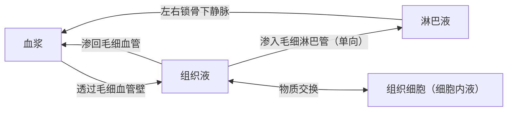

# 第1节 细胞生活的环境

## 概念定义

**体液**：人体内含有的大量以水为基础的液体，包括**细胞内液**（约占 2/3）和**细胞外液**（约占 1/3）。

**内环境**：由细胞外液构成的液体环境，主要包括**血浆、组织液、淋巴液**，是体内细胞直接生活的环境，也是细胞与外界环境进行物质交换的媒介。

## 知识梳理

| 项目 | 血浆 | 组织液 | 淋巴液 |
| --- | --- | --- | --- |
| 存在部位 | 血管内 | 组织细胞间隙 | 淋巴管内 |
| 直接生活其中的细胞 | 血细胞 | 绝大多数组织细胞 | 淋巴细胞等 |
| 蛋白质含量 | 较多 | 很少 | 很少 |
| 相互转化 | 与组织液双向渗透 | 可渗入毛细淋巴管 | 经左右锁骨下静脉汇入血浆 |

**内环境的理化性质三要素**：
1. **渗透压**：血浆渗透压约 770 kPa，大小主要取决于无机盐（Na⁺、Cl⁻ 为主）和蛋白质的含量。
2. **酸碱度**：血浆 pH 为 7.35～7.45，靠 HCO₃⁻/H₂CO₃ 等缓冲对维持相对稳定。
3. **温度**：人体细胞外液温度一般维持在 37 ℃ 左右。

**属于/不属于内环境的成分**：属于——水、无机盐、葡萄糖、氨基酸、O₂、CO₂、激素、抗体、血浆蛋白、尿素等；不属于——血红蛋白、呼吸酶等胞内物质，以及消化道、呼吸道、膀胱等与外界相通腔道内的液体（消化液、尿液、泪液、汗液）。

## 典型例题

**例 1**：下列物质中属于人体内环境组成成分的是（　）
①血红蛋白　②葡萄糖　③呼吸酶　④胰岛素　⑤尿素
A. ①②③　B. ②④⑤　C. ①③⑤　D. ②③④
**解析**：血红蛋白位于红细胞内、呼吸酶位于细胞内，均不属于内环境；葡萄糖、胰岛素、尿素可存在于血浆等细胞外液中。选 **B**。

**例 2**：营养不良患者血浆蛋白含量降低，常出现组织水肿，原因是什么？
**解析**：血浆蛋白减少 → 血浆渗透压降低 → 血浆中水分渗出增多而组织液中水分渗回血浆减少 → 组织液增多，引起组织水肿。类似情形还有：过敏使毛细血管通透性增大、淋巴管阻塞、肾小球肾炎导致蛋白尿等。

## 易错点

- 淋巴液回流是**单向**的：组织液→淋巴液→血浆，淋巴液不能直接变回组织液。
- 血浆 ≠ 血液：血液 = 血浆 + 血细胞，血细胞本身不属于内环境。
- 汗液、尿液、消化液虽在体内产生，但位于与外界相通的腔道中，**不属于体液，也不属于内环境**。
- 细胞外液本质上是一种**盐溶液**，在一定程度上反映生命起源于海洋。

## 背记要点

1. 体液 = 细胞内液（2/3）+ 细胞外液（1/3）；内环境 = 血浆 + 组织液 + 淋巴液。
2. 血浆与组织液可**双向**转化；组织液→淋巴液→血浆为**单向**。
3. 理化性质：渗透压（约 770 kPa，主要由 Na⁺、Cl⁻ 决定）、pH 7.35～7.45、温度约 37 ℃。
4. 内环境是细胞与外界环境进行物质交换的**媒介**，需消化、呼吸、循环、泌尿系统共同参与。
5. 判断内环境成分：看它能否存在于血浆、组织液或淋巴液中。

## 自测题

1. 内环境包括哪三种细胞外液？三者之间如何转化？
2. 血浆渗透压的大小主要与哪些物质的含量有关？
3. 判断：CO₂、抗体、血红蛋白都属于内环境的成分。（　）
4. 简述组织水肿产生的三种可能原因。

## 相关知识点

内环境保持相对稳定的机制见 [[第2节 内环境的稳态]]；渗透压变化引起的水盐平衡调节见 [[第3节 体液调节与神经调节的关系]]。
