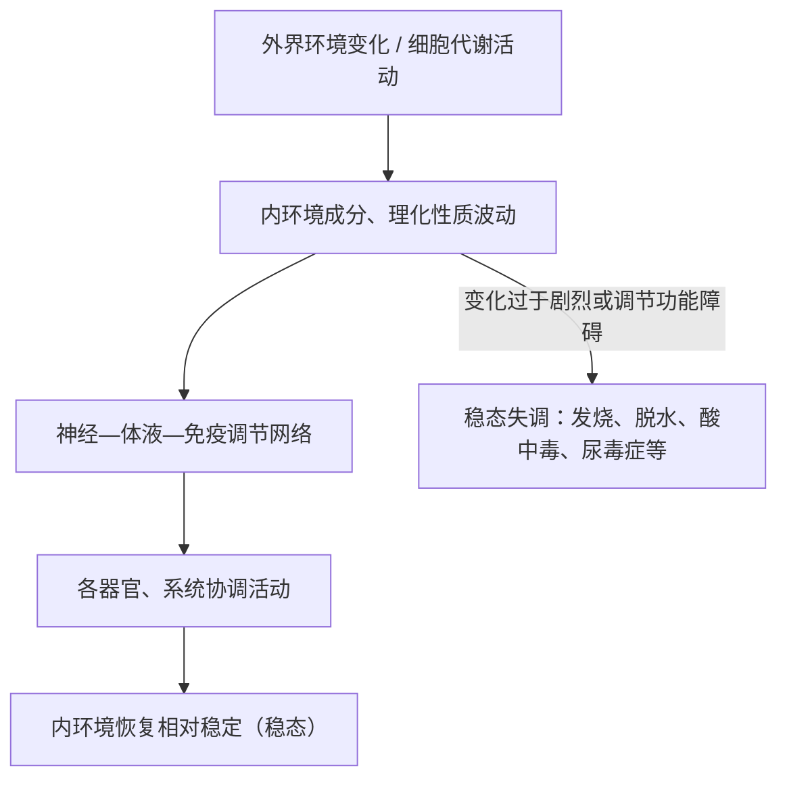

# 第2节 内环境的稳态

## 概念定义

**稳态**：正常机体通过调节作用，使各个器官、系统协调活动，共同维持内环境的**相对稳定**状态。稳态是一种**动态平衡**——内环境的化学成分和理化性质在一定范围内波动，而不是恒定不变。

**稳态调节机制**（现代观点）：**神经—体液—免疫调节网络**是机体维持稳态的主要调节机制。

## 知识梳理

| 项目 | 内容 | 说明 |
| --- | --- | --- |
| 稳态的实质 | 内环境成分与理化性质的动态平衡 | 血糖 3.9～6.1 mmol/L、pH 7.35～7.45、体温约 37 ℃ 等 |
| 调节基础 | 各器官、系统协调活动 | 直接相关：消化、呼吸、循环、泌尿系统 |
| 调节机制 | 神经—体液—免疫调节网络 | 从"神经调节"到"神经—体液"再到现代网络观 |
| 调节能力 | 有一定限度 | 外界变化过于剧烈或自身调节功能障碍时稳态被破坏 |
| 意义 | 机体进行正常生命活动的必要条件 | 酶促反应正常进行需要适宜温度、pH 等条件 |

**血浆 pH 稳定的机制（缓冲物质）**：血浆中含 HCO₃⁻/H₂CO₃、HPO₄²⁻/H₂PO₄⁻ 等缓冲对。剧烈运动产生乳酸时，乳酸与 NaHCO₃ 反应生成乳酸钠和 H₂CO₃，H₂CO₃ 分解为 CO₂ 经肺排出，pH 保持相对稳定。

**稳态失调实例**：高原缺氧反应、发高烧（体温失调）、严重腹泻引起脱水（水盐失衡）、尿毒症（代谢废物积累）、糖尿病（血糖失调）。

## 典型例题

**例 1**：关于内环境稳态的叙述，错误的是（　）
A. 稳态是内环境成分和理化性质的动态平衡
B. 稳态的维持依赖神经—体液—免疫调节网络
C. 内环境达到稳态后就不再发生变化
D. 稳态遭到破坏会引起细胞代谢紊乱
**解析**：稳态是**动态**平衡，各项指标在一定范围内波动，并非恒定不变。选 **C**。

**例 2**：剧烈运动后大量乳酸进入血液，血浆 pH 为何仅轻微下降？
**解析**：血浆中存在缓冲物质。乳酸与 NaHCO₃ 反应生成乳酸钠和碳酸，碳酸分解产生的 CO₂ 由呼吸系统排出体外；同时肾脏可排出多余的酸性物质。因此血浆 pH 维持在 7.35～7.45 的范围内相对稳定。

## 易错点

- 稳态 ≠ 恒定：血糖、体温等均在**一定范围内波动**。
- 稳态的调节能力**有限度**，并非任何情况下都能维持。
- 稳态的主要调节机制是**神经—体液—免疫**调节网络，三者缺一不可。
- 缓冲物质在血浆中调 pH；维持 pH 稳定还需要肺（排 CO₂）和肾（排酸保碱）的参与。

## 背记要点

1. 稳态定义：机体通过调节作用使内环境保持相对稳定的状态（动态平衡）。
2. 主要调节机制：神经—体液—免疫调节网络。
3. 缓冲对：HCO₃⁻/H₂CO₃、HPO₄²⁻/H₂PO₄⁻。
4. 稳态意义：是机体进行正常生命活动的**必要条件**。
5. 常考失调实例：发烧、脱水、尿毒症、糖尿病、高原反应。

## 自测题

1. 内环境稳态的调节机制经历了怎样的认识发展过程？
2. 写出血浆中两组主要的缓冲对。
3. 举出两个稳态失调引发疾病的实例并说明失调的指标。
4. 判断：只要内环境稳态不被破坏，细胞代谢就能正常进行；稳态一旦形成便不会被破坏。（　）

## 相关知识点

内环境的组成与理化性质见 [[第1节 细胞生活的环境]]；具体调节方式见 [[第2节 神经调节的基本方式]]、[[第2节 激素调节的过程]] 与 [[第1节 免疫系统的组成和功能]]。
