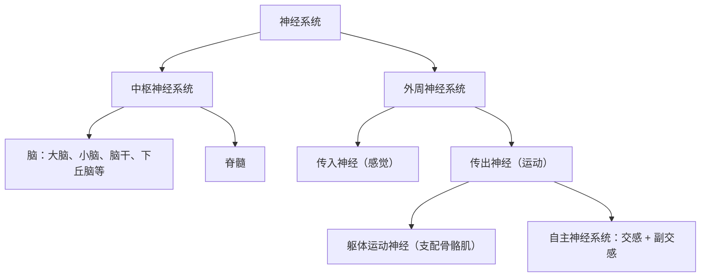

# 第1节 神经调节的结构基础

## 概念定义

**神经系统**：由**中枢神经系统**（脑和脊髓）与**外周神经系统**（脑神经 12 对、脊神经 31 对）组成，是神经调节的结构基础。

**神经元（神经细胞）**：神经系统结构与功能的基本单位，由**细胞体、树突（短而多，接收信息）、轴突（长而少，传出信息）**构成。轴突末梢的细小分支呈杯状或球状，称为**突触小体**。

**神经胶质细胞**：数量约为神经元的 10～50 倍，具有支持、保护、营养和修复神经元等功能，参与构成髓鞘。

## 知识梳理

| 组成 | 结构 | 主要功能 |
| --- | --- | --- |
| 中枢神经系统 | 大脑 | 大脑皮层是调节机体活动的最高级中枢 |
|  | 小脑 | 协调运动、维持身体平衡 |
|  | 脑干 | 有调节呼吸、心血管活动等维持生命必要的中枢 |
|  | 下丘脑 | 体温调节中枢、水盐平衡调节中枢，与生物节律有关 |
|  | 脊髓 | 低级中枢，是脑与躯干、内脏之间联系的通路 |
| 外周神经系统 | 脑神经、脊神经 | 含传入（感觉）神经和传出（运动）神经 |

**传出神经的分类**：
- **躯体运动神经**：支配骨骼肌，一般受意识支配。
- **自主神经系统**：支配内脏、血管和腺体，**不受意识支配**，包括**交感神经**与**副交感神经**。二者对同一器官的作用通常**相反**：交感神经兴奋时心跳加快、支气管扩张、胃肠蠕动减弱（应对紧急情况）；副交感神经兴奋时心跳减慢、胃肠蠕动加强（安静状态占优势），两者相互协调使机体对外界刺激作出更精确的反应。

## 典型例题

**例 1**：人在遭遇紧急情况时心跳加快、瞳孔扩大、胃肠蠕动减弱，此时占优势的是（　）
A. 躯体运动神经　B. 交感神经　C. 副交感神经　D. 传入神经
**解析**：紧急状态下交感神经活动占优势，动员机体应对环境剧变；副交感神经在安静时占优势，促进消化和积蓄能量。选 **B**。

**例 2**：某人因车祸脑干严重受损，为何会立即危及生命？
**解析**：脑干中含有调节**呼吸、心血管活动**等维持生命必要的基本中枢（"生命中枢"），受损后呼吸、心跳难以维持，故直接危及生命；而大脑皮层受损一般不会立即致死。

## 易错点

- 神经元的轴突**长而分支少**、树突**短而分支多**；一条轴突及套在外面的髓鞘构成神经纤维，许多神经纤维集结成束构成一条神经。
- 自主神经系统属于**传出神经**，其活动不受意识直接支配，但并非与中枢无关，仍受中枢神经系统调控。
- 交感与副交感对同一器官的作用相反，但对机体而言是**相互配合、协调统一**的。
- 下丘脑属于**脑**（中枢神经系统）的一部分，既是神经中枢又能分泌激素。

## 背记要点

1. 神经系统 = 中枢（脑 + 脊髓）+ 外周（脑神经 + 脊神经）。
2. 神经元三部分：细胞体、树突、轴突；基本单位是神经元，辅助细胞是神经胶质细胞。
3. 各脑区职能：大脑皮层最高级中枢、小脑管平衡、脑干含生命中枢、下丘脑管体温与水盐、脊髓为低级中枢。
4. 自主神经系统 = 交感神经 + 副交感神经，作用相反、相互协调。
5. 交感兴奋——"战斗或逃跑"；副交感兴奋——"休养生息"。

## 自测题

1. 写出神经元的基本结构并说明树突与轴突的功能差异。
2. 中枢神经系统包括哪些部分？各自的主要功能是什么？
3. 交感神经兴奋时心率、支气管口径、胃肠蠕动各如何变化？
4. 判断：自主神经系统不受中枢神经系统的控制。（　）

## 相关知识点

神经调节的基本方式与反射弧见 [[第2节 神经调节的基本方式]]；兴奋在神经元上及神经元间的传导见 [[第3节 神经冲动的产生和传导]]；各级中枢的关系见 [[第4节 神经系统的分级调节]]。
