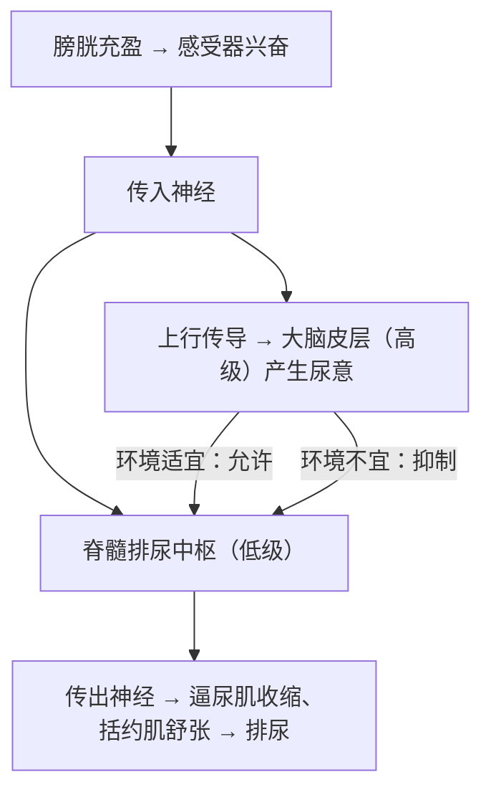

# 第4节 神经系统的分级调节

## 概念定义

**分级调节**：位于**大脑皮层的高级中枢**与位于**脑干、脊髓等处的低级中枢**对同一生理活动共同调控，且低级中枢一般受高级中枢的调控，这种调节方式称为神经系统的分级调节。

**排尿反射**：膀胱充盈刺激牵张感受器 → 传入神经 → 脊髓排尿中枢（低级中枢）→ 传出神经 → 膀胱逼尿肌收缩、括约肌舒张，完成排尿；成人的排尿还受**大脑皮层**（高级中枢）的意识控制。

## 知识梳理

| 中枢部位 | 层级 | 相关功能 |
| --- | --- | --- |
| 大脑皮层 | 最高级中枢 | 感知、随意运动、语言、学习记忆，对低级中枢有控制作用 |
| 下丘脑 | 较高级 | 体温调节、水盐平衡调节中枢，控制垂体 |
| 小脑 | —— | 协调运动、维持平衡 |
| 脑干 | —— | 呼吸中枢、心血管中枢等生命中枢 |
| 脊髓 | 低级中枢 | 排尿、排便、膝跳等基本反射的中枢 |

**分级调节的意义**：低级中枢保证基本反射快速完成；高级中枢的调控使反应更**准确、更具适应性**，机体活动协调统一。

**典型实例分析**：
1. 婴幼儿尿床：大脑皮层发育不完善，对脊髓排尿中枢的**控制能力弱**。
2. 脊髓横断（截瘫）患者：高位截瘫者排尿反射弧完整仍能完成排尿，但因脊髓与大脑联系中断，**不受意识控制**且无尿意（若感觉上行通路中断）。
3. 有意识"憋尿"：大脑皮层发出抑制信号，抑制脊髓排尿中枢的活动。

## 典型例题

**例 1**：成人可以有意识地控制排尿，而婴儿不能，主要原因是（　）
A. 婴儿脊髓中无排尿中枢
B. 婴儿大脑皮层发育不完善，对低级中枢的控制能力弱
C. 婴儿膀胱感受器不敏感
D. 婴儿反射弧不完整
**解析**：婴儿排尿反射弧完整（能排尿），但大脑皮层高级中枢发育不完善，不能有效控制脊髓低级中枢。选 **B**。

**例 2**：某患者脊髓胸段完全横断后，针刺其足部，足会缩回但本人无感觉，为什么？
**解析**：缩腿反射的中枢在**脊髓**（腰段），反射弧完整，故缩腿反射仍能完成；但脊髓与大脑皮层之间的**上行传导通路中断**，兴奋不能传到大脑皮层的躯体感觉中枢，故无痛觉。这也说明感觉产生于大脑皮层，且低级中枢可独立完成基本反射。

## 易错点

- **感觉产生于大脑皮层**，但只产生感觉（如尿意、痛觉）而无完整传出应答的过程**不属于反射**。
- 排尿反射的低级中枢在**脊髓**，高级中枢在大脑皮层，两者是**控制与被控制**的关系。
- 高位截瘫患者"能排尿但不受控制"："能"因低级中枢及反射弧完整，"不受控制"因高低级中枢联系中断。
- 分级调节不等于"高级中枢直接完成所有反射"，多数基本反射由低级中枢完成。

## 背记要点

1. 分级调节：高级中枢（大脑皮层）调控低级中枢（脑干、脊髓）。
2. 排尿反射：低级中枢在脊髓，受大脑皮层意识性控制。
3. 尿意、痛觉等感觉在**大脑皮层**形成。
4. 婴儿尿床、截瘫患者尿失禁的共同本质：皮层对脊髓中枢失去（或缺乏）控制。
5. 分级调节意义：使机体反应快速而又精准、协调。

## 自测题

1. 以排尿反射为例说明神经系统的分级调节。
2. 高位截瘫患者能否完成膝跳反射？能否感到疼痛？为什么？
3. 婴幼儿经常尿床的原因是什么？
4. 判断：产生尿意的过程属于反射。（　）

## 相关知识点

各级中枢的分布见 [[第1节 神经调节的结构基础]]；反射与反射弧见 [[第2节 神经调节的基本方式]]；大脑皮层的语言、学习等功能见 [[第5节 人脑的高级功能]]。
