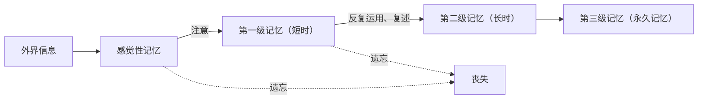

# 第5节 人脑的高级功能

## 概念定义

**人脑的高级功能**：大脑皮层除感知外部世界、控制机体的反射活动外，还具有**语言、学习、记忆和情绪**等方面的高级功能。其中**语言功能是人脑特有的高级功能**。

**言语区**：大脑皮层与语言功能相关的区域，包括 W 区（书写）、V 区（阅读/视觉性语言）、S 区（说话/运动性语言）、H 区（听懂话/听觉性语言）。

## 知识梳理

| 言语区 | 名称 | 受损后的表现（失语症） |
| --- | --- | --- |
| W 区 | 书写性语言中枢 | 不能写字（能听、说、读） |
| V 区 | 视觉性语言中枢 | 不能看懂文字（能听、说、写） |
| S 区 | 运动性语言中枢 | 不能讲话（能听、读、写）——运动性失语症 |
| H 区 | 听觉性语言中枢 | 听不懂讲话（能说、读、写） |

**学习与记忆**：
- 学习是神经系统不断接受刺激、获得新的行为习惯的过程；记忆是将获得的经验进行**储存和再现**的过程。
- 记忆分类：感觉性记忆→第一级记忆（短时）→第二级记忆（长时）→第三级记忆（永久），通过**注意与反复运用（复述）**逐级巩固。
- 机制：短时记忆主要与神经元的活动及神经元之间的联系（尤其与大脑皮层下的**海马区**）有关；长时记忆可能与**新突触的建立**有关。

**情绪**：是大脑的高级功能之一。适度的压力和情绪反应是正常的；长期压抑可导致**抑郁**等情绪障碍，可通过体育运动、听音乐、与人倾诉、寻求专业帮助等方式调适。

## 典型例题

**例 1**：某患者能看懂文字、能写字、能听懂别人讲话，但自己不能讲话，其受损的言语区是（　）
A. W 区　B. V 区　C. S 区　D. H 区
**解析**：不能讲话而其他语言功能正常，是**运动性失语症**，为 S 区（运动性语言中枢）受损。选 **C**。

**例 2**：为什么"及时复习"有助于牢固掌握知识？请用记忆的分级理论解释。
**解析**：新学的知识先进入短时记忆（第一级记忆），若不经强化很快遗忘；通过**及时复习、反复运用**，信息可转入第二级记忆（长时记忆）乃至永久记忆，其机制可能与新突触的建立有关。因此及时、多次复习能促进短时记忆向长时记忆转化。

## 易错点

- 言语区四区对应功能要与"失语"表现一一对应：S 区受损**不能说**，H 区受损**听不懂**（并非听不见，听力正常）。
- 语言功能是**人类特有**的高级功能；学习和记忆并非人类特有，动物也有。
- 长时记忆与**新突触建立**有关，短时记忆与神经元活动及海马区有关，不要混淆。
- 大脑皮层是高级功能的结构基础，但情绪等活动还与内分泌等系统协同有关。

## 背记要点

1. 人脑高级功能：语言（人类特有）、学习、记忆、情绪。
2. 四个言语区：W 写、V 看、S 说、H 听——"受损即丧失对应能力"。
3. 记忆四级：感觉性记忆→短时→长时→永久；注意和复述是转化关键。
4. 短时记忆——海马区；长时记忆——新突触的建立。
5. 情绪调适途径：运动、倾诉、音乐、必要时求助专业人员。

## 自测题

1. 写出四个言语区的名称及各自受损后的症状。
2. 简述记忆的四个阶段及促进记忆巩固的方法。
3. 人脑特有的高级功能是什么？
4. 判断：H 区受损的患者听不到任何声音。（　）

## 相关知识点

大脑皮层作为最高级中枢的地位见 [[第4节 神经系统的分级调节]]；条件反射与学习的关系见 [[第2节 神经调节的基本方式]]；突触与记忆机制的联系见 [[第3节 神经冲动的产生和传导]]。
