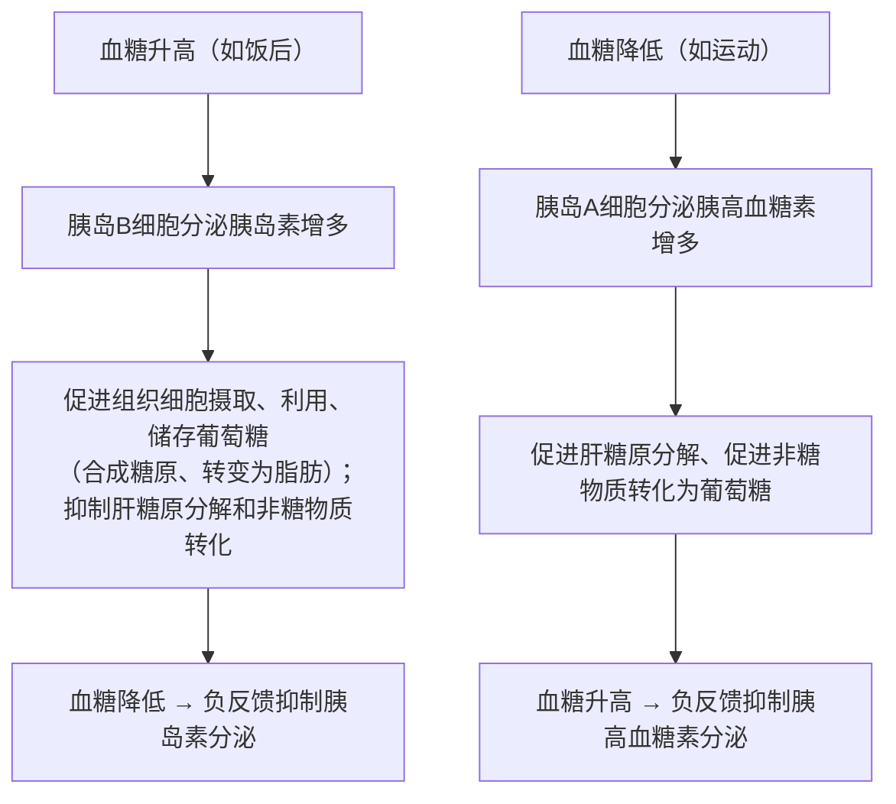

# 第2节 激素调节的过程

## 概念定义

**血糖平衡**：正常人血糖浓度维持在 **3.9～6.1 mmol/L**。来源：食物消化吸收、肝糖原分解、非糖物质转化；去向：氧化分解供能、合成肝糖原和肌糖原、转变为脂肪等非糖物质。

**反馈调节**：系统本身工作的效果反过来作为信息调节该系统的工作。**负反馈**使系统保持稳定（如血糖、甲状腺激素调节）；正反馈使变化加剧（如排尿、血液凝固、分娩）。

**分级调节**：下丘脑→垂体→靶腺（如甲状腺）的层层调控方式，形成"下丘脑—垂体—甲状腺轴"。

## 知识梳理

**血糖调节（体液调节为主，神经调节参与）**：

胰岛素是**唯一降血糖**的激素；胰高血糖素、肾上腺素升血糖。胰岛素与胰高血糖素相互**拮抗**；两者的分泌还互相影响（血糖水平是主要调节因素）。

**甲状腺激素的分级调节与反馈调节**：

| 环节 | 内容 |
| --- | --- |
| 分级 | 下丘脑分泌 TRH → 垂体分泌 TSH → 甲状腺分泌甲状腺激素 |
| 负反馈 | 甲状腺激素增多时，**抑制**下丘脑和垂体的分泌活动 |
| 意义 | 放大调节效应、精细调控；负反馈维持激素含量稳定 |

**激素调节的特点**：①通过体液进行运输；②微量和高效；③作用于靶器官、靶细胞；④作为信使传递信息，作用后被灭活。

**糖尿病（Ⅰ型）**：胰岛 B 细胞受损，胰岛素分泌不足 → 血糖持续偏高，超过肾糖阈出现糖尿；症状"三多一少"（多饮、多食、多尿、体重减少）。治疗：注射胰岛素（不能口服）。

## 典型例题

**例 1**：某人长期摄碘不足患地方性甲状腺肿，其体内 TRH、TSH 的含量变化是（　）
A. 均减少　B. 均增多　C. TRH 增多、TSH 减少　D. TRH 减少、TSH 增多
**解析**：缺碘使甲状腺激素合成减少，对下丘脑、垂体的**负反馈减弱**，TRH 和 TSH 分泌均增多；TSH 持续刺激使甲状腺增生肿大。选 **B**。

**例 2**：饭后半小时，健康人血液中胰岛素与胰高血糖素的含量如何变化？说明调节机制。
**解析**：进食后血糖浓度升高，直接刺激胰岛 B 细胞使**胰岛素分泌增多**，同时胰岛 A 细胞受抑制，**胰高血糖素分泌减少**；胰岛素促进组织细胞摄取、利用和储存葡萄糖，血糖回落至正常水平后，通过负反馈使胰岛素分泌回落。体现了激素间的拮抗作用与（负）反馈调节。

## 易错点

- 胰岛素降血糖是"三促进两抑制"：促进摄取、利用（氧化分解）、储存（合成糖原/转化脂肪）；抑制肝糖原分解、抑制非糖物质转化。
- **肌糖原不能直接分解补充血糖**，只有肝糖原可以。
- 负反馈的对象：甲状腺激素抑制的是**下丘脑和垂体**，不是甲状腺本身。
- 血糖调节以体液调节为主，但下丘脑可通过神经支配胰岛，属**神经—体液调节**共同作用。
- 性激素的分泌同样存在下丘脑—垂体—性腺轴的分级调节。

## 背记要点

1. 血糖正常值 3.9～6.1 mmol/L；三来源、三去向。
2. 胰岛素（B 细胞）唯一降糖；胰高血糖素（A 细胞）、肾上腺素升糖；拮抗关系。
3. 分级调节轴：下丘脑（TRH）→垂体（TSH）→甲状腺（甲状腺激素）。
4. 负反馈：激素增多→抑制上级分泌，维持稳态；正反馈实例：分娩、血液凝固。
5. 激素调节特点四条：体液运输、微量高效、作用靶细胞、信使作用后灭活。

## 自测题

1. 写出血糖的三个来源和三个去向。
2. 用箭头图表示甲状腺激素的分级调节与负反馈调节。
3. Ⅰ型糖尿病"三多一少"症状如何用血糖去向解释？
4. 判断：甲状腺激素分泌增多会促进垂体分泌更多 TSH。（　）

## 相关知识点

各内分泌腺及激素功能见 [[第1节 激素与内分泌系统]]；体温、水盐平衡中神经与体液的协同见 [[第3节 体液调节与神经调节的关系]]；稳态概念见 [[第2节 内环境的稳态]]。
