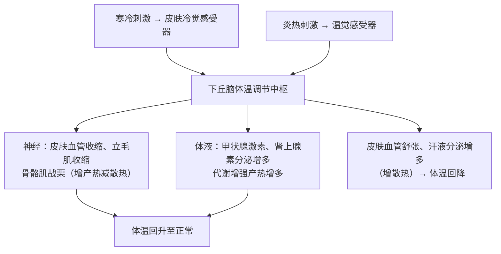

# 第3节 体液调节与神经调节的关系

## 概念定义

**体液调节**：激素等化学物质（还包括 CO₂、H⁺ 等）通过**体液运输**对生命活动进行的调节，激素调节是其主要内容。

**神经—体液调节**：动物体的各项生命活动常常同时受神经和体液的调节，两者协调配合，共同维持内环境稳态。内分泌腺多受中枢神经系统调控；激素也能影响神经系统的发育和功能（如甲状腺激素）。

## 知识梳理

| 比较项 | 神经调节 | 体液调节 |
| --- | --- | --- |
| 作用途径 | 反射弧 | 体液运输 |
| 反应速度 | 迅速 | 较缓慢 |
| 作用范围 | 准确、比较局限 | 较广泛 |
| 作用时间 | 短暂 | 比较长 |

**体温调节**（神经—体液调节，中枢在**下丘脑**）：
产热主要器官——安静时肝脏等内脏、运动时骨骼肌；散热途径——皮肤汗液蒸发、皮肤血管散热、呼气排尿等。

**水盐平衡调节**（中枢在下丘脑）：细胞外液渗透压升高（饮水少/失水多/吃食过咸）→ 下丘脑**渗透压感受器**兴奋 → ①传至大脑皮层产生**渴觉**，主动饮水；②下丘脑合成、**垂体释放**的**抗利尿激素**增多 → 促进肾小管和集合管对水的重吸收 → 尿量减少，渗透压回降（负反馈）。

**下丘脑的枢纽地位**：感受渗透压变化（感受器）、体温与水盐调节中枢、分泌促激素释放激素与抗利尿激素、通过垂体调控多种内分泌腺——是神经调节与体液调节联系的重要枢纽。

## 典型例题

**例 1**：抗利尿激素的叙述正确的是（　）
A. 由垂体合成和分泌
B. 由下丘脑合成，经垂体释放
C. 促进肾小管对无机盐的重吸收
D. 细胞外液渗透压降低时分泌增多
**解析**：抗利尿激素由**下丘脑神经细胞合成**、由**垂体释放**，作用是促进肾小管和集合管对**水**的重吸收；渗透压**升高**时分泌增多。选 **B**。

**例 2**：人从温暖室内走到寒冷室外，机体如何通过神经—体液调节维持体温？
**解析**：皮肤冷觉感受器兴奋 → 传入下丘脑体温调节中枢 → ①神经支配：皮肤血管收缩减少散热、骨骼肌不自主战栗增加产热、立毛肌收缩；②体液途径：促甲状腺激素释放激素→TSH→甲状腺激素增多，肾上腺素分泌增多，代谢增强产热增加。产热增加、散热减少，体温维持约 37 ℃。

## 易错点

- 寒冷环境中人体**产热多、散热也多**（与炎热环境相比），体温正常者产热 = 散热。
- 渴觉产生于**大脑皮层**，而渗透压感受器和调节中枢在**下丘脑**。
- 抗利尿激素：下丘脑合成分泌→垂体**释放**，注意"合成部位"与"释放部位"分开记。
- CO₂ 刺激呼吸中枢促进呼吸也属于**体液调节**（化学物质经体液传送）。
- 体温调节中甲状腺激素分泌增多经过"下丘脑→垂体→甲状腺"分级调节，起效较慢但持久。

## 背记要点

1. 神经调节：快、准、短、局部；体液调节：慢、广、久。
2. 体温调节中枢、水盐调节中枢均在**下丘脑**；渴觉、冷热觉在大脑皮层。
3. 寒冷：血管收缩 + 战栗 + 甲状腺激素/肾上腺素↑；炎热：血管舒张 + 出汗。
4. 渗透压↑→抗利尿激素↑→重吸收水↑→尿量↓（负反馈）。
5. 下丘脑四大身份：感受器、神经中枢、内分泌器官（分泌激素）、调控垂体的枢纽。

## 自测题

1. 从四个方面比较神经调节与体液调节的特点。
2. 画出细胞外液渗透压升高后水平衡调节的流程图。
3. 寒冷环境中机体增加产热、减少散热的具体措施各有哪些？
4. 判断：人体处于寒冷环境时产热量大于散热量，体温才能维持稳定。（　）

## 相关知识点

激素的分级调节与反馈见 [[第2节 激素调节的过程]]；下丘脑的神经中枢地位见 [[第1节 神经调节的结构基础]]；内环境渗透压概念见 [[第1节 细胞生活的环境]]。
