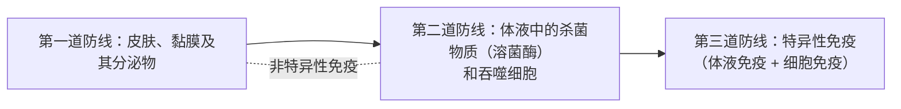

# 第1节 免疫系统的组成和功能

## 概念定义

**免疫系统**：由**免疫器官、免疫细胞和免疫活性物质**组成，是机体抵御病原体侵袭、维持内环境稳态的防御系统。

**抗原**：能引发免疫反应的物质（如病原体表面的蛋白质等大分子），具有异物性、大分子性和特异性。

**抗体**：机体产生的、能与相应抗原**特异性结合**的免疫球蛋白（化学本质为蛋白质），由浆细胞分泌，主要分布在血清中。

## 知识梳理

| 组成 | 具体内容 | 功能/说明 |
| --- | --- | --- |
| 免疫器官 | 骨髓、胸腺、脾、淋巴结、扁桃体 | 免疫细胞生成、成熟或集中分布的场所；骨髓——B 细胞成熟处，胸腺——T 细胞成熟处 |
| 免疫细胞 | 淋巴细胞（B 细胞、T 细胞）、树突状细胞、巨噬细胞等 | 均起源于骨髓造血干细胞；树突状细胞和巨噬细胞是主要的**抗原呈递细胞（APC）** |
| 免疫活性物质 | 抗体、细胞因子、溶菌酶 | 由免疫细胞或其他细胞产生的发挥免疫作用的物质 |

**三道防线**：

第一、二道防线为**非特异性免疫**（生来就有、不针对特定病原体）；第三道防线为**特异性免疫**（后天获得、针对特定抗原）。

**免疫系统三大功能**：
1. **免疫防御**：排除外来病原体——功能过强致过敏，过弱致免疫缺陷。
2. **免疫自稳**：清除衰老、损伤的细胞——异常时易发自身免疫病。
3. **免疫监视**：识别并清除突变的细胞——功能低下时易患肿瘤。

## 典型例题

**例 1**：下列属于人体第二道防线的是（　）
A. 皮肤角质层阻挡病原体
B. 唾液中溶菌酶杀灭口腔细菌
C. 血浆中的溶菌酶和吞噬细胞杀灭病原体
D. 浆细胞分泌抗体清除病毒
**解析**：皮肤、黏膜及其分泌物（包括唾液、泪液中的溶菌酶）属第一道防线；**体液（血浆等内环境）中的杀菌物质和吞噬细胞**属第二道防线；抗体参与第三道防线。选 **C**。

**例 2**：某人免疫监视功能低下，可能出现什么后果？为什么？
**解析**：免疫监视的职责是识别和清除体内**突变的细胞**。该功能低下时，突变细胞不能被及时清除，可能增殖形成**肿瘤**，故机体患恶性肿瘤的风险升高。

## 易错点

- 溶菌酶的"归属"看部位：在唾液、泪液中属**第一道**防线；在血浆、组织液中属**第二道**防线。
- B 细胞、T 细胞均**起源于骨髓造血干细胞**；区别在成熟场所（B——骨髓，T——胸腺）。
- 抗体化学本质是蛋白质（免疫球蛋白），细胞因子也属免疫活性物质，但两者来源与作用不同。
- 非特异性免疫是特异性免疫的**基础**，两者共同构成防御体系，不能割裂。

## 背记要点

1. 免疫系统组成：免疫器官 + 免疫细胞 + 免疫活性物质。
2. 成熟场所：B 细胞——骨髓；T 细胞——胸腺（"B 骨 T 胸"）。
3. 三道防线：皮肤黏膜／体液杀菌物质和吞噬细胞／特异性免疫。
4. 三大功能：防御（防外敌）、自稳（清内废）、监视（灭突变）。
5. 抗原呈递细胞（APC）：树突状细胞、巨噬细胞（B 细胞也可呈递抗原）。

## 自测题

1. 免疫系统由哪三部分组成？各举两例。
2. 区分三道防线并说明哪些属于非特异性免疫。
3. 免疫系统的三大功能分别异常时会引发哪些问题？
4. 判断：唾液中的溶菌酶杀菌属于人体的第二道防线。（　）

## 相关知识点

体液免疫与细胞免疫的具体过程见 [[第2节 特异性免疫]]；防御功能过强或过弱的疾病见 [[第3节 免疫失调]]；免疫功能的实践应用见 [[第4节 免疫学的应用]]。
