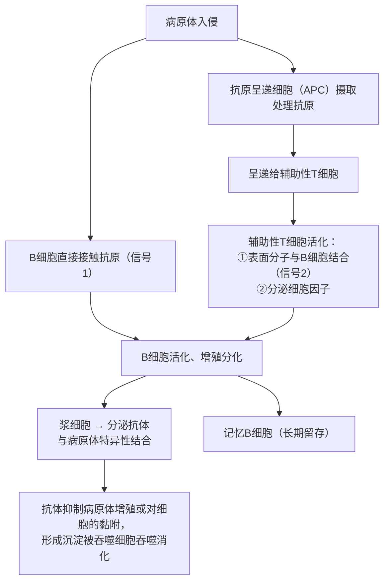

# 第2节 特异性免疫

## 概念定义

**体液免疫**：B 细胞激活后增殖分化为浆细胞，由浆细胞产生**抗体**"作战"的免疫方式，主要对付**内环境（体液）中的病原体**。

**细胞免疫**：T 细胞（细胞毒性 T 细胞）直接接触并裂解**靶细胞**的免疫方式，主要对付**侵入细胞内的病原体**（如病毒、胞内寄生菌）以及异常细胞。

**免疫记忆（二次免疫）**：初次免疫形成的记忆细胞在再次接触**相同抗原**时迅速增殖分化，产生**更快、更强**的免疫反应。

## 知识梳理

**体液免疫过程**（B 细胞活化需两个信号 + 细胞因子）：

**细胞免疫过程**：靶细胞（被病原体感染的细胞）膜表面出现抗原 → **细胞毒性 T 细胞**识别，并在辅助性 T 细胞分泌的细胞因子作用下增殖分化为新的细胞毒性 T 细胞和**记忆 T 细胞** → 细胞毒性 T 细胞识别并接触、**裂解靶细胞** → 释放出的病原体被抗体结合或被吞噬细胞消灭。

| 比较项 | 体液免疫 | 细胞免疫 |
| --- | --- | --- |
| 核心细胞 | B 细胞→浆细胞 | 细胞毒性 T 细胞 |
| "武器" | 抗体 | 直接接触裂解靶细胞 |
| 作用对象 | 细胞外（体液中）的病原体 | 被感染的细胞、突变细胞、移植的异体细胞 |
| 联系 | 辅助性 T 细胞在两者中都起关键作用；两者相互配合，共同清除病原体 | |

**二次免疫特点**：反应**快**、抗体产生**多**且维持时间长、症状轻或无症状。原因：记忆细胞对抗原十分敏感，能迅速增殖分化为浆细胞（或细胞毒性 T 细胞）。

## 典型例题

**例 1**：新冠病毒侵入人体细胞后，彻底清除病毒需要（　）
A. 只需体液免疫　B. 只需细胞免疫
C. 细胞免疫裂解靶细胞，再由体液免疫的抗体清除释放的病毒
D. 非特异性免疫即可完成
**解析**：病毒进入细胞后抗体无法进入细胞，需细胞免疫**裂解靶细胞**使病毒暴露，再由抗体结合、吞噬细胞清除，两者协同。选 **C**。

**例 2**：接种某疫苗后再感染相应病原体，患者常不表现症状，用二次免疫解释。
**解析**：接种疫苗相当于初次免疫，体内产生了**记忆细胞**（和一定量抗体）。当相同病原体再次入侵时，记忆细胞迅速增殖分化为浆细胞，**快速、大量**产生抗体，在病原体大量增殖、引起明显症状之前将其消灭，故不发病或症状轻微。

## 易错点

- **浆细胞不能识别抗原**（无识别功能，只分泌抗体）；吞噬细胞能识别但**无特异性**识别能力。
- 抗体不能进入细胞内，胞内病原体必须先由细胞免疫裂解靶细胞。
- B 细胞活化需要**两个信号**（抗原直接接触 + 辅助性 T 细胞表面分子）和细胞因子，缺一不可。
- 二次免疫中抗体主要由**记忆细胞增殖分化来的浆细胞**产生，并非记忆细胞直接分泌抗体。
- 辅助性 T 细胞是体液免疫与细胞免疫的"枢纽"，HIV 主要攻击辅助性 T 细胞导致两类免疫均受损。

## 背记要点

1. 体液免疫主角：B 细胞→浆细胞→抗体；细胞免疫主角：细胞毒性 T 细胞裂解靶细胞。
2. B 细胞活化两信号一因子：抗原接触、辅助性 T 细胞结合、细胞因子。
3. 靶细胞裂解属于细胞**凋亡**（程序性死亡）。
4. 二次免疫：更快、更强、更持久——记忆细胞的功劳。
5. 特异性免疫中能识别抗原的细胞：B、T（辅助性/细胞毒性）、记忆细胞、APC（非特异识别）；不能识别的：浆细胞。

## 自测题

1. 画出体液免疫的基本流程图并标出记忆细胞产生的环节。
2. 细胞免疫如何清除被病毒感染的细胞？之后病毒如何被彻底清除？
3. 比较初次免疫与二次免疫中抗体产生的速度和数量。
4. 判断：浆细胞能特异性识别抗原并分泌抗体。（　）

## 相关知识点

免疫系统的组成与三道防线见 [[第1节 免疫系统的组成和功能]]；免疫功能异常疾病见 [[第3节 免疫失调]]；疫苗原理见 [[第4节 免疫学的应用]]。
