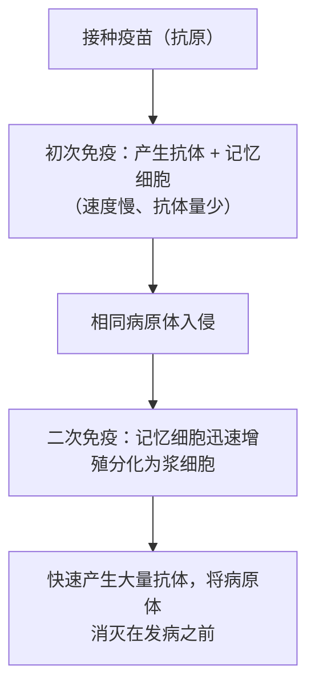

# 第4节 免疫学的应用

## 概念定义

**疫苗**：通常用**灭活的或减毒的病原体**（或其组分、mRNA 等）制成的生物制品。接种后机体产生相应**抗体和记忆细胞**，从而获得对特定传染病的免疫力（属于人工主动免疫）。

**免疫诊断**：利用**抗原—抗体反应的高度特异性**检测病原体和肿瘤标志物等，如早孕试纸、核酸/抗原检测试剂盒。

**免疫排斥**：进行器官移植时，受体免疫系统识别移植器官上的**组织相容性抗原（HLA，主要组织相容性抗原）**为"非己"成分而发起攻击的现象。

## 知识梳理

| 应用领域 | 原理 | 实例/要点 |
| --- | --- | --- |
| 免疫预防（疫苗） | 疫苗作为抗原引发初次免疫，产生记忆细胞；再遇病原体时发生二次免疫 | 牛痘疫苗消灭天花；脊灰糖丸；有些疫苗需**多次接种**以提高抗体和记忆细胞水平 |
| 免疫诊断 | 抗原与抗体特异性结合 | 检测病原体、肿瘤标志物；灵敏度高、特异性强 |
| 免疫治疗 | 调整（增强或抑制）机体免疫功能 | 注射细胞因子、免疫抑制剂；肿瘤的免疫疗法（如增强 T 细胞对癌细胞的识别） |
| 器官移植 | 降低免疫排斥 | 关键是**供受体 HLA 配型**（一半以上相同即可考虑移植）+ 术后长期使用**免疫抑制剂** |

**器官移植的难题与出路**：免疫排斥的本质是**细胞免疫**攻击移植器官（细胞毒性 T 细胞裂解异体细胞）。措施：HLA 配型、免疫抑制剂（但会降低整体免疫力、增加感染风险）。前景：利用**自体干细胞/诱导多能干细胞**培养组织器官、异种器官基因改造等有望解决供体短缺和排斥问题。

## 典型例题

**例 1**：接种疫苗能预防相应传染病的根本原因是（　）
A. 疫苗能直接杀灭入侵的病原体
B. 疫苗使机体产生了记忆细胞和抗体，再次感染时发生快而强的二次免疫
C. 疫苗能增强非特异性免疫
D. 疫苗中含有大量现成抗体
**解析**：疫苗作为**抗原**引发初次免疫，关键是产生**记忆细胞**；再遇相同病原体时发生二次免疫，快速大量产生抗体。选 **B**。

**例 2**：器官移植患者需长期服用免疫抑制剂，这带来什么益处和风险？
**解析**：益处——抑制 T 细胞增殖等免疫应答，减弱对移植器官的**免疫排斥**，延长移植器官存活时间。风险——机体整体免疫功能（防御、监视）下降，**易发生感染，患肿瘤的风险升高**。因此需权衡剂量并做好防护。

## 易错点

- 疫苗接种属**主动免疫**（自身产生抗体和记忆细胞）；注射抗体/血清属**被动免疫**（直接获得抗体，见效快但不持久、无记忆）。
- 某些疫苗需多次接种：每次接种相当于再次免疫刺激，使**抗体和记忆细胞数量增多**、免疫力更持久。
- 免疫排斥主要由**细胞免疫**（细胞毒性 T 细胞）介导。
- HLA 完全相同几乎只有同卵双胞胎；临床要求关键 HLA **一半以上相同**即可移植。
- 免疫抑制剂是"双刃剑"：抗排斥的同时削弱防御与监视功能。

## 背记要点

1. 免疫学四大应用：免疫预防（疫苗）、免疫诊断、免疫治疗、器官移植。
2. 疫苗原理：初次免疫产生记忆细胞→二次免疫又快又强。
3. 主动免疫（打疫苗）vs 被动免疫（注抗体血清）：持久性与记忆的差别。
4. 器官移植两法宝：HLA 配型 + 免疫抑制剂。
5. 免疫诊断基础：抗原—抗体反应的高度特异性。

## 自测题

1. 从免疫学角度解释疫苗预防传染病的原理。
2. 紧急预防破伤风时注射抗毒素血清而非疫苗，为什么？
3. 器官移植面临的主要免疫学障碍是什么？如何应对？
4. 判断：服用免疫抑制剂只会带来好处，不会有副作用。（　）

## 相关知识点

二次免疫与记忆细胞见 [[第2节 特异性免疫]]；免疫系统组成见 [[第1节 免疫系统的组成和功能]]；艾滋病等免疫缺陷背景见 [[第3节 免疫失调]]。
