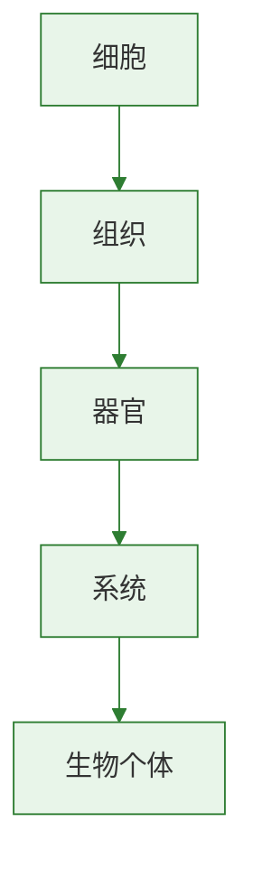

# 第一节 学习使用显微镜

标签：#显微镜 #细胞 #实验技能

## 一、本节定位

人教版·生物学七年级上册 **第一单元 生物和细胞 · 第二章 认识细胞 · 第一节**。显微镜是观察细胞的重要工具，本节重点学习显微镜的结构、使用方法及成像特点。

## 二、核心概念

| 术语 | 含义 |
|---|---|
| 目镜 | 接近眼睛的镜头，无螺纹 |
| 物镜 | 接近标本的镜头，有螺纹，装在转换器上 |
| 反光镜 | 反射光线进入镜筒，有平面镜和凹面镜两面 |
| 遮光器 | 上有大小不同的光圈，可调节进光量 |
| 粗准焦螺旋 | 大幅度升降镜筒，用于找到物像 |
| 细准焦螺旋 | 小幅度升降镜筒，使物像更清晰 |

## 三、知识梳理

### 1. 显微镜的结构

- **光学部分**：目镜、物镜、反光镜。
- **机械部分**：镜座、镜柱、镜臂、载物台、压片夹、通光孔、遮光器、转换器、镜筒、粗/细准焦螺旋。

### 2. 显微镜的使用步骤

1. **取镜和安放**：一手握镜臂，一手托镜座，放在实验台略偏左位置。
2. **对光**：转动转换器，使低倍物镜对准通光孔；调节遮光器和反光镜，直到看到明亮的圆形视野。
3. **观察**：
   - 放置玻片标本，用压片夹压住。
   - 顺时针转动粗准焦螺旋，使镜筒缓缓下降，眼睛从侧面看着物镜，避免压碎玻片。
   - 左眼向目镜内看，逆时针转动粗准焦螺旋，使镜筒缓缓上升，直到看清物像。
   - 略微转动细准焦螺旋，使物像更清晰。
4. **收镜**：擦净外表，转动转换器使物镜偏到两旁，把镜筒降到最低，放回镜箱。

### 3. 放大倍数与成像

- 放大倍数 = **目镜放大倍数 × 物镜放大倍数**。
- 放大倍数越大，看到的细胞越**大**，数目越**少**，视野越**暗**。
- 显微镜成**倒像**：物像上下、左右均颠倒，即旋转180°后的像。

## 四、易混辨析

| 对比项 | 目镜 | 物镜 |
|---|---|---|
| 位置 | 接近眼睛 | 接近标本 |
| 螺纹 | 无 | 有 |
| 长度与放大倍数 | 越长放大倍数越小 | 越长放大倍数越大 |

## 五、背记要点

1. 显微镜放大倍数 = 目镜倍数 × 物镜倍数。
2. 对光时用低倍物镜和大光圈，光线强时用平面镜、小光圈，光线弱时用凹面镜、大光圈。
3. 镜筒下降时眼睛要从侧面看物镜，防止压碎玻片。
4. 显微镜成倒像，物像偏向哪个方向，玻片就向哪个方向移动。
5. 低倍镜换高倍镜：先移物像至视野中央，再换高倍物镜，最后调细准焦螺旋。

## 六、自测小题

1. 显微镜的放大倍数等于______与______放大倍数的乘积。
2. 显微镜成的像是______像，若物像在视野左上方，应将玻片向______移动。
3. 镜筒下降时，眼睛应看着______。
4. 对光时，应选用（A. 高倍物镜 B. 低倍物镜）。
5. 光线较弱时，应选用反光镜的（A. 平面镜 B. 凹面镜）和遮光器的（A. 大光圈 B. 小光圈）。
6. 判断：显微镜放大倍数越大，看到的细胞数目越多。（对/错）

**答案**：1. 目镜；物镜 2. 倒；左上方 3. 物镜 4. B 5. B；A 6. 错（数目越少）

相关：[[第二节 植物细胞]] ｜ [[第三节 动物细胞]]

### 生物过程与层级图

