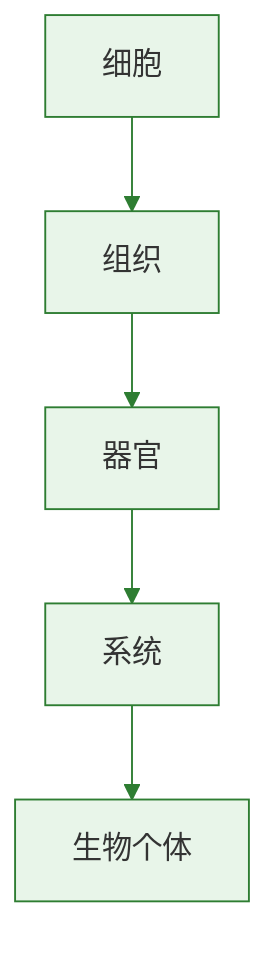

# 第四节 细胞的生活

标签：#细胞生活 #细胞膜 #能量转换 #细胞核

## 一、本节定位

人教版·生物学七年级上册 **第一单元 生物和细胞 · 第二章 认识细胞 · 第四节**。本节从物质、能量和信息三个角度理解细胞的生活，建立"细胞是物质、能量和信息统一体"的观念。

## 二、核心概念

| 术语 | 含义 |
|---|---|
| 有机物 | 含碳、分子较大，如糖类、脂质、蛋白质、核酸 |
| 无机物 | 一般不含碳、分子较小，如水、无机盐、氧 |
| 细胞膜 | 控制物质进出细胞的结构 |
| 能量转换器 | 细胞中能将一种形式的能量转化为另一种形式能量的结构 |
| 叶绿体 | 将光能转化为化学能储存在有机物中 |
| 线粒体 | 将有机物中的化学能释放出来供细胞利用 |
| 细胞核 | 细胞的控制中心，含有遗传物质 DNA |

## 三、知识梳理

### 1. 细胞中的物质

- **无机物**：水、无机盐、氧等，分子小，一般不含碳。
- **有机物**：糖类、脂质、蛋白质、核酸等，分子大，含碳。
- 细胞需要不断从外界吸收物质，同时排出代谢废物。

### 2. 细胞膜控制物质的进出

- **有用物质进入**：如氧气、水、营养物质。
- **废物排出**：如二氧化碳、尿素等。
- **有害物质阻挡**：细胞膜具有选择透过性。

### 3. 细胞中的能量转换

| 能量转换器 | 分布 | 功能 |
|---|---|---|
| 叶绿体 | 植物绿色部分细胞 | 光合作用：光能 → 化学能（储存在有机物中） |
| 线粒体 | 动植物细胞 | 呼吸作用：化学能 → 细胞能利用的能量 |

### 4. 细胞核是控制中心

- 细胞核中含有**DNA**，DNA 上有指导生物发育的全部遗传信息。
- 细胞核控制着生物的**发育和遗传**。
- 细胞是**物质、能量和信息**的统一体。

## 四、易混辨析

| 对比项 | 叶绿体 | 线粒体 |
|---|---|---|
| 分布 | 植物绿色部分 | 动植物细胞 |
| 能量变化 | 储存能量 | 释放能量 |
| 作用 | 光合作用 | 呼吸作用 |
| 公式简记 | 二氧化碳+水 → 有机物+氧 | 有机物+氧 → 二氧化碳+水+能量 |

## 五、背记要点

1. 细胞中的物质分为有机物和无机物两大类。
2. 细胞膜能控制物质进出，具有选择透过性。
3. 叶绿体和线粒体是细胞中的能量转换器。
4. 叶绿体将光能转变成化学能储存在有机物中；线粒体将有机物中的化学能释放出来。
5. 细胞核含有 DNA，是细胞的控制中心，控制生物的发育和遗传。
6. 细胞是物质、能量和信息的统一体。

## 六、自测小题

1. 细胞中的物质可分为______和______两大类。
2. 控制物质进出细胞的结构是______。
3. 植物细胞中将光能转化为化学能的结构是______；动植物细胞中都能释放能量的结构是______。
4. 细胞的控制中心是______，其中含有遗传物质______。
5. 细胞是______、______和信息的统一体。
6. 判断：细胞膜能让所有物质自由进出细胞。（对/错）

**答案**：1. 有机物；无机物 2. 细胞膜 3. 叶绿体；线粒体 4. 细胞核；DNA 5. 物质；能量 6. 错（具有选择透过性）

相关：[[第二节 植物细胞]] ｜ [[第三节 动物细胞]] ｜ [[第一节 细胞通过分裂产生新细胞]]

### 生物过程与层级图

