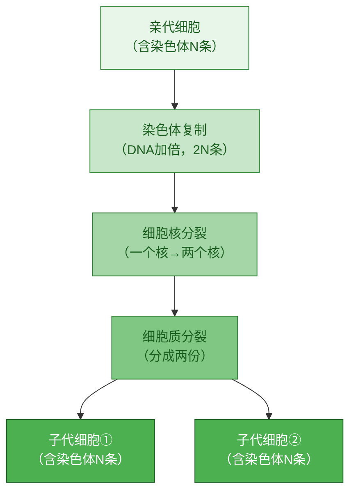

# 第一节 细胞通过分裂产生新细胞

标签：#细胞分裂 #染色体 #生长

## 一、本节定位

人教版·生物学七年级上册 **第一单元 生物和细胞 · 第三章 从细胞到生物体 · 第一节**。本节学习细胞分裂的过程、染色体的变化规律，以及细胞生长与生物体生长的关系。

## 二、核心概念

| 术语 | 含义 |
|---|---|
| 细胞分裂 | 一个细胞分成两个细胞的过程 |
| 细胞生长 | 细胞体积由小变大的过程 |
| 染色体 | 细胞核中容易被碱性染料染成深色的物质，由 DNA 和蛋白质组成 |
| DNA | 遗传物质，携带着指导生物发育的遗传信息 |

## 三、知识梳理

### 1. 生物体由小长大的原因

- **细胞生长**：细胞体积增大。
- **细胞分裂**：细胞数目增多。
- 植物细胞还靠细胞生长和分裂共同实现；动物体 likewise。

### 2. 细胞分裂的过程

> 关键：染色体先复制再平均分配，新细胞与原细胞**遗传物质相同**。

1. **动物细胞分裂**：
   - 细胞核先由一个分成两个。
   - 细胞质分成两份，每份各含一个细胞核。
   - 细胞膜从细胞的中部向内凹陷，缢裂成两个细胞。

2. **植物细胞分裂**：
   - 细胞核先由一个分成两个。
   - 细胞质分成两份。
   - 在原来细胞中央形成新的**细胞膜**和新的**细胞壁**，一个细胞分裂成两个。

### 3. 染色体的变化

- 细胞分裂前，染色体先进行**复制**。
- 分裂过程中，染色体**平均分配**到两个新细胞中。
- 新细胞与原细胞所含的**遗传物质相同**，保证了遗传的稳定性。

## 四、易混辨析

| 对比项 | 动物细胞分裂 | 植物细胞分裂 |
|---|---|---|
| 细胞核变化 | 先一分为二 | 先一分为二 |
| 细胞质变化 | 分成两份 | 分成两份 |
| 最后形成 | 细胞膜向内凹陷缢裂 | 形成新的细胞膜和细胞壁 |

## 五、背记要点

1. 生物体由小长大与细胞生长、细胞分裂有关。
2. 细胞分裂就是一个细胞分成两个细胞，使细胞数目增多。
3. 细胞分裂时，细胞核先分裂，随后细胞质分裂。
4. 细胞分裂过程中，染色体先复制再平均分配，新细胞与原细胞遗传物质相同。
5. 动物细胞靠细胞膜缢裂分裂；植物细胞靠形成新的细胞膜和细胞壁分裂。

## 六、自测小题

1. 生物体由小长大，与细胞的______和______有关。
2. 细胞分裂时，______先由一个分成两个。
3. 细胞分裂过程中，染色体先______，再______分配到两个新细胞中。
4. 植物细胞分裂最后在细胞中央形成新的______和______。
5. 细胞分裂后，新细胞与原细胞所含遗传物质（A. 相同 B. 不同）。
6. 判断：动物细胞和植物细胞的分裂过程完全相同。（对/错）

**答案**：1. 生长；分裂 2. 细胞核 3. 复制；平均 4. 细胞膜；细胞壁 5. A 6. 错（末期分裂方式不同）

相关：[[第二节 动物体的结构层次]] ｜ [[第三节 植物体的结构层次]]
