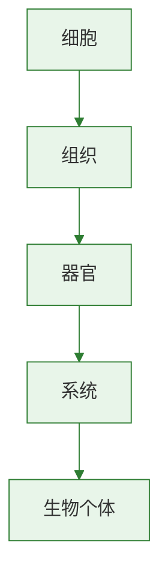

# 二 两栖动物和爬行动物

标签：#两栖动物 #爬行动物 #脊椎动物

## 一、本节定位

人教版·生物学七年级上册 **第二单元 多种多样的生物 · 第二章 动物的类群 · 第二节 脊椎动物 · 二 两栖动物和爬行动物**。本节学习两栖动物和爬行动物的主要特征及代表动物。

## 二、核心概念

| 术语 | 含义 |
|---|---|
| 两栖动物 | 幼体生活在水中，用鳃呼吸；成体大多生活在陆地上，也可在水中游泳，用肺呼吸，皮肤辅助呼吸 |
| 爬行动物 | 体表覆盖角质的鳞片或甲，用肺呼吸，在陆地上产卵，卵表面有坚韧卵壳 |
| 变态发育 | 幼体和成体在形态结构和生活习性上有显著差异的发育方式 |
| 肺呼吸 | 用肺进行气体交换 |

## 三、知识梳理

### 1. 两栖动物

- **主要特征**：幼体生活在水中，用鳃呼吸；成体大多生活在陆地上，也可在水中游泳，用肺呼吸，**皮肤裸露且湿润，可辅助呼吸**。
- **代表动物**：青蛙、蟾蜍、大鲵（娃娃鱼）、蝾螈等。
- **与人类关系**：青蛙捕食害虫，是庄稼的好朋友；蟾蜍可入药；应保护两栖动物的生存环境。

### 2. 爬行动物

- **主要特征**：体表覆盖**角质的鳞片或甲**；用**肺**呼吸；在**陆地上产卵**，卵表面有**坚韧的卵壳**。
- **代表动物**：蜥蜴、龟、鳖、蛇、鳄、恐龙等。
- **与人类关系**：可食用、入药；蛇毒可制药；蜥蜴捕食害虫；应正确对待野生动物。

### 3. 两栖动物与爬行动物的比较

| 比较项目 | 两栖动物 | 爬行动物 |
|---|---|---|
| 体表 | 裸露、湿润 | 有角质鳞片或甲 |
| 呼吸 | 幼体鳃，成体肺和皮肤 | 肺 |
| 生殖发育 | 水中产卵，变态发育 | 陆地产卵，卵有硬壳 |
| 对陆地适应 | 较弱，生殖离不开水 | 较强，真正适应陆地 |

## 四、背记要点

1. 两栖动物幼体水生用鳃呼吸，成体可陆生用肺和皮肤呼吸。
2. 爬行动物体表有角质鳞片或甲，用肺呼吸，在陆地产卵。
3. 爬行动物的生殖和发育摆脱了对水环境的依赖，是真正适应陆地生活的脊椎动物。
4. 大鲵是最大的两栖动物；蜥蜴、蛇、龟、鳄都是爬行动物。
5. 青蛙的发育属于变态发育，经历受精卵→蝌蚪→幼蛙→成蛙四个阶段。

## 五、自测小题

1. 两栖动物成体用______呼吸，______辅助呼吸。
2. 爬行动物体表覆盖______或______，用______呼吸。
3. 爬行动物在______上产卵，卵表面有坚韧的______。
4. 下列属于两栖动物的是（A. 蜥蜴 B. 青蛙 C. 蛇）。
5. 真正适应陆地生活的脊椎动物类群是（A. 两栖动物 B. 爬行动物 C. 鱼类）。
6. 判断：爬行动物的生殖和发育完全摆脱了对水环境的依赖。（对/错）

**答案**：1. 肺；皮肤 2. 角质鳞片；甲；肺 3. 陆地；卵壳 4. B 5. B 6. 对

相关：[[一 鱼]] ｜ [[三 鸟和哺乳动物]]

### 生物过程与层级图

