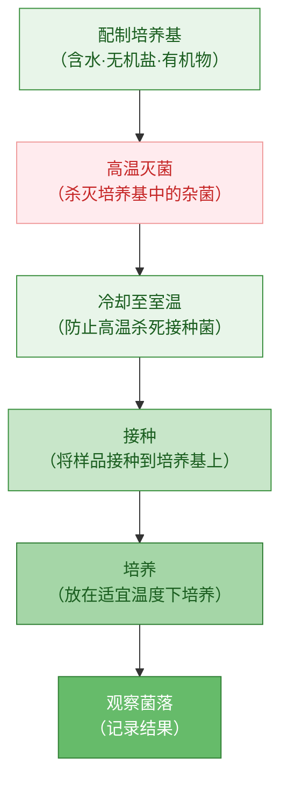

# 第一节 微生物的分布

标签：#微生物 #分布 #培养 #细菌和真菌

## 一、本节定位

人教版·生物学七年级上册 **第二单元 多种多样的生物 · 第三章 微生物 · 第一节**。本节认识微生物的概念和分布特点，学习检测环境中细菌和真菌的基本方法。

## 二、核心概念

| 术语 | 含义 |
|---|---|
| 微生物 | 个体微小、结构简单的生物，包括细菌、真菌、病毒等 |
| 菌落 | 由一个细菌或真菌繁殖后形成的肉眼可见的集合体 |
| 培养基 | 为细菌或真菌生长提供营养物质的基质 |
| 接种 | 将少量细菌或真菌转移到培养基上的过程 |
| 高温灭菌 | 用高温杀死培养基和用具上的杂菌 |

## 三、知识梳理

### 1. 微生物的分布特点

- 微生物在生物圈中**分布十分广泛**。
- 土壤中、水中、空气中、动植物体表和体内都有微生物存在。
- 在**极端环境**中也有微生物生存，如高温温泉、深海、高盐湖泊等。

### 2. 培养细菌和真菌的一般方法

> 关键步骤：**灭菌**（杀死所有微生物）→ **接种**（引入目标微生物）→ **培养**

1. **配制培养基**：常用牛肉汁加琼脂，为细菌和真菌提供有机物和水分。
2. **高温灭菌**：杀死培养基和培养皿中的杂菌。
3. **冷却接种**：待培养基冷却后，将少量细菌或真菌转移到培养基上。
4. **恒温培养**：将接种后的培养基放在温暖的地方培养。

### 3. 细菌和真菌菌落的比较

| 比较项目 | 细菌菌落 | 真菌菌落 |
|---|---|---|
| 大小 | 较小 | 较大 |
| 形态 | 表面光滑黏稠或粗糙干燥 | 常呈绒毛状、絮状或蜘蛛网状 |
| 颜色 | 多为白色、黄色等 | 常有红、褐、绿、黑、黄等颜色 |

## 四、背记要点

1. 微生物个体微小、结构简单，包括细菌、真菌、病毒等。
2. 微生物分布广泛，在土壤、水、空气、动植物体表和体内都存在。
3. 培养细菌和真菌的一般步骤：配制培养基 → 高温灭菌 → 冷却接种 → 恒温培养。
4. 接种前要高温灭菌，目的是杀死杂菌，避免污染。
5. 细菌和真菌的菌落大小、形态、颜色不同，可作为初步判断依据。

## 五、自测小题

1. 微生物包括______、______、______等。
2. 由一个细菌或真菌繁殖后形成的肉眼可见的集合体叫______。
3. 培养细菌和真菌时，配制培养基后要______，目的是杀死杂菌。
4. 接种前必须等培养基______后再进行，否则会烫死要接种的微生物。
5. 下列环境中微生物最少的是（A. 土壤 B. 高温灭菌后的培养基 C. 空气）。
6. 判断：细菌和真菌的菌落形态、大小、颜色都相同。（对/错）

**答案**：1. 细菌；真菌；病毒 2. 菌落 3. 高温灭菌 4. 冷却 5. B 6. 错

相关：[[第二节 细菌]] ｜ [[第三节 真菌]] ｜ [[第四节 病毒]]
