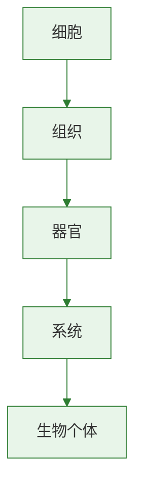

# 综合实践项目：利用细菌或真菌制作发酵食品

标签：#发酵 #微生物 #实践 #食品安全

## 一、本节定位

人教版·生物学七年级上册 **第二单元 多种多样的生物 · 第三章 微生物** 综合实践项目。通过动手制作发酵食品，理解细菌和真菌在食品制作中的作用。

## 二、核心概念

| 术语 | 含义 |
|---|---|
| 发酵 | 微生物在无氧或有氧条件下，将有机物分解或转化为其他产物的过程 |
| 酵母菌发酵 | 酵母菌分解葡萄糖产生二氧化碳和酒精 |
| 乳酸菌发酵 | 乳酸菌分解有机物产生乳酸 |
| 灭菌 | 杀死食品中微生物的措施 |
| 无菌操作 | 防止杂菌污染的操作方法 |

## 三、知识梳理

### 1. 常见发酵食品及其原理

| 食品 | 主要微生物 | 发酵原理 |
|---|---|---|
| 馒头、面包 | 酵母菌 | 分解葡萄糖产生二氧化碳，使面团膨胀 |
| 酸奶、泡菜 | 乳酸菌 | 分解有机物产生乳酸 |
| 醋 | 醋酸菌 | 将酒精氧化成醋酸 |
| 米酒 | 酵母菌 | 将葡萄糖转化为酒精 |
| 腐乳、酱油 | 霉菌 | 分解蛋白质等产生特殊风味 |

### 2. 制作米酒的实验要点

1. 将糯米蒸熟，目的是**杀菌**并使淀粉易于被分解。
2. 蒸熟后冷却至约 30℃，避免高温杀死酒曲中的酵母菌。
3. 加入酒曲，酒曲中含有酵母菌和霉菌等微生物。
4. 将容器盖好，放在温暖处发酵，创造无氧环境。
5. 发酵过程中尽量少打开容器，防止杂菌进入。

### 3. 制作酸奶的实验要点

1. 将牛奶煮沸灭菌，然后冷却。
2. 加入适量酸奶作为菌种，其中含有乳酸菌。
3. 密封后放在温暖处发酵数小时。
4. 发酵完成后冷藏保存。

### 4. 注意事项

- 所用容器要清洗干净，最好进行消毒。
- 操作过程要注意无菌，避免杂菌污染。
- 控制适宜的温度，有利于发酵菌的生长繁殖。

## 四、背记要点

1. 酵母菌发酵产生二氧化碳和酒精，可用于制作馒头、面包、米酒。
2. 乳酸菌发酵产生乳酸，可用于制作酸奶、泡菜。
3. 发酵食品制作要注意灭菌、无菌操作和适宜温度。
4. 微生物在食品制作中应用广泛，但也要注意防止杂菌污染和食品腐败。

## 五、自测小题

1. 制作馒头和面包主要利用______发酵产生的______使面团膨胀。
2. 制作酸奶和泡菜主要利用______发酵产生______。
3. 制作米酒时，糯米要先蒸熟，目的是______。
4. 发酵过程中要尽量少打开容器，主要是为了防止______进入。
5. 下列微生物中用于制作酸奶的是（A. 酵母菌 B. 乳酸菌 C. 醋酸菌）。
6. 判断：制作米酒时，酒曲中的微生物都是细菌。（对/错）

**答案**：1. 酵母菌；二氧化碳 2. 乳酸菌；乳酸 3. 杀菌（灭菌） 4. 杂菌 5. B 6. 错（主要是酵母菌和霉菌等真菌）

相关：[[第二节 细菌]] ｜ [[第三节 真菌]] ｜ [[第一节 尝试对生物进行分类]]

### 生物过程与层级图

