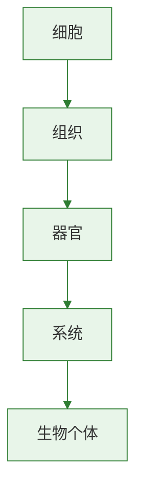

# 种子的萌发

## 核心概念

| 术语 | 含义 |
|------|------|
| 种子结构 | 由种皮和胚（胚芽、胚轴、胚根、子叶）组成 |
| 胚 | 种子的主要部分，是新植物体的幼体 |
| 子叶 | 储存或转运营养物质，单子叶植物1片，双子叶植物2片 |
| 胚乳 | 某些种子（如玉米）中储存营养的结构 |

### 种子萌发的条件

**自身条件：**
- 胚是完整的、活的
- 种子不在休眠期
- 有充足的营养储备

**外界条件：**
- 适宜的温度（25-30°C最适）
- 一定的水分（使种皮软化、酶活化）
- 充足的空气（提供呼吸作用所需氧气）

### 萌发过程

1. 种子吸水膨胀，种皮胀破
2. 胚根最先突破种皮，发育成**根**
3. 胚轴伸长，连接根和茎
4. 胚芽发育成**茎和叶**
5. 子叶逐渐萎缩（营养被消耗）

### 实验：探究种子萌发的外界条件

| 组别 | 处理 | 结果 | 变量 |
|------|------|------|------|
| 1号 | 干燥、室温、有空气 | 不萌发 | 缺水 |
| 2号 | 适量水、室温、有空气 | 萌发 | 对照组 |
| 3号 | 适量水、冰箱、有空气 | 不萌发 | 低温 |
| 4号 | 完全浸水、室温 | 不萌发 | 缺氧 |

> **背记要点：**
> - 胚是种子最重要的结构，由胚芽、胚轴、胚根、子叶组成
> - 萌发三要素：适温、适水、足氧
> - 胚根→根，胚芽→茎和叶

### 自测题

1. 种子萌发时最先突破种皮的结构是（ ）A.胚芽 B.胚轴 C.胚根 D.子叶
2. 将浸泡的种子完全淹没在水中不能萌发，原因是（ ）A.温度不适 B.缺少水分 C.缺少空气 D.光照不足
3. 玉米种子的营养物质主要储存在（ ）A.子叶 B.胚乳 C.胚芽 D.种皮
4. 探究种子萌发条件的实验中，实验组与对照组之间应遵循（ ）A.等量原则 B.单一变量原则 C.重复原则 D.以上都是

[[第二节 植株的生长]] | [[第三节 开花和结果]]

### 生物过程与层级图

