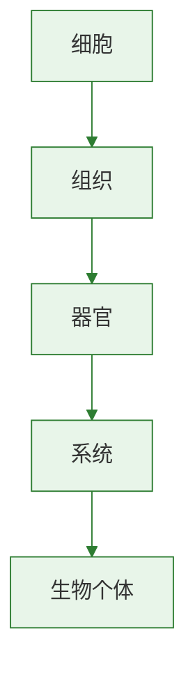

# 植株的生长

## 核心概念

| 术语 | 含义 |
|------|------|
| 根尖 | 从根的顶端到生有根毛的部位 |
| 分生区 | 细胞小、排列紧密，不断分裂产生新细胞 |
| 伸长区 | 细胞迅速伸长，是根伸长最快的部位 |
| 成熟区 | 有根毛，是吸收水和无机盐的主要部位 |
| 芽 | 未展开的枝或花，有生长点 |

### 根尖的结构（从下到上）

| 部位 | 特点 | 功能 |
|------|------|------|
| 根冠 | 细胞较大，排列不整齐 | 保护根尖 |
| 分生区 | 细胞小而密，细胞壁薄 | 细胞分裂，产生新细胞 |
| 伸长区 | 细胞逐渐伸长 | 根伸长最快的部位 |
| 成熟区 | 有大量根毛 | 吸收水分和无机盐 |

### 根的生长原因

根的生长依靠：
1. **分生区**的细胞不断**分裂**——增加细胞数目
2. **伸长区**的细胞不断**伸长**——增大细胞体积

### 枝条是由芽发育成的

- 芽中有**生长点**，细胞不断分裂
- 叶原基→叶，芽轴→茎，芽原基→新芽

### 植株生长需要的无机盐

| 无机盐 | 作用 | 缺乏症状 |
|--------|------|----------|
| 含氮无机盐 | 促进茎叶生长 | 植株矮小、叶色发黄 |
| 含磷无机盐 | 促进开花结果 | 植株暗绿、生长缓慢 |
| 含钾无机盐 | 促进茎秆粗壮 | 茎秆软弱、易倒伏 |

> **背记要点：**
> - 根尖四区：根冠→分生区→伸长区→成熟区
> - 根伸长=分生区细胞分裂+伸长区细胞伸长
> - 氮促叶、磷促果、钾壮茎

### 自测题

1. 根吸收水分和无机盐的主要部位是（ ）A.根冠 B.分生区 C.伸长区 D.成熟区
2. 根的生长主要依靠哪两个区（ ）A.根冠和分生区 B.分生区和伸长区 C.伸长区和成熟区 D.根冠和伸长区
3. 植物缺少含氮无机盐时表现为（ ）A.茎秆软弱 B.叶色发黄 C.开花迟 D.果实小
4. 枝条是由什么发育而来的（ ）A.根 B.芽 C.叶 D.花

[[第一节 种子的萌发]] | [[第三节 开花和结果]]

### 生物过程与层级图

