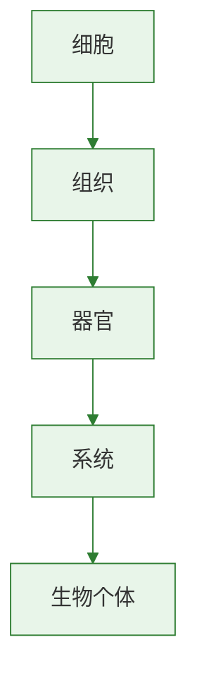

# 开花和结果

## 核心概念

| 术语 | 含义 |
|------|------|
| 花的结构 | 花柄、花托、花萼、花瓣、雄蕊（花药+花丝）、雌蕊（柱头+花柱+子房） |
| 传粉 | 花粉从花药落到雌蕊柱头上的过程 |
| 受精 | 精子与卵细胞结合形成受精卵的过程 |
| 果实 | 由子房发育而来，包括果皮和种子 |

### 花的基本结构

| 部分 | 组成 | 功能 |
|------|------|------|
| 雄蕊 | 花药（含花粉）+ 花丝 | 产生花粉（含精子） |
| 雌蕊 | 柱头 + 花柱 + 子房（含胚珠） | 子房内胚珠含卵细胞 |
| 花瓣 | 组成花冠 | 保护、吸引昆虫 |
| 花萼 | 由萼片组成 | 保护花蕾 |

> 花的主要结构是**雄蕊和雌蕊**（与繁殖直接相关）

### 传粉方式

| 类型 | 特点 | 举例 |
|------|------|------|
| 自花传粉 | 同一朵花的花粉落到自己柱头上 | 小麦、水稻 |
| 异花传粉 | 花粉传到另一朵花的柱头上 | 玉米、苹果 |
| 虫媒花 | 花大色艳有蜜腺，花粉粘 | 桃花、油菜花 |
| 风媒花 | 花小无香，花粉轻而多 | 玉米、杨树 |

### 受精过程

1. 花粉落到柱头上（传粉）
2. 花粉萌发出**花粉管**
3. 花粉管穿过花柱到达子房中的胚珠
4. 花粉管中的**精子**与胚珠中的**卵细胞**结合→受精卵

### 果实和种子的形成

| 花的结构 | 发育成 |
|----------|--------|
| 子房 | 果实 |
| 子房壁 | 果皮 |
| 胚珠 | 种子 |
| 受精卵 | 胚 |

> **背记要点：**
> - 花最重要的结构：雄蕊和雌蕊
> - 子房→果实，胚珠→种子，受精卵→胚
> - 传粉≠受精，传粉在先受精在后

### 自测题

1. 花的主要结构是（ ）A.花萼和花瓣 B.雄蕊和雌蕊 C.花柄和花托 D.花瓣和雄蕊
2. 果实是由花的哪个结构发育而来（ ）A.子房 B.胚珠 C.花药 D.柱头
3. 下列属于虫媒花特征的是（ ）A.花小无香 B.花粉轻而量大 C.花大色艳有蜜腺 D.没有花瓣
4. 受精卵将发育成种子的（ ）A.种皮 B.胚 C.胚乳 D.子叶

[[第一节 种子的萌发]] | [[第二节 植株的生长]] | [[第一节 水的利用与散失]]

### 生物过程与层级图

