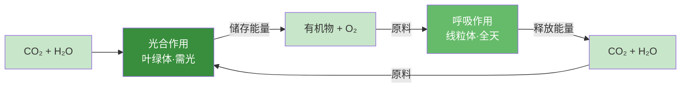

# 光合作用

## 核心概念

| 术语 | 含义 |
|------|------|
| 光合作用 | 绿色植物利用光能，在叶绿体中把二氧化碳和水合成有机物并释放氧气 |
| 叶绿体 | 光合作用的场所，含叶绿素 |
| 淀粉 | 光合作用的主要产物之一 |

### 光合作用的发现史

| 科学家 | 实验 | 结论 |
|--------|------|------|
| 海尔蒙特 | 柳树实验（只浇水5年） | 植物生长需要水 |
| 普利斯特利 | 密封钟罩+小鼠+植物 | 植物能更新空气（释放氧气） |
| 萨克斯 | 暗处理→半遮光→碘液 | 光合作用产生淀粉，光是必要条件 |

### 光合作用公式

$$二氧化碳 + 水 \xrightarrow{光能（叶绿体）} 有机物(淀粉) + 氧气$$

- **原料：** 二氧化碳、水
- **产物：** 有机物（淀粉）、氧气
- **条件：** 光能
- **场所：** 叶绿体

<svg viewBox="0 0 620 200" xmlns="http://www.w3.org/2000/svg" style="max-width:100%;font-family:sans-serif">
  <rect width="620" height="200" fill="#f1f8e9" rx="10"/>
  <text x="310" y="26" text-anchor="middle" font-size="14" font-weight="bold" fill="#1b5e20">光合作用过程示意图</text>
  <!-- 叶绿体 -->
  <ellipse cx="310" cy="115" rx="90" ry="60" fill="#a5d6a7" stroke="#388e3c" stroke-width="3"/>
  <text x="310" y="108" text-anchor="middle" font-size="13" font-weight="bold" fill="#1b5e20">叶绿体</text>
  <text x="310" y="126" text-anchor="middle" font-size="11" fill="#2e7d32">（光合作用场所）</text>
  <!-- 光能箭头 -->
  <line x1="310" y1="55" x2="310" y2="40" stroke="#f9a825" stroke-width="2" marker-end="url(#sun)"/>
  <text x="310" y="36" text-anchor="middle" font-size="11" fill="#f57f17">光能</text>
  <!-- 原料输入 -->
  <text x="80" y="90" text-anchor="middle" font-size="12" fill="#1565c0">CO₂</text>
  <text x="80" y="108" text-anchor="middle" font-size="12" fill="#1565c0">（气孔进入）</text>
  <line x1="130" y1="100" x2="218" y2="108" stroke="#1565c0" stroke-width="1.5" marker-end="url(#blu)"/>
  <text x="80" y="140" text-anchor="middle" font-size="12" fill="#0277bd">H₂O</text>
  <text x="80" y="158" text-anchor="middle" font-size="12" fill="#0277bd">（根吸收）</text>
  <line x1="130" y1="148" x2="218" y2="128" stroke="#0277bd" stroke-width="1.5" marker-end="url(#blu)"/>
  <!-- 产物输出 -->
  <text x="530" y="90" text-anchor="middle" font-size="12" fill="#388e3c">有机物</text>
  <text x="530" y="108" text-anchor="middle" font-size="12" fill="#388e3c">（淀粉）</text>
  <line x1="400" y1="108" x2="480" y2="100" stroke="#388e3c" stroke-width="1.5" marker-end="url(#grn)"/>
  <text x="530" y="140" text-anchor="middle" font-size="12" fill="#43a047">O₂</text>
  <text x="530" y="158" text-anchor="middle" font-size="12" fill="#43a047">（气孔散出）</text>
  <line x1="400" y1="122" x2="480" y2="140" stroke="#43a047" stroke-width="1.5" marker-end="url(#grn)"/>
  <defs>
    <marker id="sun" markerWidth="8" markerHeight="8" refX="6" refY="3" orient="auto"><path d="M0,0 L0,6 L8,3 z" fill="#f9a825"/></marker>
    <marker id="blu" markerWidth="8" markerHeight="8" refX="6" refY="3" orient="auto"><path d="M0,0 L0,6 L8,3 z" fill="#1565c0"/></marker>
    <marker id="grn" markerWidth="8" markerHeight="8" refX="6" refY="3" orient="auto"><path d="M0,0 L0,6 L8,3 z" fill="#388e3c"/></marker>
  </defs>
</svg>

### 实验：检验光合作用产生淀粉

1. **暗处理**：将植物放在黑暗处一昼夜（消耗原有淀粉）
2. **部分遮光**：用黑纸片夹住叶片一部分
3. **光照**数小时后摘下叶片
4. **酒精脱色**：隔水加热，叶绿素溶于酒精，叶片变黄白
5. **碘液检验**：遮光部分不变蓝（无淀粉），见光部分变蓝（有淀粉）

### 光合作用与呼吸作用对比

| 项目 | 光合作用 | 呼吸作用 |
|------|----------|----------|
| 场所 | 叶绿体 | 所有活细胞（主要线粒体） |
| 条件 | 需要光 | 有光无光都能进行 |
| 原料 | CO₂和水 | 有机物和O₂ |
| 产物 | 有机物和O₂ | CO₂和水 |
| 能量 | 储存能量 | 释放能量 |

> **背记要点：**
> - 光合作用场所叶绿体，条件光，原料CO₂+水，产物有机物+O₂
> - 萨克斯实验关键步骤：暗处理→遮光→脱色→碘液
> - 光合作用储能，呼吸作用释能，二者相互依存

### 自测题

1. 光合作用的场所是（ ）A.线粒体 B.叶绿体 C.细胞核 D.液泡
2. 萨克斯实验中暗处理的目的是（ ）A.消耗叶片中的水分 B.消耗叶片中原有的淀粉 C.使叶片变黄 D.促进光合作用
3. 光合作用的原料是（ ）A.有机物和氧气 B.二氧化碳和水 C.淀粉和氧气 D.水和氧气
4. 下列关于光合作用和呼吸作用的叙述正确的是（ ）A.都在叶绿体中进行 B.都需要光 C.光合作用储能呼吸作用释能 D.都产生氧气

[[第一节 水的利用与散失]] | [[第三节 呼吸作用]]
