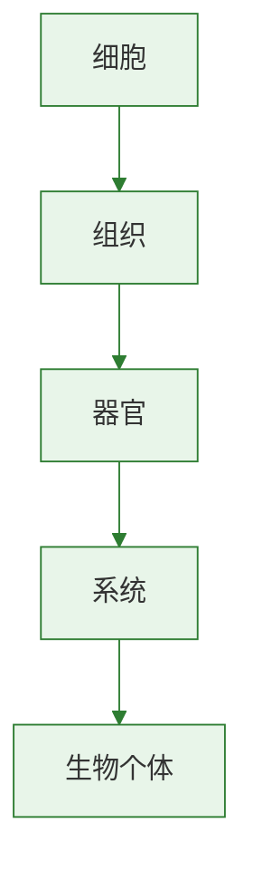

# 呼吸作用

## 核心概念

| 术语 | 含义 |
|------|------|
| 呼吸作用 | 细胞利用氧气分解有机物为CO₂和水，释放能量的过程 |
| 线粒体 | 呼吸作用的主要场所 |
| 有氧呼吸 | 在氧气参与下彻底分解有机物 |

### 呼吸作用公式

$$有机物(淀粉等) + 氧气 \rightarrow 二氧化碳 + 水 + 能量$$

- **场所：** 所有活细胞的线粒体
- **条件：** 有光无光均可进行，全天候
- **实质：** 分解有机物，释放能量

### 呼吸作用的实验验证

**实验一：产生CO₂**
- 将萌发的种子放入保温瓶，导管连接澄清石灰水
- 石灰水变浑浊→证明产生了CO₂

**实验二：消耗O₂**
- 甲瓶（萌发种子）乙瓶（煮熟种子），密封一段时间
- 甲瓶中燃烧的蜡烛熄灭→说明O₂被消耗

**实验三：释放热量**
- 对比萌发种子与煮熟种子的温度变化
- 萌发种子温度升高→证明释放热量

### 呼吸作用的意义

1. 为生命活动提供**能量**
2. 为其他有机物的合成提供**原料**

### 呼吸作用在生产中的应用

| 场景 | 措施 | 原理 |
|------|------|------|
| 粮食储存 | 低温、干燥、低氧 | 降低呼吸强度，减少有机物消耗 |
| 果蔬保鲜 | 低温、气调包装 | 抑制呼吸，延缓衰老 |
| 松土 | 翻耕土壤 | 促进根的呼吸，有利于吸收 |
| 栽花 | 花盆底部有孔 | 保证根部氧气供应 |

> **背记要点：**
> - 呼吸作用全天进行（不需光），场所线粒体
> - 分解有机物释放能量（与光合作用相反）
> - 保存粮食要低温干燥低氧（抑制呼吸）

### 自测题

1. 呼吸作用的主要场所是（ ）A.叶绿体 B.线粒体 C.细胞核 D.液泡
2. 粮食储存时要保持干燥低温是为了（ ）A.促进光合作用 B.抑制呼吸作用 C.加速呼吸作用 D.促进蒸腾作用
3. 呼吸作用的实质是（ ）A.合成有机物储存能量 B.分解有机物释放能量 C.吸收氧气呼出二氧化碳 D.吸收水分排出废物
4. 下列哪项不能用呼吸作用的原理解释（ ）A.松土促根生长 B.低温保存水果 C.叶片遮光变黄 D.花盆底部留孔

[[第二节 光合作用]] | [[第四节 植物在自然界中的作用]]

### 生物过程与层级图

