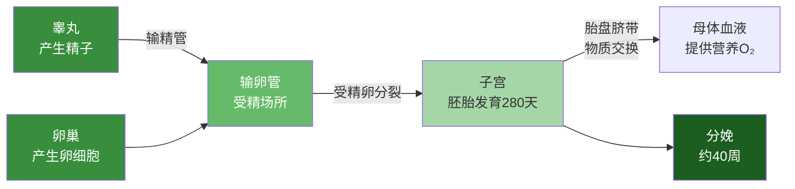

# 人体发育·重点梳理

## 知识框架

| 主题 | 核心内容 |
|------|----------|
| 生殖系统 | 男：睾丸产精子；女：卵巢产卵细胞 |
| 受精发育 | 输卵管受精→子宫发育→胎盘交换→约40周分娩 |
| 青春期 | 身高突增、第二性征、心理变化 |

### 重点一：生殖过程的关键场所

| 过程 | 场所 |
|------|------|
| 产生精子 | 睾丸 |
| 产生卵细胞 | 卵巢 |
| 受精 | 输卵管 |
| 胚胎发育 | 子宫 |
| 物质交换 | 胎盘 |



### 重点二：胚胎发育时间线

```
受精卵(输卵管) → 细胞分裂 → 植入子宫(约1周)
→ 胚胎期(2-8周，器官形成) → 胎儿期(9周-出生)
→ 分娩(约40周/280天)
```

### 重点三：青春期发育变化汇总

| 类别 | 变化 | 原因 |
|------|------|------|
| 身体形态 | 身高体重突增 | 生长激素+性激素协同 |
| 生殖发育 | 器官发育成熟 | 性激素分泌增多 |
| 第二性征 | 男女外貌差异显现 | 雄/雌性激素 |
| 心理变化 | 独立意识、情绪波动 | 神经系统发育+激素变化 |

### 易错辨析

| 易错点 | 正确理解 |
|--------|----------|
| 受精在子宫 | ✗ 受精在输卵管 |
| 胎儿直接用母体的血 | ✗ 通过胎盘交换，血液不直接相通 |
| 青春期=叛逆期 | ✗ 青春期心理变化是正常的 |
| 第二性征=生殖器官发育 | ✗ 第二性征是生殖器官以外的差异 |

> **背记口诀：**
> - "睾精卵卵管受精，子宫发育盘交换"
> - 青春期：高突增、征二性、心理正常莫紧张

### 综合自测

1. 受精卵形成到植入子宫大约需要（ ）A.1天 B.1周 C.1月 D.3月
2. 下列哪项属于第二性征（ ）A.卵巢发育 B.睾丸产生精子 C.男性长胡须 D.子宫增大
3. 青春期身高突增主要与什么有关（ ）A.营养充足 B.生长激素和性激素 C.运动量大 D.睡眠充足
4. 胎儿获得氧气的途径是（ ）A.自己呼吸 B.通过胎盘从母体获取 C.通过子宫壁 D.通过脐带直接吸入
5. 下列关于青春期说法错误的是（ ）A.身高突增是突出特征 B.第二性征开始出现 C.不需要加强营养 D.心理变化是正常的

[[第一节 人的生殖]] | [[第二节 青春期]] | [[第一节 食物中的营养物质]]
