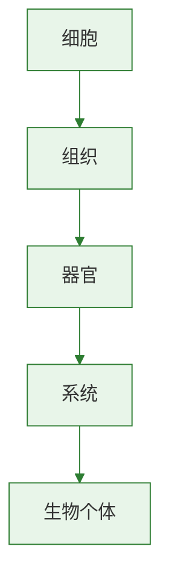

# 消化和吸收

## 核心概念

| 术语 | 含义 |
|------|------|
| 消化 | 食物中的大分子有机物分解为小分子的过程 |
| 吸收 | 营养物质通过消化道壁进入血液的过程 |
| 消化酶 | 促进食物消化的生物催化剂 |
| 小肠 | 消化和吸收的主要场所 |

### 消化系统的组成

**消化道：** 口腔→咽→食道→胃→小肠→大肠→肛门
**消化腺：** 唾液腺、胃腺、肝脏、胰腺、肠腺

| 消化腺 | 分泌物 | 作用 |
|--------|--------|------|
| 唾液腺 | 唾液（含唾液淀粉酶） | 初步消化淀粉 |
| 胃腺 | 胃液（含胃蛋白酶） | 初步消化蛋白质 |
| 肝脏 | 胆汁（不含酶） | 乳化脂肪 |
| 胰腺 | 胰液（含多种酶） | 消化糖类、蛋白质、脂肪 |
| 肠腺 | 肠液（含多种酶） | 消化糖类、蛋白质、脂肪 |

### 三大营养物质的消化过程

| 物质 | 开始消化部位 | 最终产物 |
|------|------------|----------|
| 淀粉 | 口腔（唾液淀粉酶） | 葡萄糖 |
| 蛋白质 | 胃（胃蛋白酶） | 氨基酸 |
| 脂肪 | 小肠（胆汁乳化+脂肪酶） | 甘油和脂肪酸 |

### 小肠是消化吸收的主要场所

小肠适于消化吸收的结构特点：
1. **长**——约5-6米
2. **内壁有环形皱襞和小肠绒毛**——增大表面积
3. **绒毛壁薄**——仅一层上皮细胞
4. **绒毛内有丰富毛细血管**——便于吸收运输
5. **有多种消化液**——肠液、胰液、胆汁

### 实验：唾液对淀粉的消化作用

| 试管 | 内容物 | 处理 | 加碘液结果 |
|------|--------|------|-----------|
| 1号 | 淀粉糊+唾液 | 37°C水浴10分钟 | 不变蓝 |
| 2号 | 淀粉糊+清水 | 37°C水浴10分钟 | 变蓝 |

> **背记要点：**
> - 淀粉→口腔开始→葡萄糖；蛋白质→胃开始→氨基酸；脂肪→小肠开始→甘油+脂肪酸
> - 肝脏分泌胆汁（无酶），乳化脂肪
> - 小肠是消化吸收主要场所（长+绒毛+壁薄+血管丰富）

### 自测题

1. 淀粉开始被消化的部位是（ ）A.口腔 B.胃 C.小肠 D.大肠
2. 下列消化液中不含消化酶的是（ ）A.唾液 B.胃液 C.胆汁 D.肠液
3. 蛋白质最终被消化为（ ）A.葡萄糖 B.氨基酸 C.甘油 D.脂肪酸
4. 小肠是消化吸收主要场所的原因不包括（ ）A.长约5-6米 B.有绒毛增大面积 C.能蠕动搅拌食物 D.有大量细菌分解食物

[[第一节 食物中的营养物质]] | [[第三节 合理营养与食品安全]]

### 生物过程与层级图

