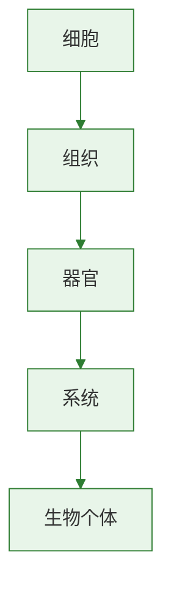

# 合理营养与食品安全

## 核心概念

| 术语 | 含义 |
|------|------|
| 合理营养 | 全面摄入各种营养素，比例适当 |
| 平衡膳食 | 食物多样、荤素搭配、粗细搭配 |
| 食品安全 | 食物无毒无害，符合营养要求 |

### 合理营养的原则

| 原则 | 说明 |
|------|------|
| 食物多样 | 每天至少12种，每周25种以上 |
| 荤素搭配 | 动物性和植物性食物合理比例 |
| 粗细搭配 | 粗粮与精粮交替食用 |
| 三餐合理 | 早餐30%、午餐40%、晚餐30% |
| 不偏食不挑食 | 保证营养全面均衡 |

### 中国居民平衡膳食宝塔

| 层级（从底到顶） | 食物类别 | 每日推荐量 |
|-----------------|----------|-----------|
| 第一层（底） | 谷薯类 | 250-400g |
| 第二层 | 蔬菜水果 | 300-500g+200-350g |
| 第三层 | 畜禽鱼蛋 | 120-200g |
| 第四层 | 奶及奶制品、大豆 | 300g+25g |
| 第五层（顶） | 油盐 | 油25-30g、盐<6g |

> 底层吃得多，顶层吃得少

### 食品安全常识

| 方面 | 注意事项 |
|------|----------|
| 购买 | 查看生产日期和保质期，注意包装是否完好 |
| 保存 | 生熟分开，冰箱保存有时限 |
| 加工 | 蔬果要清洗，肉类要煮熟 |
| 辨别 | 不吃发霉变质食物，警惕添加剂过多 |

### 关注食品添加剂

- 防腐剂：延长保质期（如苯甲酸钠）
- 色素：改善食物颜色
- 甜味剂：增加甜味
- 原则：合法使用是安全的，但要适量

### 绿色食品标志

- 绿色食品：安全、优质、营养
- 标志：绿色圆形，象征保护和安全
- 分为A级（限量使用化学物质）和AA级（不使用化学物质）

> **背记要点：**
> - 膳食宝塔：谷薯最多，油盐最少
> - 三餐比例：3:4:3
> - 食品安全：查日期、生熟分开、煮熟吃

### 自测题

1. 一日三餐中热量摄入比例最大的应是（ ）A.早餐 B.午餐 C.晚餐 D.三餐相同
2. 平衡膳食宝塔中摄入量最多的应是（ ）A.蔬菜水果 B.谷薯类 C.奶制品 D.鱼肉蛋
3. 下列做法有利于食品安全的是（ ）A.用工业色素给食物染色 B.大量使用防腐剂 C.购买食品时查看保质期 D.路边摊买散装食品
4. 绿色食品标志表示该食品（ ）A.颜色是绿色 B.只含蔬菜 C.安全优质营养 D.没有任何添加剂

[[第一节 食物中的营养物质]] | [[第二节 消化和吸收]]

### 生物过程与层级图

