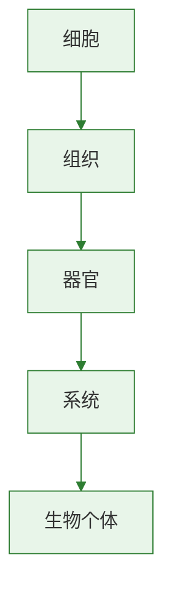

# 发生在肺内的气体交换

## 核心概念

| 术语 | 含义 |
|------|------|
| 肺泡 | 肺的基本功能单位，气体交换的场所 |
| 气体交换 | O₂和CO₂在肺泡与血液之间的扩散 |
| 膈肌 | 胸腔底部的肌肉，参与呼吸运动 |
| 肋间肌 | 肋骨间的肌肉，参与呼吸运动 |

### 呼吸运动（肺的通气）

| 过程 | 膈肌 | 肋间肌 | 胸廓 | 肺 | 气流 |
|------|------|--------|------|------|------|
| 吸气 | 收缩下降 | 收缩 | 扩大 | 扩张 | 外界→肺 |
| 呼气 | 舒张上升 | 舒张 | 缩小 | 回缩 | 肺→外界 |

> 呼吸运动的实质：**肋间肌和膈肌的收缩与舒张**引起胸廓容积变化→肺被动扩张或回缩→气体进出

### 肺泡适于气体交换的结构特点

| 特点 | 作用 |
|------|------|
| 数量极多（约7亿个） | 增大气体交换总面积 |
| 肺泡壁极薄（一层扁平上皮细胞） | 便于气体通过 |
| 外面缠绕丰富毛细血管 | 便于气体与血液交换 |
| 毛细血管壁也极薄 | 气体只需穿过两层细胞 |

### 肺泡内的气体交换

| 方向 | 气体 | 原理 |
|------|------|------|
| 肺泡→血液 | O₂ | O₂浓度：肺泡>血液，扩散进入 |
| 血液→肺泡 | CO₂ | CO₂浓度：血液>肺泡，扩散排出 |

> 气体交换原理：**气体的扩散作用**——从浓度高处向浓度低处扩散

### 组织里的气体交换

| 方向 | 气体 | 原理 |
|------|------|------|
| 血液→组织细胞 | O₂ | O₂浓度：血液>组织 |
| 组织细胞→血液 | CO₂ | CO₂浓度：组织>血液 |

### 实验：验证呼出气体含较多CO₂

- 向澄清石灰水中分别吹入吸入的空气和呼出的气体
- 呼出气使石灰水变浑浊程度更大
- 说明呼出气体中CO₂含量高于吸入气体

> **背记要点：**
> - 吸气：膈肌收缩→胸廓扩大→肺扩张→气进
> - 呼气：膈肌舒张→胸廓缩小→肺回缩→气出
> - 肺泡特点：多、薄、血管丰富
> - 气体交换原理：扩散作用（高浓度→低浓度）

### 自测题

1. 吸气时膈肌的状态是（ ）A.收缩 B.舒张 C.先收缩后舒张 D.不变
2. 肺泡壁由几层细胞构成（ ）A.一层 B.两层 C.三层 D.多层
3. 肺泡内气体交换的原理是（ ）A.呼吸运动 B.气体扩散 C.主动运输 D.渗透作用
4. 呼出的气体与吸入的气体相比（ ）A.O₂增多CO₂减少 B.O₂减少CO₂增多 C.成分不变 D.全是CO₂

[[第一节 呼吸道对空气的处理]] | [[人体的呼吸·重点梳理]]

### 生物过程与层级图

