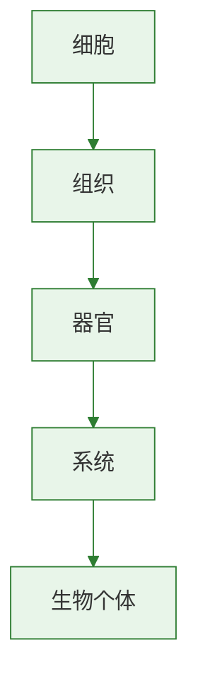

# 人体的呼吸·重点梳理

## 知识框架

| 主题 | 核心内容 |
|------|----------|
| 呼吸道 | 鼻→咽→喉→气管→支气管，清洁温暖湿润空气 |
| 呼吸运动 | 膈肌+肋间肌收缩舒张→胸廓变化→肺通气 |
| 气体交换 | 肺泡处+组织处，原理：气体扩散 |

### 重点一：呼吸全过程

```
外界气体 →(呼吸运动)→ 肺泡
    →(肺泡处气体交换)→ 血液
    →(血液运输)→ 组织细胞
    →(组织处气体交换)→ 细胞利用O₂
```

| 过程 | 实现方式 | 涉及结构 |
|------|----------|----------|
| 肺的通气 | 呼吸运动 | 膈肌、肋间肌、肺 |
| 肺泡内气体交换 | 气体扩散 | 肺泡、毛细血管 |
| 气体在血液中运输 | 血液循环 | 血红蛋白、血管 |
| 组织内气体交换 | 气体扩散 | 毛细血管、组织细胞 |

### 重点二：吸气与呼气对比

| 项目 | 吸气 | 呼气 |
|------|------|------|
| 膈肌 | 收缩、下降 | 舒张、上升 |
| 肋间肌 | 收缩 | 舒张 |
| 肋骨 | 上提外展 | 下降内收 |
| 胸廓 | 扩大 | 缩小 |
| 肺内气压 | 低于外界 | 高于外界 |
| 气流方向 | 外界→肺 | 肺→外界 |

### 重点三：两处气体交换对比

| 项目 | 肺泡处 | 组织处 |
|------|--------|--------|
| O₂方向 | 肺泡→血液 | 血液→组织 |
| CO₂方向 | 血液→肺泡 | 组织→血液 |
| 血液变化 | 静脉血→动脉血 | 动脉血→静脉血 |

### 易错辨析

| 易错点 | 正确理解 |
|--------|----------|
| 呼吸运动是肺主动扩缩 | ✗ 是膈肌肋间肌收缩带动胸廓变化，肺被动扩缩 |
| 吸气时膈肌舒张 | ✗ 吸气时膈肌收缩下降 |
| 气体交换靠主动运输 | ✗ 靠气体扩散（从高浓度到低浓度） |

> **背记口诀：**
> - 吸气：肌缩廓大肺扩气进
> - 呼气：肌舒廓小肺缩气出
> - 扩散方向：高→低，不耗能

### 综合自测

1. 呼吸全过程包括几个环节（ ）A.2个 B.3个 C.4个 D.5个
2. 血液流经肺泡周围毛细血管后变为（ ）A.静脉血 B.动脉血 C.不变 D.混合血
3. 下列哪个过程不属于呼吸（ ）A.肺的通气 B.肺泡内气体交换 C.食物消化 D.组织内气体交换
4. 平静呼吸时吸气过程中肋骨运动方向是（ ）A.上提外展 B.下降内收 C.不动 D.先升后降
5. 组织细胞处气体交换后血液中（ ）A.O₂增多 B.CO₂增多 C.O₂和CO₂都增多 D.成分不变

[[第一节 呼吸道对空气的处理]] | [[第二节 发生在肺内的气体交换]] | [[第一节 流动的组织——血液]]


### 生物过程与层级图


