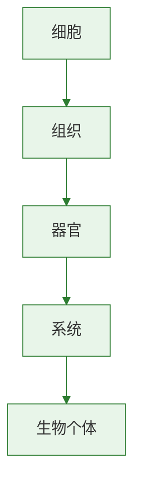

# 血流的管道——血管

## 核心概念

| 血管类型 | 功能 |
|----------|------|
| 动脉 | 将血液从心脏输送到全身 |
| 静脉 | 将血液从全身送回心脏 |
| 毛细血管 | 连接最小动脉和静脉，进行物质交换 |

### 三种血管的比较

| 特征 | 动脉 | 毛细血管 | 静脉 |
|------|------|----------|------|
| 管壁 | 厚，弹性大 | 极薄，一层上皮细胞 | 较薄，弹性小 |
| 管腔 | 较小 | 极小（仅红细胞单行通过） | 较大 |
| 血流速度 | 快 | 最慢 | 慢 |
| 血流方向 | 心脏→全身 | 动脉→静脉 | 全身→心脏 |
| 瓣膜 | 无 | 无 | 有（防止血液倒流） |

### 毛细血管——物质交换的场所

毛细血管适于物质交换的特点：
1. **分布广**——遍布全身各组织
2. **管壁极薄**——仅一层上皮细胞
3. **管腔极小**——红细胞单行通过
4. **血流速度最慢**——充分交换

### 观察小鱼尾鳍血液流动

实验要点：
- 用湿棉花包裹小鱼（保持湿润和呼吸）
- 低倍镜观察尾鳍毛细血管
- **识别三种血管：**
  - 动脉：血流由粗→细分支
  - 静脉：血流由细汇合→粗
  - 毛细血管：红细胞单行通过，血流最慢

### 静脉瓣的作用

- 位于四肢静脉内
- 作用：**防止血液倒流**，保证血液向心脏方向流动
- 原理：单向阀门，只允许血液朝一个方向通过

### 出血的初步判断

| 血管类型 | 出血特点 | 处理方式 |
|----------|----------|----------|
| 动脉出血 | 鲜红色，喷射状 | 近心端压迫止血 |
| 静脉出血 | 暗红色，缓慢流出 | 远心端压迫止血 |
| 毛细血管出血 | 少量渗出 | 消毒后贴创可贴 |

> **背记要点：**
> - 动脉壁厚弹性大流速快；静脉壁薄有瓣膜；毛细血管壁最薄一层细胞
> - 毛细血管：壁薄、腔小、流慢、分布广——利于物质交换
> - 动脉出血近心端止血，静脉出血远心端止血

### 自测题

1. 毛细血管的管壁由几层细胞构成（ ）A.一层 B.两层 C.三层 D.多层
2. 静脉瓣的作用是（ ）A.加速血流 B.防止血液倒流 C.过滤血液 D.调节血压
3. 动脉出血的特点是（ ）A.暗红缓流 B.少量渗出 C.鲜红喷射 D.不出血
4. 观察小鱼尾鳍血管时，红细胞单行通过的是（ ）A.动脉 B.静脉 C.毛细血管 D.淋巴管

[[第一节 流动的组织——血液]] | [[第三节 输送血液的泵——心脏]]

### 生物过程与层级图

