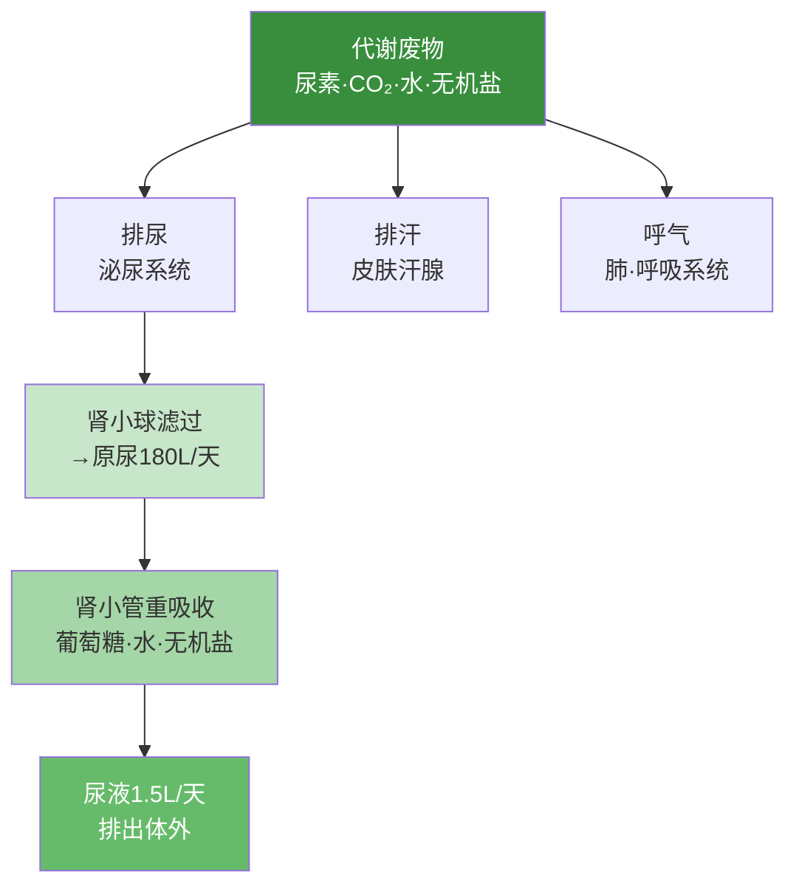

# 人体内废物的排出·综合练习

## 知识回顾

| 关键概念 | 要点 |
|----------|------|
| 排泄 | 代谢废物排出体外（排便不算） |
| 泌尿系统 | 肾脏→输尿管→膀胱→尿道 |
| 尿液形成 | 肾小球滤过→肾小管重吸收 |
| 排泄途径 | 排尿、排汗、呼气 |

### 典型考题精练

**一、选择题**

1. 形成尿液的器官是（ ）
A.膀胱 B.肾脏 C.输尿管 D.尿道

2. 正常情况下，原尿中有而尿液中没有的物质是（ ）
A.水 B.无机盐 C.葡萄糖 D.尿素

3. 血液流经肾脏后，下列物质明显减少的是（ ）
A.二氧化碳 B.氧气 C.尿素 D.葡萄糖

4. 下列哪项属于排泄（ ）
A.排出粪便 B.排出尿液 C.呕吐 D.吐痰

5. 某患者尿液中检出大量蛋白质和血细胞，最可能发生病变的结构是（ ）
A.肾小囊 B.肾小管 C.肾小球 D.输尿管

6. 人体每天形成原尿约180L，而排出尿液约1.5L，这是因为（ ）
A.肾小球的滤过作用 B.肾小管的重吸收作用
C.膀胱的储尿作用 D.输尿管的输送作用

7. 下列哪种物质不能透过肾小球滤过到肾小囊中（ ）
A.水 B.葡萄糖 C.蛋白质 D.无机盐

8. 与入球小动脉中血液相比，肾静脉中血液的特点是（ ）
A.尿素减少，氧气减少 B.尿素增多，氧气减少
C.尿素减少，氧气增多 D.尿素增多，氧气增多

**二、判断改错**

1. 排便是排泄的一种方式。（ ）
   改正：排便不是排泄，因为粪便中的食物残渣未参与细胞代谢。

2. 肾小管能重吸收原尿中的全部物质。（ ）
   改正：肾小管只重吸收全部葡萄糖、大部分水和部分无机盐，尿素等废物不被重吸收。

3. 尿液的形成是连续的，排尿也是连续的。（ ）
   改正：尿液形成是连续的，但排尿是间歇的（尿液先储存在膀胱中）。

**三、综合分析**

下表是某健康人血浆、原尿和尿液的部分成分含量（g/100mL）：

| 成分 | 血浆 | 原尿 | 尿液 |
|------|------|------|------|
| 蛋白质 | 7.5 | 0 | 0 |
| 葡萄糖 | 0.1 | 0.1 | 0 |
| 尿素 | 0.03 | 0.03 | 1.8 |
| 无机盐 | 0.72 | 0.72 | 1.1 |

分析：
1. 原尿中无蛋白质→说明蛋白质不能通过肾小球滤过
2. 尿液中无葡萄糖→说明肾小管全部重吸收了葡萄糖
3. 尿液中尿素浓度远高于原尿→水被大量重吸收，尿素被浓缩

> **答题技巧：**
> - 看到"排泄"先排除排便
> - 看到"原尿有、尿液无"想到重吸收
> - 看到"尿中出现蛋白质/血细胞"想到肾小球病变
> - 看到"尿中出现葡萄糖"想到肾小管重吸收障碍或血糖过高

### 选择题答案

1.B 2.C 3.C 4.B 5.C 6.B 7.C 8.A

[[人体内废物的排出·重点梳理]] | [[第三节 输送血液的泵——心脏]]
