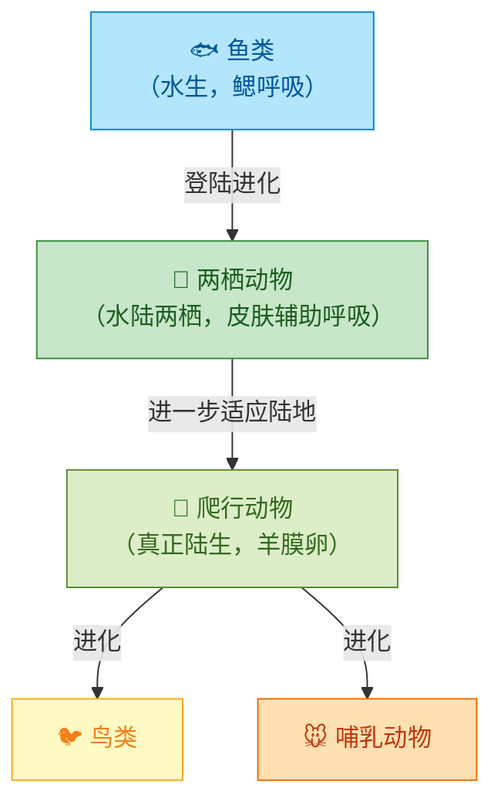

# 两栖动物和爬行动物

## 概念表

| 概念 | 含义 | 代表动物 |
|---|---|---|
| 两栖动物 | 幼体生活在水中，用鳃呼吸；成体水陆两栖，用肺呼吸，皮肤辅助呼吸 | 青蛙、蟾蜍、大鲵、蝾螈 |
| 爬行动物 | 体表有鳞片或甲，用肺呼吸，在陆地产卵，卵有坚韧外壳 | 蜥蜴、蛇、龟、鳄鱼 |
| 变态发育 | 幼体与成体形态差异很大，经历明显变化的发育方式 | 青蛙：蝌蚪→幼蛙→成蛙 |
| 羊膜卵 | 爬行动物的卵，有坚韧外壳和羊膜，能防止水分散失 | 蜥蜴卵、蛇卵 |

## 知识梳理

两栖动物是从水生到陆生的过渡类群。青蛙幼体（蝌蚪）生活在水中，用鳃呼吸，有尾无四肢；成体水陆两栖，用肺呼吸，皮肤辅助呼吸（皮肤必须保持湿润）。两栖动物的生殖和发育仍离不开水，这限制了其向陆地的进一步扩展。

爬行动物是真正的陆生脊椎动物。体表有鳞片或甲，能防止水分散失；用肺呼吸，肺比两栖动物发达；在陆地产卵，卵有坚韧外壳（羊膜卵），不需要水就能完成发育。爬行动物是变温动物（冷血动物），体温随环境温度变化。

## 两栖动物与爬行动物演化关系图

## 青蛙变态发育过程

<svg viewBox="0 0 680 200" xmlns="http://www.w3.org/2000/svg" style="max-width:100%;font-family:sans-serif">
  <rect width="680" height="200" fill="#f1f8e9" rx="10"/>
  <text x="340" y="25" text-anchor="middle" font-size="15" font-weight="bold" fill="#1b5e20">青蛙的变态发育过程</text>

  <!-- 阶段1：卵 -->
  <circle cx="60" cy="110" r="25" fill="#e8f5e9" stroke="#388e3c" stroke-width="2"/>
  <circle cx="55" cy="105" r="5" fill="#1b5e20" opacity="0.6"/>
  <circle cx="65" cy="115" r="5" fill="#1b5e20" opacity="0.6"/>
  <circle cx="60" cy="108" r="4" fill="#1b5e20" opacity="0.6"/>
  <text x="60" y="148" text-anchor="middle" font-size="12" fill="#1b5e20" font-weight="bold">受精卵</text>
  <text x="60" y="163" text-anchor="middle" font-size="10" fill="#555">（水中）</text>

  <!-- 箭头 -->
  <polygon points="100,110 118,103 118,117" fill="#388e3c"/>
  <line x1="85" y1="110" x2="118" y2="110" stroke="#388e3c" stroke-width="2"/>

  <!-- 阶段2：蝌蚪 -->
  <ellipse cx="165" cy="110" rx="22" ry="14" fill="#80cbc4" stroke="#00796b" stroke-width="2"/>
  <path d="M187,110 Q210,95 215,110 Q210,125 187,110" fill="#4db6ac" stroke="#00796b" stroke-width="1.5"/>
  <circle cx="155" cy="106" r="4" fill="#1b5e20"/>
  <text x="165" y="148" text-anchor="middle" font-size="12" fill="#1b5e20" font-weight="bold">蝌蚪</text>
  <text x="165" y="163" text-anchor="middle" font-size="10" fill="#555">（水中，鳃呼吸）</text>

  <!-- 箭头 -->
  <polygon points="220,110 238,103 238,117" fill="#388e3c"/>
  <line x1="215" y1="110" x2="238" y2="110" stroke="#388e3c" stroke-width="2"/>

  <!-- 阶段3：长出后肢 -->
  <ellipse cx="285" cy="110" rx="22" ry="14" fill="#80cbc4" stroke="#00796b" stroke-width="2"/>
  <path d="M307,110 Q325,98 328,110 Q325,122 307,110" fill="#4db6ac" stroke="#00796b" stroke-width="1.5"/>
  <circle cx="275" cy="106" r="4" fill="#1b5e20"/>
  <!-- 后肢 -->
  <line x1="278" y1="122" x2="265" y2="140" stroke="#00796b" stroke-width="2"/>
  <line x1="292" y1="123" x2="295" y2="142" stroke="#00796b" stroke-width="2"/>
  <text x="285" y="155" text-anchor="middle" font-size="12" fill="#1b5e20" font-weight="bold">长出后肢</text>

  <!-- 箭头 -->
  <polygon points="340,110 358,103 358,117" fill="#388e3c"/>
  <line x1="328" y1="110" x2="358" y2="110" stroke="#388e3c" stroke-width="2"/>

  <!-- 阶段4：幼蛙 -->
  <ellipse cx="405" cy="108" rx="20" ry="16" fill="#66bb6a" stroke="#388e3c" stroke-width="2"/>
  <circle cx="396" cy="100" r="5" fill="#1b5e20"/>
  <!-- 四肢 -->
  <line x1="388" y1="118" x2="372" y2="135" stroke="#388e3c" stroke-width="2"/>
  <line x1="422" y1="118" x2="438" y2="135" stroke="#388e3c" stroke-width="2"/>
  <line x1="390" y1="122" x2="375" y2="140" stroke="#388e3c" stroke-width="2"/>
  <line x1="420" y1="122" x2="435" y2="140" stroke="#388e3c" stroke-width="2"/>
  <!-- 短尾 -->
  <path d="M425,108 Q440,105 442,110" fill="none" stroke="#388e3c" stroke-width="1.5"/>
  <text x="405" y="155" text-anchor="middle" font-size="12" fill="#1b5e20" font-weight="bold">幼蛙</text>
  <text x="405" y="170" text-anchor="middle" font-size="10" fill="#555">（尾渐消失）</text>

  <!-- 箭头 -->
  <polygon points="458,110 476,103 476,117" fill="#388e3c"/>
  <line x1="445" y1="110" x2="476" y2="110" stroke="#388e3c" stroke-width="2"/>

  <!-- 阶段5：成蛙 -->
  <ellipse cx="530" cy="105" rx="25" ry="20" fill="#43a047" stroke="#1b5e20" stroke-width="2.5"/>
  <circle cx="518" cy="95" r="7" fill="#1b5e20"/>
  <circle cx="542" cy="95" r="7" fill="#1b5e20"/>
  <!-- 四肢 -->
  <line x1="510" y1="120" x2="490" y2="145" stroke="#1b5e20" stroke-width="2.5"/>
  <line x1="550" y1="120" x2="570" y2="145" stroke="#1b5e20" stroke-width="2.5"/>
  <line x1="515" y1="123" x2="495" y2="150" stroke="#1b5e20" stroke-width="2.5"/>
  <line x1="545" y1="123" x2="565" y2="150" stroke="#1b5e20" stroke-width="2.5"/>
  <text x="530" y="165" text-anchor="middle" font-size="12" fill="#1b5e20" font-weight="bold">成蛙</text>
  <text x="530" y="180" text-anchor="middle" font-size="10" fill="#555">（肺+皮肤呼吸）</text>
</svg>

## 实验要点

"观察蛙的发育"实验：收集青蛙卵，在水槽中观察蝌蚪的孵化和发育过程，记录蝌蚪长出后肢、前肢，尾部消失的时间，理解变态发育的概念。

"比较蜥蜴和青蛙的皮肤"实验：观察蜥蜴（干燥、有鳞片）和青蛙（湿润、无鳞片）的皮肤，理解两者对陆地环境适应程度的差异。

## 对比表格

| 比较项 | 两栖动物（青蛙） | 爬行动物（蜥蜴） |
|---|---|---|
| 体表 | 湿润皮肤，无鳞片 | 干燥鳞片或甲 |
| 呼吸 | 肺+皮肤辅助呼吸 | 肺呼吸（肺较发达） |
| 生殖 | 水中产卵，体外受精 | 陆地产卵（羊膜卵），体内受精 |
| 发育 | 变态发育 | 直接发育 |
| 体温 | 变温 | 变温 |
| 与水的关系 | 生殖发育离不开水 | 完全脱离水 |

## 背记要点

- 两栖动物：幼体水中鳃呼吸，成体肺+皮肤呼吸，代表动物青蛙、蟾蜍、大鲵。
- 爬行动物：体表有鳞片，肺呼吸，陆地产羊膜卵，代表动物蜥蜴、蛇、龟、鳄鱼。
- 两栖动物是从水生到陆生的过渡类群，但生殖发育仍依赖水。
- 爬行动物是真正的陆生脊椎动物，羊膜卵是关键适应。
- 大鲵（娃娃鱼）是现存最大的两栖动物，是国家二级保护动物。

## 自测题

1. 两栖动物和爬行动物各有哪些主要特征？
2. 青蛙的发育经历哪些阶段？属于什么发育方式？
3. 为什么说爬行动物比两栖动物更适应陆地生活？
4. 蛇和蚯蚓都没有四肢，它们属于同一类动物吗？为什么？

相关知识点：[[第四节 鱼的运动和呼吸]]、[[第二节 鸟]]、[[第三节 哺乳动物]]、[[第四节 动物的进化]]
