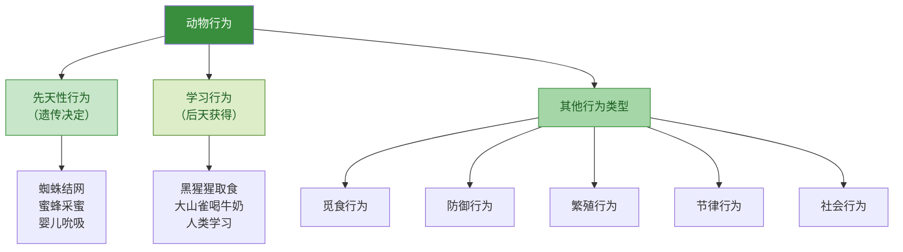

# 动物的行为

## 概念表

| 概念 | 含义 | 举例 |
|---|---|---|
| 先天性行为 | 生来就有，由遗传因素决定，不需要学习 | 蜘蛛结网、蜜蜂采蜜、鸟类迁徙 |
| 学习行为 | 后天通过学习获得，受环境影响 | 黑猩猩用树枝取食白蚁、大山雀喝牛奶 |
| 趋性 | 动物对刺激的定向运动反应 | 趋光性（飞蛾扑火）、趋化性 |
| 节律行为 | 与环境周期性变化相适应的行为 | 候鸟迁徙、昼夜节律 |
| 防御行为 | 保护自身、防御天敌的行为 | 乌贼喷墨、负鼠装死 |

## 知识梳理

动物的行为是动物对外界刺激和内部刺激所做出的有规律的反应。根据行为的获得方式，可分为先天性行为和学习行为。

先天性行为是动物生来就有的，由遗传物质决定，不需要后天学习，如蜘蛛结网、蜜蜂采蜜、鸟类筑巢等。先天性行为是动物适应环境的基础，但比较固定，不能随环境变化而改变。

学习行为是在先天性行为的基础上，通过后天学习和经验积累而获得的行为。动物越高等，大脑越发达，学习行为越复杂，占行为的比例越大。人类的学习行为最为复杂，语言和文字是人类学习行为的重要工具。

## 先天性行为与学习行为对比图

<svg viewBox="0 0 700 360" xmlns="http://www.w3.org/2000/svg" style="max-width:100%;font-family:sans-serif">
  <!-- 背景 -->
  <rect width="700" height="360" fill="#f1f8e9" rx="12"/>
  <text x="350" y="28" text-anchor="middle" font-size="17" font-weight="bold" fill="#1b5e20">先天性行为 vs 学习行为</text>

  <!-- 左侧：先天性行为 -->
  <rect x="20" y="45" width="310" height="290" fill="#c8e6c9" rx="10" stroke="#388e3c" stroke-width="2"/>
  <text x="175" y="70" text-anchor="middle" font-size="15" fill="#1b5e20" font-weight="bold">先天性行为</text>

  <!-- 特征列表 -->
  <rect x="35" y="82" width="280" height="30" fill="#a5d6a7" rx="6" stroke="#388e3c" stroke-width="1"/>
  <text x="175" y="102" text-anchor="middle" font-size="12" fill="#1b5e20">获得方式：生来就有，遗传决定</text>
  <rect x="35" y="120" width="280" height="30" fill="#a5d6a7" rx="6" stroke="#388e3c" stroke-width="1"/>
  <text x="175" y="140" text-anchor="middle" font-size="12" fill="#1b5e20">神经中枢：脊髓、脑干（低级）</text>
  <rect x="35" y="158" width="280" height="30" fill="#a5d6a7" rx="6" stroke="#388e3c" stroke-width="1"/>
  <text x="175" y="178" text-anchor="middle" font-size="12" fill="#1b5e20">稳定性：终生不变，固定</text>
  <rect x="35" y="196" width="280" height="30" fill="#a5d6a7" rx="6" stroke="#388e3c" stroke-width="1"/>
  <text x="175" y="216" text-anchor="middle" font-size="12" fill="#1b5e20">适应性：适应固定环境</text>

  <!-- 举例 -->
  <text x="175" y="248" text-anchor="middle" font-size="13" fill="#1b5e20" font-weight="bold">典型举例</text>
  <text x="50" y="268" font-size="12" fill="#333">• 蜘蛛结网</text>
  <text x="50" y="286" font-size="12" fill="#333">• 蜜蜂采蜜、筑巢</text>
  <text x="50" y="304" font-size="12" fill="#333">• 鸟类迁徙（部分）</text>
  <text x="50" y="322" font-size="12" fill="#333">• 婴儿吮吸（吸吮反射）</text>

  <!-- 右侧：学习行为 -->
  <rect x="370" y="45" width="310" height="290" fill="#dcedc8" rx="10" stroke="#558b2f" stroke-width="2"/>
  <text x="525" y="70" text-anchor="middle" font-size="15" fill="#1b5e20" font-weight="bold">学习行为</text>

  <!-- 特征列表 -->
  <rect x="385" y="82" width="280" height="30" fill="#c5e1a5" rx="6" stroke="#558b2f" stroke-width="1"/>
  <text x="525" y="102" text-anchor="middle" font-size="12" fill="#1b5e20">获得方式：后天学习，经验积累</text>
  <rect x="385" y="120" width="280" height="30" fill="#c5e1a5" rx="6" stroke="#558b2f" stroke-width="1"/>
  <text x="525" y="140" text-anchor="middle" font-size="12" fill="#1b5e20">神经中枢：大脑皮层（高级）</text>
  <rect x="385" y="158" width="280" height="30" fill="#c5e1a5" rx="6" stroke="#558b2f" stroke-width="1"/>
  <text x="525" y="178" text-anchor="middle" font-size="12" fill="#1b5e20">稳定性：可改变，可消退</text>
  <rect x="385" y="196" width="280" height="30" fill="#c5e1a5" rx="6" stroke="#558b2f" stroke-width="1"/>
  <text x="525" y="216" text-anchor="middle" font-size="12" fill="#1b5e20">适应性：适应复杂多变环境</text>

  <!-- 举例 -->
  <text x="525" y="248" text-anchor="middle" font-size="13" fill="#1b5e20" font-weight="bold">典型举例</text>
  <text x="400" y="268" font-size="12" fill="#333">• 黑猩猩用树枝取食白蚁</text>
  <text x="400" y="286" font-size="12" fill="#333">• 大山雀学会打开瓶盖喝牛奶</text>
  <text x="400" y="304" font-size="12" fill="#333">• 海豚表演节目</text>
  <text x="400" y="322" font-size="12" fill="#333">• 人类学习语言、技能</text>

  <!-- 中间关系 -->
  <text x="350" y="200" text-anchor="middle" font-size="22" fill="#388e3c">⇄</text>
  <text x="350" y="220" text-anchor="middle" font-size="10" fill="#555">基础</text>
</svg>

## 动物行为类型总览

## 实验要点

"探究蚂蚁的觅食行为"实验：在蚂蚁巢穴附近放置食物，观察蚂蚁发现食物后的行为，分析蚂蚁如何传递食物位置信息（信息素），理解先天性行为与学习行为的区别。

"探究动物的学习行为"实验：以小白鼠走迷宫为例，记录小白鼠找到食物所需的时间和错误次数，分析学习行为的形成过程。

## 对比表格

| 比较项 | 先天性行为 | 学习行为 |
|---|---|---|
| 形成时间 | 生来就有 | 后天形成 |
| 遗传基础 | 由遗传物质决定 | 在遗传基础上，受环境影响 |
| 神经中枢 | 低级中枢（脊髓、脑干） | 高级中枢（大脑皮层） |
| 稳定性 | 终生不变 | 可改变、可消退 |
| 适应性 | 适应固定环境 | 适应复杂多变环境 |
| 动物等级 | 所有动物都有 | 越高等越复杂 |

## 背记要点

- 先天性行为：生来就有，遗传决定，如蜘蛛结网、蜜蜂采蜜。
- 学习行为：后天获得，大脑皮层参与，如黑猩猩取食白蚁。
- 动物越高等，学习行为越复杂，占行为比例越大。
- 人类的学习行为最复杂，语言和文字是重要工具。
- 先天性行为是学习行为的基础，学习行为不能脱离先天性行为。

## 自测题

1. 先天性行为和学习行为有什么区别？各举两例。
2. 为什么说动物越高等，学习行为越复杂？
3. 蜘蛛结网是先天性行为还是学习行为？如何判断？
4. 人类的学习行为与其他动物有什么不同？

相关知识点：[[第一节 动物的运动]]、[[第三节 社会行为]]
