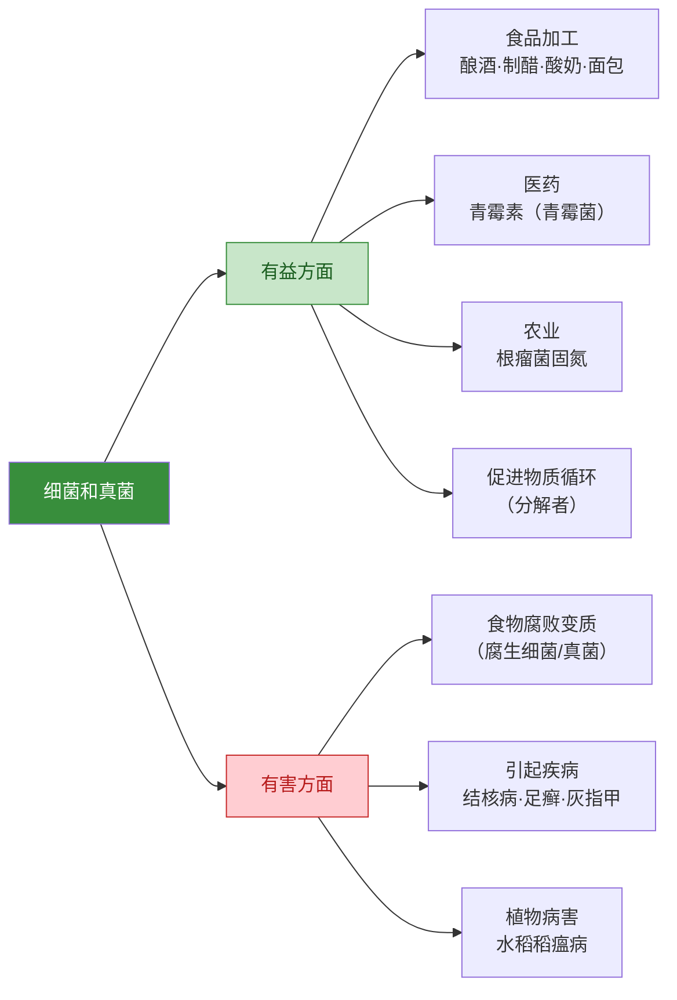

# 细菌和真菌在自然界中的作用

## 概念表

| 概念 | 含义 | 举例 |
|---|---|---|
| 分解者 | 将有机物分解为无机物，归还到无机环境中的生物 | 腐生细菌、腐生真菌 |
| 腐生 | 以分解动植物遗体中的有机物为生的营养方式 | 蘑菇、枯草杆菌 |
| 寄生 | 生活在宿主体内或体表，从宿主获取营养 | 结核杆菌、根霉寄生植物 |
| 共生 | 两种生物共同生活，相互有利 | 根瘤菌与豆科植物 |
| 物质循环 | 组成生物体的物质在生物与无机环境之间的循环流动 | 碳循环、氮循环 |

## 知识梳理

细菌和真菌在自然界中扮演着分解者的重要角色。腐生细菌和真菌能将动植物遗体中的有机物（蛋白质、脂肪、糖类等）分解为无机物（CO₂、H₂O、无机盐等），归还到无机环境中，供植物重新利用，从而促进物质循环。

细菌和真菌与其他生物的关系：
1. **腐生**：分解有机物，促进物质循环（有益）
2. **寄生**：引起动植物和人类疾病（有害）
3. **共生**：根瘤菌与豆科植物共生，根瘤菌固氮，植物提供有机物（互利）

细菌和真菌与人类的关系：有益方面包括食品加工（酿酒、制醋、制酸奶、制面包）、医药（青霉素）、农业（根瘤菌固氮）；有害方面包括引起食物腐败变质、引起人和动植物疾病。

## 物质循环图（碳循环）

<svg viewBox="0 0 700 380" xmlns="http://www.w3.org/2000/svg" style="max-width:100%;font-family:sans-serif">
  <!-- 背景 -->
  <rect width="700" height="380" fill="#f1f8e9" rx="12"/>
  <text x="350" y="28" text-anchor="middle" font-size="17" font-weight="bold" fill="#1b5e20">细菌和真菌在物质循环中的作用（碳循环）</text>

  <!-- 大气CO2（顶部） -->
  <rect x="250" y="45" width="200" height="50" fill="#b3e5fc" rx="10" stroke="#0288d1" stroke-width="2.5"/>
  <text x="350" y="67" text-anchor="middle" font-size="14" fill="#01579b" font-weight="bold">大气中的CO₂</text>
  <text x="350" y="85" text-anchor="middle" font-size="11" fill="#01579b">（无机环境）</text>

  <!-- 植物（左侧） -->
  <rect x="50" y="155" width="160" height="70" fill="#c8e6c9" rx="10" stroke="#388e3c" stroke-width="2.5"/>
  <text x="130" y="183" text-anchor="middle" font-size="13" fill="#1b5e20" font-weight="bold">植物（生产者）</text>
  <text x="130" y="200" text-anchor="middle" font-size="11" fill="#1b5e20">光合作用固定CO₂</text>
  <text x="130" y="215" text-anchor="middle" font-size="11" fill="#1b5e20">合成有机物</text>

  <!-- 动物（中间） -->
  <rect x="270" y="155" width="160" height="70" fill="#dcedc8" rx="10" stroke="#558b2f" stroke-width="2.5"/>
  <text x="350" y="183" text-anchor="middle" font-size="13" fill="#1b5e20" font-weight="bold">动物（消费者）</text>
  <text x="350" y="200" text-anchor="middle" font-size="11" fill="#1b5e20">摄食有机物</text>
  <text x="350" y="215" text-anchor="middle" font-size="11" fill="#1b5e20">呼吸释放CO₂</text>

  <!-- 细菌和真菌（右侧，分解者） -->
  <rect x="490" y="155" width="180" height="70" fill="#fff9c4" rx="10" stroke="#f9a825" stroke-width="3"/>
  <text x="580" y="178" text-anchor="middle" font-size="13" fill="#e65100" font-weight="bold">细菌和真菌</text>
  <text x="580" y="195" text-anchor="middle" font-size="12" fill="#e65100" font-weight="bold">（分解者）</text>
  <text x="580" y="212" text-anchor="middle" font-size="11" fill="#e65100">分解有机物→CO₂</text>

  <!-- 动植物遗体（底部） -->
  <rect x="200" y="295" width="300" height="55" fill="#efebe9" rx="10" stroke="#795548" stroke-width="2"/>
  <text x="350" y="318" text-anchor="middle" font-size="13" fill="#5d4037" font-weight="bold">动植物遗体、排泄物</text>
  <text x="350" y="338" text-anchor="middle" font-size="11" fill="#5d4037">（含有机物）</text>

  <!-- 箭头：光合作用（大气→植物） -->
  <line x1="280" y1="95" x2="175" y2="155" stroke="#388e3c" stroke-width="2.5"/>
  <polygon points="171,151 179,151 175,159" fill="#388e3c"/>
  <text x="200" y="125" text-anchor="middle" font-size="11" fill="#388e3c" font-weight="bold">光合作用</text>
  <text x="200" y="140" text-anchor="middle" font-size="10" fill="#388e3c">（固定CO₂）</text>

  <!-- 箭头：植物呼吸（植物→大气） -->
  <line x1="155" y1="155" x2="270" y2="95" stroke="#0288d1" stroke-width="1.5" stroke-dasharray="5,3"/>
  <polygon points="266,91 274,91 270,99" fill="#0288d1"/>
  <text x="185" y="108" text-anchor="middle" font-size="10" fill="#0288d1">呼吸作用</text>

  <!-- 箭头：植物→动物（捕食） -->
  <line x1="210" y1="190" x2="270" y2="190" stroke="#558b2f" stroke-width="2"/>
  <polygon points="266,186 274,190 266,194" fill="#558b2f"/>
  <text x="240" y="183" text-anchor="middle" font-size="10" fill="#558b2f">捕食</text>

  <!-- 箭头：动物呼吸（动物→大气） -->
  <line x1="350" y1="155" x2="350" y2="95" stroke="#0288d1" stroke-width="2"/>
  <polygon points="346,91 354,91 350,99" fill="#0288d1"/>
  <text x="375" y="125" font-size="10" fill="#0288d1">呼吸作用</text>

  <!-- 箭头：动植物遗体→分解者 -->
  <line x1="500" y1="295" x2="580" y2="225" stroke="#f9a825" stroke-width="2.5"/>
  <polygon points="576,221 584,221 580,229" fill="#f9a825"/>
  <text x="560" y="268" text-anchor="middle" font-size="11" fill="#e65100" font-weight="bold">分解</text>

  <!-- 箭头：植物→遗体 -->
  <line x1="130" y1="225" x2="250" y2="295" stroke="#795548" stroke-width="1.5" stroke-dasharray="4,2"/>
  <polygon points="246,291 254,291 250,299" fill="#795548"/>

  <!-- 箭头：动物→遗体 -->
  <line x1="350" y1="225" x2="350" y2="295" stroke="#795548" stroke-width="1.5" stroke-dasharray="4,2"/>
  <polygon points="346,291 354,291 350,299" fill="#795548"/>

  <!-- 箭头：分解者→大气CO2 -->
  <line x1="580" y1="155" x2="450" y2="95" stroke="#e65100" stroke-width="2.5"/>
  <polygon points="446,91 454,91 450,99" fill="#e65100"/>
  <text x="540" y="115" text-anchor="middle" font-size="11" fill="#e65100" font-weight="bold">释放CO₂</text>

  <!-- 分解者重要性标注 -->
  <rect x="490" y="240" width="180" height="50" fill="#fff3e0" rx="8" stroke="#f9a825" stroke-width="1.5"/>
  <text x="580" y="260" text-anchor="middle" font-size="11" fill="#e65100" font-weight="bold">分解者的作用</text>
  <text x="580" y="278" text-anchor="middle" font-size="10" fill="#333">将有机物→无机物</text>
  <text x="580" y="292" text-anchor="middle" font-size="10" fill="#333">促进物质循环</text>
</svg>

## 细菌和真菌与人类的关系

## 实验要点

"探究细菌和真菌的分布"实验：将培养基暴露在空气中、用手触摸、对着培养基咳嗽等，培养后观察菌落的数量和形态，理解细菌和真菌广泛分布在自然界中。

"探究食物腐败的原因"实验：将相同食物分别放在密封和不密封、高温和常温等不同条件下，观察腐败速度，理解细菌和真菌是食物腐败的主要原因，以及防腐的原理。

## 对比表格

| 关系类型 | 特点 | 举例 | 对人类影响 |
|---|---|---|---|
| 腐生（分解者） | 分解有机物为无机物 | 蘑菇、腐生细菌 | 有益（促进物质循环） |
| 寄生 | 从宿主获取营养，危害宿主 | 结核杆菌、足癣真菌 | 有害（引起疾病） |
| 共生 | 两者互利 | 根瘤菌与豆科植物 | 有益（固氮，提高土壤肥力） |

## 背记要点

- 细菌和真菌在自然界中主要作为分解者，将有机物分解为无机物，促进物质循环。
- 根瘤菌与豆科植物共生：根瘤菌固定大气中的氮气，为植物提供氮素；植物为根瘤菌提供有机物。
- 食物腐败的原因：细菌和真菌分解食物中的有机物。防腐方法：低温、干燥、密封、高温灭菌。
- 青霉素是从青霉菌中提取的，能抑制细菌细胞壁的合成，用于治疗细菌性感染。
- 细菌和真菌引起的疾病：肺结核（结核杆菌）、足癣（真菌）、灰指甲（真菌）。

## 自测题

1. 细菌和真菌在自然界中扮演什么角色？有什么意义？
2. 根瘤菌与豆科植物是什么关系？各有什么益处？
3. 食物为什么会腐败？如何防止食物腐败？
4. 青霉素是如何发现的？它能杀灭哪类微生物？

相关知识点：[[第一节 细菌]]、[[第二节 真菌]]
