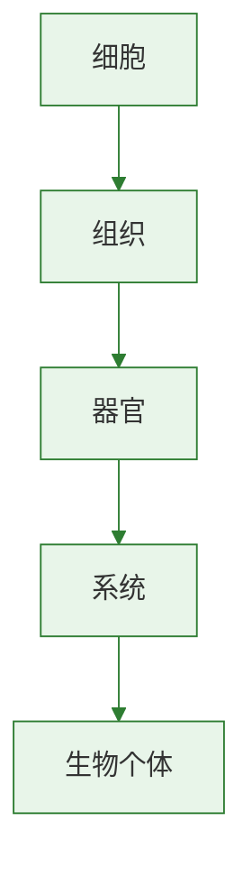

# 昆虫的生殖和发育

昆虫种类繁多，但多数通过有性生殖产生后代。
昆虫发育过程常考完全变态和不完全变态的区别。
学习本节时可联系[[两栖动物的生殖和发育]]比较不同动物类群的发育特点。

## 概念表

| 概念 | 含义 | 关键词 |
| --- | --- | --- |
| 受精 | 精子与卵细胞结合形成受精卵 | 生殖起点 |
| 发育 | 受精卵发育成成体的过程 | 生长、形态变化 |
| 完全变态 | 幼体与成体差异大，经过蛹期 | 卵→幼虫→蛹→成虫 |
| 不完全变态 | 幼体与成体相似，无蛹期 | 卵→若虫→成虫 |

## 知识梳理

昆虫一般雌雄异体，通过交配完成体内受精或体外受精中的特定形式，但教材重点强调有性生殖。
受精卵经过发育形成幼体，再逐步发育为成虫。
昆虫发育过程中，外骨骼不能随身体连续长大，因此需要蜕皮。
蜕皮次数有限，最后一次蜕皮后形成成虫。

完全变态发育的代表有家蚕、蝴蝶、蚊、蝇、蜜蜂等。
幼虫与成虫在形态结构和生活习性上差异明显。
蛹期是幼虫向成虫转变的重要阶段。
这种发育方式有利于幼体和成体减少食物与空间竞争。

不完全变态发育的代表有蝗虫、蟋蟀、蝉、蜻蜓等。
若虫与成虫形态相似，只是生殖器官和翅未发育成熟。
若虫经过多次蜕皮逐渐发育为成虫。

## 实验要点

### 家蚕发育过程观察

1. 按时间顺序观察卵、幼虫、蛹、成虫四个阶段。
2. 记录各阶段形态特点和生活方式。
3. 比较幼虫与成虫在取食、运动和外形上的差异。
4. 归纳家蚕属于完全变态发育的依据。

### 蝗虫标本观察

1. 观察若虫与成虫的外形差异。
2. 重点比较翅和生殖器官发育情况。
3. 结合蜕皮现象理解外骨骼对生长的限制。

## 对比表格

| 项目 | 完全变态 | 不完全变态 |
| --- | --- | --- |
| 发育阶段 | 卵、幼虫、蛹、成虫 | 卵、若虫、成虫 |
| 是否有蛹期 | 有 | 无 |
| 幼体与成体差异 | 大 | 小 |
| 代表动物 | 家蚕、蝴蝶 | 蝗虫、蝉 |

## 易错辨析

| 说法 | 判断 | 纠正 |
| --- | --- | --- |
| 蝗虫发育经过蛹期 | 错 | 蝗虫属于不完全变态发育 |
| 家蚕幼虫和成虫生活习性相同 | 错 | 两者差异明显 |
| 昆虫蜕皮是因为外骨骼限制生长 | 对 | 外骨骼不能随身体连续增大 |

## 背记要点

- 昆虫多数通过有性生殖繁殖后代。
- 完全变态发育：卵、幼虫、蛹、成虫。
- 不完全变态发育：卵、若虫、成虫。
- 家蚕是完全变态发育代表，蝗虫是不完全变态发育代表。
- 蜕皮原因是外骨骼限制昆虫身体长大。
- [[鸟的生殖和发育]]可与本节对照理解不同动物的胚后发育方式。

## 自测题

1. 完全变态发育和不完全变态发育的主要区别是什么？
2. 为什么昆虫在生长过程中要蜕皮？
3. 家蚕和蝗虫分别属于哪种发育类型？
4. 蛹期在完全变态发育中有什么作用？
5. 昆虫发育方式对其适应环境有什么意义？

### 生物过程与层级图

