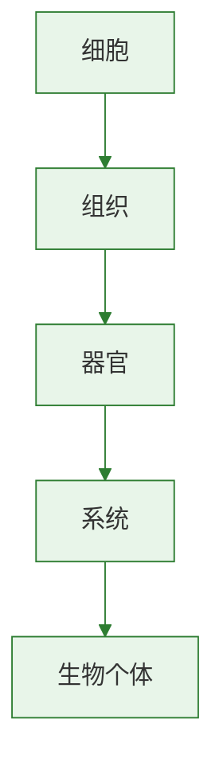

# 生物的变异

子代与亲代之间、同种生物不同个体之间存在差异，这种现象叫变异。
变异是生物进化和育种的重要基础。
本节与[[生物进化的原因]]联系紧密，是理解自然选择的前提。

## 概念表

| 概念 | 含义 | 关键词 |
| --- | --- | --- |
| 变异 | 亲子代和子代个体间的差异 | 差异现象 |
| 可遗传变异 | 由遗传物质改变引起，可传给后代 | 基因或染色体改变 |
| 不可遗传变异 | 由环境引起，遗传物质未改变 | 不能稳定遗传 |
| 诱变育种 | 利用射线、化学物质等诱发遗传变异 | 育种应用 |

## 知识梳理

生物界普遍存在遗传和变异现象。
遗传使亲子代保持相似，变异使后代与亲代、个体与个体之间出现差异。
没有变异，生物就缺少适应环境变化和进化的原始材料。

变异分为可遗传变异和不可遗传变异。
由遗传物质改变引起的变异能够遗传给后代，如太空椒性状变化、染色体异常等。
由环境条件引起的变异一般不能遗传，如晒黑的皮肤、营养不同导致植株高矮差异。
判断关键是遗传物质是否发生改变。

人类利用有利变异进行选育。
杂交育种、诱变育种和选择育种都离不开变异。
例如高产抗倒伏水稻品种的培育，就是利用变异并进行人工选择的结果。

## 实验要点

### 调查生物个体差异

1. 观察同一品种植物叶形、株高、果实大小差异。
2. 分析哪些差异可能由环境造成，哪些可能与遗传有关。
3. 归纳变异普遍存在的结论。

### 案例分析

1. 比较普通椒和太空椒的差异。
2. 判断其是否属于可遗传变异并说明理由。

## 对比表格

| 项目 | 可遗传变异 | 不可遗传变异 |
| --- | --- | --- |
| 原因 | 遗传物质改变 | 环境改变 |
| 能否遗传 | 能 | 不能 |
| 举例 | 太空椒 | 晒黑皮肤 |
| 育种价值 | 大 | 小 |

## 易错辨析

| 说法 | 判断 | 纠正 |
| --- | --- | --- |
| 所有变异都能遗传 | 错 | 只有遗传物质改变引起的变异可遗传 |
| 晒黑的皮肤属于可遗传变异 | 错 | 这是环境影响造成的 |
| 变异为生物进化提供原材料 | 对 | 自然选择以变异为基础 |

## 背记要点

- 变异是生物个体间存在差异的现象。
- 变异分为可遗传变异和不可遗传变异。
- 判断依据是遗传物质是否改变。
- 可遗传变异是育种和进化的重要基础。
- 人工选择能保留有利变异。
- [[地球上生命的起源]]与本节共同构成生命发展主题的前后衔接。

## 自测题

1. 什么是变异？为什么说变异普遍存在？
2. 可遗传变异和不可遗传变异怎样区分？
3. 为什么育种工作离不开可遗传变异？
4. 晒黑皮肤和太空椒分别属于哪类变异？
5. 变异在生物进化中有什么意义？

### 生物过程与层级图

