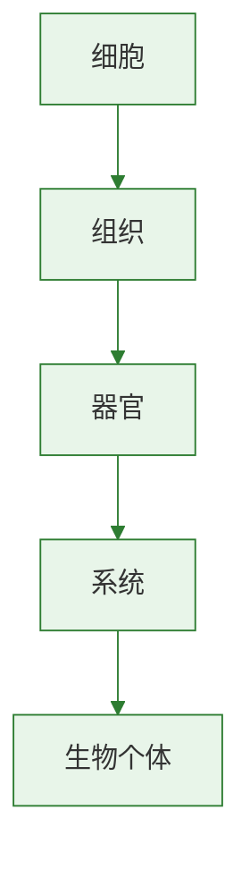

# 地球上生命的起源

生命起源问题是生物学中的重要科学议题。
教材主要介绍化学进化学说及相关实验支持。
本节可与[[生物进化的历程]]衔接，理解“先起源，后进化”的逻辑。

## 概念表

| 概念 | 含义 | 关键词 |
| --- | --- | --- |
| 生命起源 | 地球上最早生命如何出现的问题 | 科学推测 |
| 化学进化学说 | 生命由非生命物质逐步演变而来 | 原始大气、原始海洋 |
| 原始大气 | 早期地球大气成分 | 无氧 |
| 米勒实验 | 模拟原始地球条件形成有机物的实验 | 支持化学进化 |

## 知识梳理

关于生命起源，现代科学更倾向于化学进化学说。
该学说认为，在原始地球条件下，无机小分子在高温、闪电、紫外线等能量作用下形成有机小分子。
这些有机小分子进一步形成有机大分子，并逐步演变出原始生命。
原始海洋被认为是生命的摇篮。

原始地球环境与现在差异很大。
当时地表温度高，火山活动频繁，大气中没有游离氧。
缺少氧气有利于某些有机物的形成和保存。

米勒实验模拟原始大气和闪电环境，最终在装置中检测到多种氨基酸等有机小分子。
这说明在一定条件下，无机物可以形成构成生命的有机物。
但米勒实验并没有直接制造出生命，只是为化学进化学说提供了实验支持。

## 实验要点

### 米勒实验分析

1. 识别实验装置中水蒸气循环和放电部分。
2. 明确实验模拟的是原始地球环境，而非现代环境。
3. 关注实验产物是有机小分子，不是完整生命体。

### 证据讨论

1. 区分科学推测、实验支持和直接证据。
2. 理解生命起源研究仍在不断发展。

## 对比表格

| 项目 | 原始地球 | 现代地球 |
| --- | --- | --- |
| 大气特点 | 无游离氧 | 含较多氧气 |
| 能量条件 | 火山、闪电频繁 | 相对稳定 |
| 生命状态 | 尚未出现或刚出现原始生命 | 生物多样性丰富 |

## 易错辨析

| 说法 | 判断 | 纠正 |
| --- | --- | --- |
| 米勒实验直接证明生命已经产生 | 错 | 只证明无机物可形成有机物 |
| 原始海洋被认为是生命的摇篮 | 对 | 是化学进化的重要场所 |
| 原始大气中含大量氧气 | 错 | 原始大气中没有游离氧 |

## 背记要点

- 生命起源研究常用化学进化学说解释。
- 原始地球环境高温、火山活动频繁、无游离氧。
- 原始海洋被认为是生命的摇篮。
- 米勒实验支持无机物形成有机物的可能性。
- 米勒实验不能直接证明生命已经形成。
- [[生物进化的原因]]研究的是生命出现后的变化机制。

## 自测题

1. 化学进化学说的基本观点是什么？
2. 为什么说原始海洋可能是生命的摇篮？
3. 米勒实验模拟了哪些原始地球条件？
4. 米勒实验说明了什么，又不能说明什么？
5. 原始地球大气与现代大气的主要区别是什么？

### 生物过程与层级图

