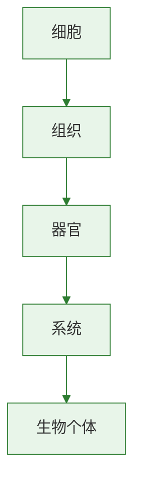

# 生物多样性的形成及保护

今天地球上丰富多样的生物，是长期进化的结果。
保护生物多样性既是生态要求，也是人类可持续发展的需要。
本节可联系[[单元综合复习]]进行全册综合提升。

## 概念表

| 概念 | 含义 | 关键词 |
| --- | --- | --- |
| 生物多样性 | 生物种类、基因和生态系统的多样性 | 三个层次 |
| 物种多样性 | 生物种类丰富多样 | 最直观层次 |
| 基因多样性 | 同种生物不同个体基因差异 | 遗传资源 |
| 生态系统多样性 | 生态系统类型多样 | 森林、湿地等 |

## 知识梳理

生物多样性是在漫长进化过程中形成的。
不同环境条件和长期自然选择，使生物不断分化，形成丰富的物种和复杂的生态系统。
生物多样性不仅包括看得见的物种数量，还包括同种生物内部的基因差异以及生态系统类型差异。

生物多样性具有重要价值。
它为人类提供食物、药物、工业原料和基因资源，也维持生态平衡。
如果某些关键物种消失，生态系统稳定性可能受到破坏。

威胁生物多样性的主要因素包括乱砍滥伐、环境污染、滥捕乱猎、外来物种入侵等。
保护生物多样性的根本措施是保护生物的栖息环境，保护生态系统多样性。
建立自然保护区是保护生物多样性最有效的措施之一。
此外还可采取迁地保护、法制管理和科学教育等方式。

## 实验要点

### 资料调查

1. 调查本地常见生态系统和代表生物。
2. 分析人类活动对生物多样性的影响。
3. 提出可行保护建议。

### 案例分析

1. 分析大熊猫、朱鹮等保护案例。
2. 区分就地保护与迁地保护。
3. 理解自然保护区的重要意义。

## 对比表格

| 项目 | 含义 | 例子 |
| --- | --- | --- |
| 基因多样性 | 同种生物基因差异 | 不同水稻品种 |
| 物种多样性 | 生物种类丰富 | 森林中多种动植物 |
| 生态系统多样性 | 生态系统类型多样 | 森林、草原、湿地 |

## 易错辨析

| 说法 | 判断 | 纠正 |
| --- | --- | --- |
| 保护生物多样性就是只保护珍稀动物 | 错 | 还要保护基因和生态系统多样性 |
| 建立自然保护区是有效措施之一 | 对 | 属于就地保护 |
| 生物多样性与人类生活关系不大 | 错 | 与资源、生态安全密切相关 |

## 背记要点

- 生物多样性包括基因、物种和生态系统多样性。
- 生物多样性是长期进化形成的结果。
- 保护生物多样性的根本措施是保护栖息环境和生态系统。
- 建立自然保护区是最有效措施之一。
- 人类活动是生物多样性受威胁的重要原因。
- [[综合实践：生命延续与进化专题梳理]]可帮助整合本节与前面进化内容。

## 自测题

1. 生物多样性包括哪三个层次？
2. 为什么说保护栖息环境是根本措施？
3. 建立自然保护区属于哪种保护方式？
4. 威胁生物多样性的主要因素有哪些？
5. 生物多样性对人类有哪些价值？

### 生物过程与层级图

