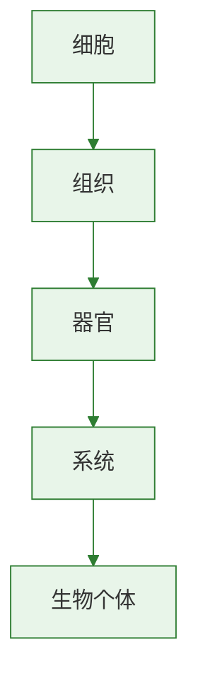

# 综合实践：生命延续与进化专题梳理

本专题用于把生殖、遗传、变异、起源和进化等内容串联起来。
复习时要抓住“生命如何延续、怎样变化、为何进化”三条主线。
可把[[单元综合复习]]作为进一步查漏补缺的终点站。

## 概念表

| 模块 | 核心问题 | 关键概念 |
| --- | --- | --- |
| 生殖与发育 | 后代怎样产生并长大 | 受精、生殖方式、发育 |
| 遗传 | 性状为什么像亲代 | 基因、染色体、传递 |
| 变异 | 后代为什么又不完全相同 | 可遗传变异、环境影响 |
| 进化 | 生物为何越来越多样 | 自然选择、适者生存 |

## 知识梳理

第一章围绕生物的生殖和发育展开。
植物可进行有性生殖和无性生殖；昆虫、两栖动物和鸟类在受精方式和发育方式上各有特点。
比较这些内容时，要特别关注是否依赖水环境、是否有变态发育、是否具有保护胚胎的结构。

第二章围绕遗传与变异展开。
基因控制性状，基因位于染色体上，并通过生殖细胞在亲子代间传递。
显性和隐性解释了相对性状的表现规律，性别遗传说明性染色体的作用。
变异则为育种和进化提供原材料。

第三章围绕生命起源和生物进化展开。
生命起源常用化学进化学说解释，米勒实验提供支持。
化石是研究进化历程的重要证据。
自然选择学说解释了进化原因：过度繁殖、生存斗争、遗传变异和适者生存。

第四章强调生物多样性的形成及保护。
今天丰富的生物世界是长期进化的结果，保护多样性要从保护栖息环境做起。

## 实验要点

### 综合比较任务

1. 比较植物、昆虫、两栖动物和鸟类的生殖发育特点。
2. 比较可遗传变异与不可遗传变异。
3. 比较生命起源、进化历程和进化原因三个模块的研究重点。

### 思维导图整理

1. 以“生命的延续与发展”为中心绘制知识网络。
2. 用箭头连接“生殖→遗传→变异→进化→多样性保护”。
3. 标出易混概念和典型例题切入点。

## 对比表格

| 主题 | 关键问题 | 高频考点 |
| --- | --- | --- |
| 生殖发育 | 后代如何形成 | 受精方式、发育类型 |
| 遗传变异 | 性状如何传递和变化 | 显隐性、性别遗传、变异分类 |
| 起源进化 | 生命如何出现并发展 | 米勒实验、化石、自然选择 |
| 保护 | 为什么要保护多样性 | 根本措施、自然保护区 |

## 背记要点

- 生殖保证生命延续，遗传保证亲子相似。
- 变异使后代出现差异，是进化基础。
- 化石说明进化历程，自然选择解释进化原因。
- 生物多样性是长期进化形成的结果。
- 保护生物多样性的根本措施是保护栖息环境。
- [[生物多样性的形成及保护]]是全册价值导向的重要落点。

## 自测题

1. 全册知识可以概括为哪几条主线？
2. 为什么说变异是连接遗传与进化的桥梁？
3. 比较鸟类和两栖动物在生殖发育上的差异。
4. 化石和米勒实验分别解决什么问题？
5. 保护生物多样性的根本措施是什么？

### 生物过程与层级图

