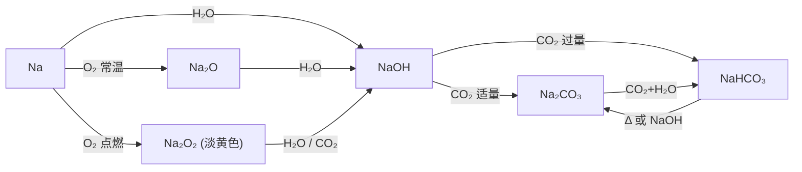

# 第一节 钠及其化合物

## 概念定义

**钠**是典型的活泼金属，银白色、质软（可用小刀切割）、密度比水小、熔点低，保存在**煤油**中。最外层 1 个电子，反应中易失去，表现强还原性。

**焰色试验**：某些金属元素灼烧时使火焰呈特殊颜色，属**物理变化**。钠为**黄色**，钾为**紫色**（透过蓝色钴玻璃观察）。

## 知识梳理

钠及其化合物转化关系：

**核心方程式**：

- 钠与水：$2Na + 2H_2O = 2NaOH + H_2\uparrow$（离子式：$2Na + 2H_2O = 2Na^+ + 2OH^- + H_2\uparrow$），现象"浮、熔、游、响、红"。
- 过氧化钠与水：$2Na_2O_2 + 2H_2O = 4NaOH + O_2\uparrow$；与二氧化碳：$2Na_2O_2 + 2CO_2 = 2Na_2CO_3 + O_2$（供氧剂原理）。
- 碳酸氢钠受热分解：$2NaHCO_3 \xrightarrow{\Delta} Na_2CO_3 + H_2O + CO_2\uparrow$。

## Na₂CO₃ 与 NaHCO₃ 对比表

| 项目 | $Na_2CO_3$（纯碱、苏打） | $NaHCO_3$（小苏打） |
| --- | --- | --- |
| 溶解度 | 较大 | 较小 |
| 热稳定性 | 稳定，受热不分解 | 不稳定，受热分解 |
| 与盐酸反应 | 分步、较慢（先生成 $HCO_3^-$） | 一步、剧烈：$HCO_3^- + H^+ = H_2O + CO_2\uparrow$ |
| 与 $NaOH$ | 不反应 | $HCO_3^- + OH^- = CO_3^{2-} + H_2O$ |
| 用途 | 玻璃、造纸、洗涤 | 发酵粉、治胃酸 |

## 典型例题

**例 1**：将一小块钠投入 $CuSO_4$ 溶液，写出反应并说明能否置换出铜。

**解**：钠先与水反应：$2Na + 2H_2O = 2NaOH + H_2\uparrow$，生成的 $NaOH$ 再与 $CuSO_4$ 反应：$Cu^{2+} + 2OH^- = Cu(OH)_2\downarrow$。**不能**置换出铜，现象为产生气泡和蓝色沉淀。

**例 2**：7.8 g $Na_2O_2$ 与足量水反应，标准状况下生成 $O_2$ 的体积是多少？

**解**：$n(Na_2O_2) = \dfrac{7.8\ \text{g}}{78\ \text{g/mol}} = 0.1\ \text{mol}$。由 $2Na_2O_2 \sim O_2$，$n(O_2) = 0.05\ \text{mol}$，$V = n \cdot V_m = 0.05 \times 22.4 = 1.12\ \text{L}$。

## 易错点

- 钠燃烧生成 $Na_2O_2$（淡黄色）而不是 $Na_2O$；$Na_2O_2$ 中氧为 $-1$ 价，阴阳离子个数比为 **1:2**。
- $Na_2O_2$ 与水、$CO_2$ 反应中，$Na_2O_2$ 既是氧化剂又是还原剂（氧元素歧化）。
- 除去 $Na_2CO_3$ 固体中的 $NaHCO_3$ 用**加热**；除去 $NaHCO_3$ 溶液中的 $Na_2CO_3$ 通入足量 $CO_2$，不能加盐酸。
- 焰色试验是**元素**的性质（物理变化），铂丝需用**稀盐酸**洗净并灼烧至无色。

## 背记要点

1. 钠与水五现象口诀：**浮、熔、游、响、红**。
2. $Na_2O_2$ 两条供氧反应，比例记 $2Na_2O_2 \sim O_2$（转移 $2e^-$）。
3. 鉴别 $Na_2CO_3$ 与 $NaHCO_3$：固体用加热法，溶液用 $CaCl_2$（前者沉淀）或逐滴加盐酸。
4. 焰色：钠黄、钾紫（蓝色钴玻璃）。

## 自测题

1. 金属钠保存在____中，切开后断面变暗是因为生成____。
2. 写出 $Na_2O_2$ 与 $CO_2$ 反应的化学方程式：____。
3. 等质量的 $Na_2CO_3$ 和 $NaHCO_3$ 分别与足量盐酸反应，产生 $CO_2$ 较多的是____。
4. 向饱和 $Na_2CO_3$ 溶液中通入过量 $CO_2$ 的现象是____。

## 相关知识点

钠化合物间转化的离子方程式书写见 [[第二节 离子反应]]；同族碱金属的递变规律见 [[第一节 原子结构与元素周期表]]；相关计算工具见 [[第三节 物质的量]]。
