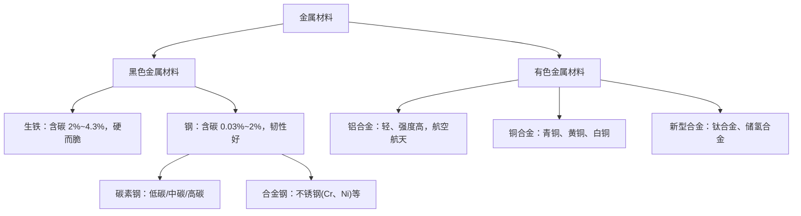

# 第二节 金属材料

## 概念定义

**合金**：由两种或两种以上的金属（或金属与非金属）熔合而成的具有金属特性的**混合物**。

**合金的特性**：硬度一般**大于**成分金属；熔点一般**低于**成分金属；性能可调（强度、耐腐蚀性等优于纯金属）。

**金属材料**分为**黑色金属材料**（铁、铬、锰及其合金，以钢铁为主）和**有色金属材料**（其余金属及其合金，如铝合金、铜合金）。

## 知识梳理

**铝的重要性质**（铝合金基础，$Al$、$Al_2O_3$、$Al(OH)_3$ 均具**两性**）：

- 与酸：$2Al + 6HCl = 2AlCl_3 + 3H_2\uparrow$
- 与强碱：$2Al + 2NaOH + 2H_2O = 2NaAlO_2 + 3H_2\uparrow$
- 氧化铝两性：$Al_2O_3 + 6H^+ = 2Al^{3+} + 3H_2O$；$Al_2O_3 + 2OH^- = 2AlO_2^- + H_2O$
- 铝热反应：$2Al + Fe_2O_3 \xrightarrow{\text{高温}} Al_2O_3 + 2Fe$（焊接铁轨）

## 常见合金性能对比表

| 合金 | 主要成分 | 特性 | 用途 |
| --- | --- | --- | --- |
| 生铁 | $Fe$、$C(2\%\sim4.3\%)$ | 硬而脆 | 铸件 |
| 不锈钢 | $Fe$、$Cr$、$Ni$ | 抗腐蚀 | 医疗器械、餐具 |
| 铝合金 | $Al$、$Mg$、$Cu$ 等 | 密度小、强度高 | 飞机、高铁车体 |
| 青铜 | $Cu$、$Sn$ | 耐磨、易铸造 | 最早使用的合金 |
| 钛合金 | $Ti$ 为主 | 强度高、生物相容 | 人造骨骼、航天 |

## 典型例题

**例 1**：等质量的铝分别与足量盐酸、足量 $NaOH$ 溶液反应，产生 $H_2$ 的体积比（同状况）是多少？

**解**：两反应中均为 $Al \to +3$ 价，失 $3e^-$，由电子守恒，等质量铝生成 $H_2$ 相等，体积比为 **1:1**。（若酸碱等量而铝足量，则比为 1:3，注意审题。）

**例 2**：5.4 g 铝与足量 $NaOH$ 溶液反应，标况下生成 $H_2$ 多少升？

**解**：$n(Al) = \dfrac{5.4}{27} = 0.2\ \text{mol}$。由 $2Al \sim 3H_2$，$n(H_2) = 0.3\ \text{mol}$，$V = 0.3 \times 22.4 = 6.72\ \text{L}$。

## 易错点

- 合金是**混合物**，不是化合物；合金中可以含非金属（如钢含碳）。
- 合金熔点**低于**任一成分金属，硬度**大于**成分金属——"熔点降、硬度升"。
- 铝能与 $NaOH$ 溶液反应是金属中的特例，实质是 $Al$ 被水氧化、$NaOH$ 溶解氧化膜与氢氧化铝。
- 生铁与钢的区别在**含碳量**：生铁高（2%~4.3%）、钢低（0.03%~2%）。
- 铝制品耐腐蚀是因表面致密的 $Al_2O_3$ 保护膜，不是铝不活泼。

## 背记要点

1. 合金两特性口诀："硬度更硬、熔点更低"。
2. 铝的"两性三兄弟"：$Al$、$Al_2O_3$、$Al(OH)_3$ 都既能溶于强酸又能溶于强碱。
3. 铝与酸、碱反应产氢比较：等铝等价电子守恒 → 等氢。
4. 用途选材看性能：轻→铝合金；耐蚀→不锈钢；生物相容→钛合金。

## 自测题

1. 生铁和钢的主要区别是____的不同。
2. 写出铝与氢氧化钠溶液反应的化学方程式：____。
3. 判断：合金的熔点一般比各成分金属高。（对/错）
4. 铝热反应 $2Al + Fe_2O_3 \xrightarrow{\text{高温}} Al_2O_3 + 2Fe$ 中，还原剂是____，每生成 1 mol $Fe$ 转移电子____ mol。

## 相关知识点

铁及其化合物的性质基础见 [[第一节 铁及其化合物]]；金属活动性与原子结构的联系见 [[第二节 元素周期律]]；铝与酸碱反应计算工具见 [[第三节 物质的量]]。
