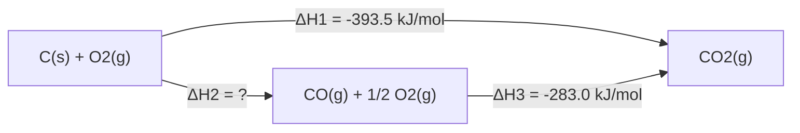

# 第二节 反应热的计算

## 概念定义

**盖斯定律**：一个化学反应，不管是一步完成还是分几步完成，其反应热是相同的。即反应热只与体系的**始态和终态**有关，与反应途径无关。

盖斯定律使我们能间接求算**难以直接测定**的反应热（如 C 不完全燃烧生成 CO 的 ΔH）。

## 知识梳理

| 方法 | 要点 |
| --- | --- |
| 叠加法（主要方法） | 目标方程式 = 已知方程式的加减组合，ΔH 做相同的加减 |
| 方程式乘以 n | ΔH 也乘以 n |
| 方程式逆写 | ΔH 变号 |
| 键能法 | ΔH = 反应物总键能 − 生成物总键能 |
| 燃烧热法 | ΔH = 反应物燃烧热总和 − 生成物燃烧热总和（均取正值代入） |

**操作步骤**：① 找目标方程式中的物质在已知方程式中的位置；② 调整方向和系数消去中间产物；③ 对应加减 ΔH。

## 盖斯定律示意（途径无关）

由 $\Delta H_1=\Delta H_2+\Delta H_3$ 得 $\Delta H_2=-393.5-(-283.0)=-110.5\ \text{kJ/mol}$。

## 典型例题

**例 1**：已知：
① $C(s)+O_2(g)=CO_2(g)\quad \Delta H_1=-393.5\ \text{kJ/mol}$
② $CO(g)+\dfrac{1}{2}O_2(g)=CO_2(g)\quad \Delta H_2=-283.0\ \text{kJ/mol}$
求 $C(s)+\dfrac{1}{2}O_2(g)=CO(g)$ 的 ΔH。

**解**：目标式 = ① − ②，故 ΔH = ΔH1 − ΔH2 = −393.5 − (−283.0) = **−110.5 kJ/mol**。

**例 2**：已知：
① $2H_2(g)+O_2(g)=2H_2O(l)\quad \Delta H_1=-571.6\ \text{kJ/mol}$
② $H_2O(g)=H_2O(l)\quad \Delta H_2=-44.0\ \text{kJ/mol}$
求 $2H_2(g)+O_2(g)=2H_2O(g)$ 的 ΔH。

**解**：目标式 = ① − 2×②，ΔH = −571.6 − 2×(−44.0) = **−483.6 kJ/mol**。

## 易错点

- 加减 ΔH 时**符号跟着运算走**，逆写忘记变号是最常见错误。
- 目标式确定后先"定物质、定位置、定系数"，再消中间物，切勿凭感觉拼凑。
- 同一物质**聚集状态不同**（H2O(l) 与 H2O(g)）不能直接相消。
- 比较 ΔH 大小时连同负号一起比较；比较"放出热量"时只比数值。
- 燃烧热法公式中反应物、生成物位置与键能法**相反方向**易混，建议统一用叠加法。

## 背记要点

1. 盖斯定律：反应热只与始态、终态有关，与途径无关。
2. 方程式相加减，ΔH 同步相加减；乘 n 则 ΔH 乘 n；逆写则变号。
3. 三种求 ΔH 途径：叠加法、键能法、能量（燃烧热）法。
4. 高考视角：盖斯定律计算是北京卷工业流程题、原理综合题的必考环节，务必规范书写"目标式 = ①×a ± ②×b"。

## 自测题

1. 已知 $S(s)+O_2(g)=SO_2(g)\ \Delta H_1$，$S(g)+O_2(g)=SO_2(g)\ \Delta H_2$，则 ΔH1____ΔH2（填 > 或 <）。
2. 反应 A→B 分两步：A→C（ΔH1=+20 kJ/mol），C→B（ΔH2=−50 kJ/mol），则 A→B 的 ΔH=____。
3. 判断：应用盖斯定律时，中间产物的聚集状态可以忽略。（　）
4. 已知 ①$Fe_2O_3(s)+3CO(g)=2Fe(s)+3CO_2(g)\ \Delta H=-25\ \text{kJ/mol}$，写出用盖斯定律求其他反应 ΔH 的一般步骤。

## 相关知识点

反应热与焓变的基本概念见 [[第一节 反应热]]；反应方向的复合判据见 [[第三节 化学反应的方向]]；速率与限度的调控见 [[第四节 化学反应的调控]]。
