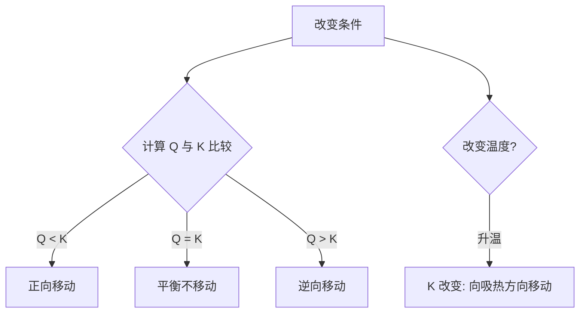

# 第二节 化学平衡

## 概念定义

**化学平衡状态**：一定条件下的可逆反应中，正反应速率与逆反应速率**相等**，各组分浓度**保持不变**的状态。特征："逆、等、动、定、变"。

**化学平衡常数 K**：一定温度下，可逆反应达平衡时生成物浓度幂之积与反应物浓度幂之积的比值。对 $aA(g)+bB(g)\rightleftharpoons cC(g)+dD(g)$：
$$K=\dfrac{c^c(C)\cdot c^d(D)}{c^a(A)\cdot c^b(B)}$$
K 只与**温度**有关。固体和纯液体不写入表达式。

**浓度商 Q**：任意时刻按 K 表达式计算的比值。Q<K 正向进行；Q=K 平衡；Q>K 逆向进行。

## 知识梳理

| 改变条件 | 平衡移动方向（勒夏特列原理） |
| --- | --- |
| 增大反应物浓度 | 正向移动 |
| 增大压强（缩小体积） | 向气体分子数减小的方向移动 |
| 升高温度 | 向吸热方向移动（放热反应 K 减小） |
| 催化剂 | 不移动，只缩短达平衡时间 |
| 恒温恒容充惰性气体 | 不移动 |
| 恒温恒压充惰性气体 | 向气体分子数增大的方向移动 |

**勒夏特列原理**：改变影响平衡的一个条件，平衡向能够**减弱**这种改变的方向移动（只能减弱，不能抵消）。

**转化率** $\alpha=\dfrac{\text{已转化量}}{\text{起始量}}\times100\%$；平衡计算用"三段式"（起始、变化、平衡）。

## 平衡移动判断流程

## 典型例题

**例 1**：恒温下，2 L 容器中充入 2 mol N2 和 6 mol H2，达平衡时生成 2 mol NH3。求 N2 的转化率和 K。

**解**：三段式（单位 mol）：N2：2→1（变化 1）；H2：6→3（变化 3）；NH3：0→2。
α(N2)=1/2×100%=**50%**。
平衡浓度：c(N2)=0.5，c(H2)=1.5，c(NH3)=1 mol/L。
$K=\dfrac{1^2}{0.5\times1.5^3}=\dfrac{1}{1.6875}\approx0.59$（mol/L）⁻²。

**例 2**：某温度下 $CO(g)+H_2O(g)\rightleftharpoons CO_2(g)+H_2(g)$ 的 K=1。某时刻 c(CO)=2、c(H2O)=3、c(CO2)=1、c(H2)=1（mol/L），判断反应方向。

**解**：$Q=\dfrac{1\times1}{2\times3}=\dfrac{1}{6}<K=1$，反应**正向进行**。

## 易错点

- 平衡标志：正逆速率相等须"一正一逆且比例等于计量数比"；"浓度不变"是标志，"浓度相等"不是。
- 对气体分子数不变的反应（如 H2+I2⇌2HI），压强改变**不使平衡移动**。
- 勒夏特列原理只"减弱"改变：增大压强后新平衡压强仍比原来大。
- K 只随温度变化；改变浓度、压强时平衡移动但 K 不变。
- 转化率与平衡移动方向不一定一致：两种反应物中只增大一种的浓度，本身转化率降低、另一种升高。

## 背记要点

1. 平衡特征五字诀：逆、等、动、定、变。
2. $K=\dfrac{\text{生成物浓度幂之积}}{\text{反应物浓度幂之积}}$，只与温度有关；Q 与 K 比较判方向。
3. 勒夏特列原理：平衡向减弱外界改变的方向移动。
4. 高考视角：三段式计算 K 与转化率、K 与 Q 判断方向、图像题（v–t、c–t、转化率–T/p）是北京卷大题核心。

## 自测题

1. 反应 $2SO_2(g)+O_2(g)\rightleftharpoons 2SO_3(g)\ \Delta H<0$，升高温度 K____（增大/减小）。
2. 判断：恒温恒容下充入 He，$N_2+3H_2\rightleftharpoons 2NH_3$ 平衡不移动。（　）
3. 某反应 Q>K 时，反应向____方向进行。
4. 恒容容器中 $A(g)+B(g)\rightleftharpoons 2C(g)$，起始各 1 mol/L，平衡时 c(C)=1 mol/L，求 K=____。

## 相关知识点

速率与碰撞理论见 [[第一节 化学反应速率]]；反应自发性见 [[第三节 化学反应的方向]]；工业条件选择见 [[第四节 化学反应的调控]]；电离平衡是化学平衡的延伸，见 [[第一节 电离平衡]]。
