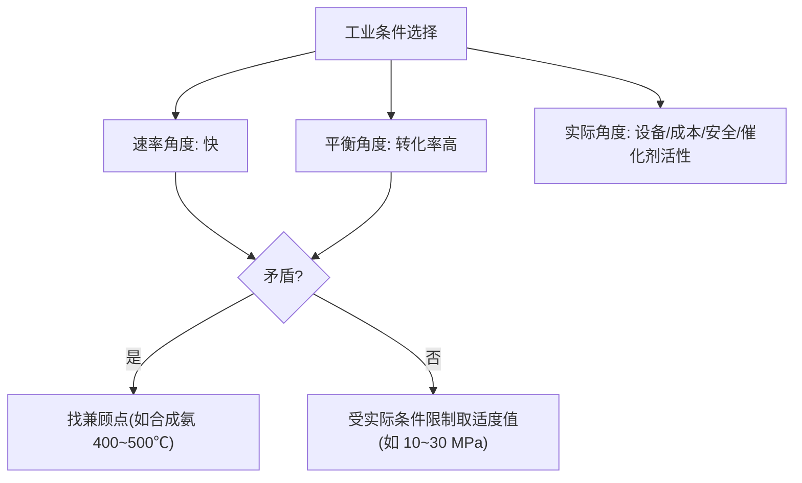

# 第四节 化学反应的调控

## 概念定义

**化学反应的调控**：综合运用化学反应速率和化学平衡原理，兼顾**反应快慢（动力学）**与**转化限度（热力学）**，并考虑设备、成本、安全等实际因素，选择工业生产的适宜条件。典型案例：**工业合成氨**。

合成氨反应：$N_2(g)+3H_2(g)\underset{\text{高温高压}}{\overset{\text{催化剂}}{\rightleftharpoons}}2NH_3(g)\quad \Delta H=-92.4\ \text{kJ/mol}$

正反应为**放热、气体分子数减小**的反应。

## 知识梳理

| 条件 | 对速率 | 对平衡（NH3 产率） | 工业实际选择 | 原因 |
| --- | --- | --- | --- | --- |
| 温度 | 升温加快 | 升温产率降低 | 400~500 ℃ | 兼顾速率与催化剂活性温度 |
| 压强 | 加压加快 | 加压产率提高 | 10~30 MPa | 压强过高对设备材料要求高、成本大 |
| 催化剂 | 显著加快 | 不影响 | 铁触媒 | 缩短达平衡时间 |
| 浓度 | — | — | N2、H2 循环使用；及时液化分离 NH3 | 减小生成物浓度使平衡正移，提高原料利用率 |

**调控的一般思路**：
1. 若速率与平衡要求一致（如加压），条件尽量满足但受设备/成本限制；
2. 若矛盾（如温度），寻找**兼顾点**（适宜温度）；
3. 利用**分离产物、循环原料**等工程手段突破平衡限制。

## 条件选择的权衡

## 典型例题

**例 1**：合成氨中，为什么不采用室温（平衡产率最高）进行生产？

**解**：室温下虽然平衡正向程度大、NH3 理论产率高，但**反应速率极慢**，且铁触媒在低温下活性很低，单位时间产量太低，无经济效益。故选择 400~500 ℃，在催化剂活性最大的温度下兼顾速率与产率。

**例 2**：合成氨生产中将混合气中的 NH3 液化分离后，剩余 N2、H2 循环使用。用平衡原理解释其作用。

**解**：分离 NH3 使**生成物浓度减小**，Q<K，平衡向正反应方向移动，提高 N2、H2 的总转化率；循环使用未反应原料提高原料利用率、降低成本。

## 易错点

- 催化剂只加快到达平衡的速率，**不提高平衡转化率**；但工业上意义重大（提高单位时间产量）。
- "温度越低产率越高"不能推出"低温更好"——必须考虑速率与催化剂活性。
- 压强并非越大越好：设备造价、能耗、安全都要权衡。
- 分析条件对产率影响时区分"平衡转化率"与"实际产率（单位时间产量）"。
- 合成氨中 N2 与 H2 按 1:3 投料时转化率相等；改变投料比会改变两者转化率。

## 背记要点

1. 合成氨适宜条件：铁触媒、400~500 ℃、10~30 MPa、原料循环、及时分离 NH3。
2. 调控原则：速率要快、限度要大、成本要低、安全可行，矛盾时找兼顾点。
3. 升温加快速率但使放热反应平衡逆移——"温度双刃剑"是条件选择题的核心矛盾。
4. 高考视角：北京卷常以真实工业流程（合成氨、接触法制硫酸、工业合成甲醇）为背景，要求用速率与平衡原理解释条件选择。

## 自测题

1. 合成氨选择 400~500 ℃ 的主要原因是该温度下____活性最大。
2. 判断：使用催化剂可以提高合成氨的平衡转化率。（　）
3. 增大压强对合成氨的速率和平衡分别有何影响？____。
4. 从平衡角度解释：及时移走 NH3 能提高原料转化率：____。

## 相关知识点

速率影响因素见 [[第一节 化学反应速率]]；平衡移动原理与 K 见 [[第二节 化学平衡]]；反应方向判据见 [[第三节 化学反应的方向]]；相关实验见 [[实验活动1 探究影响化学平衡移动的因素]]。
