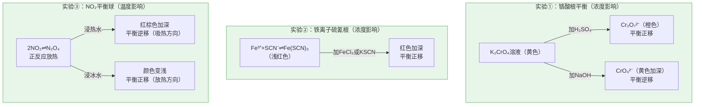

# 实验活动1 探究影响化学平衡移动的因素

## 三组经典平衡实验示意

## 实验目的

1. 通过实验探究浓度、温度对化学平衡的影响。
2. 加深对勒夏特列原理的理解，学会用平衡移动原理解释实验现象。

## 实验原理

**① 浓度对平衡的影响**（铬酸盐平衡）：
$$2CrO_4^{2-}(黄色)+2H^+\rightleftharpoons Cr_2O_7^{2-}(橙色)+H_2O$$
加酸平衡正移变橙色，加碱平衡逆移变黄色。

**② 浓度对平衡的影响**（铁离子与硫氰根）：
$$Fe^{3+}+3SCN^-\rightleftharpoons Fe(SCN)_3(红色)$$
增大 Fe³⁺ 或 SCN⁻ 浓度，平衡正移，红色加深。

**③ 温度对平衡的影响**（二氧化氮球）：
$$2NO_2(g)(红棕色)\rightleftharpoons N_2O_4(g)(无色)\quad \Delta H=-56.9\ \text{kJ/mol}$$
正反应放热：升温平衡逆移颜色加深，降温平衡正移颜色变浅。

## 实验步骤

1. **铬酸钾溶液**：取 K2CrO4 溶液于两支试管，一支滴加稀硫酸，另一支滴加 NaOH 溶液，观察颜色变化并对比。
2. **硫氰化铁溶液**：取 FeCl3 与 KSCN 混合稀溶液分装三支试管，分别滴加饱和 FeCl3 溶液、KSCN 溶液，第三支作对照，观察红色深浅。
3. **NO2 平衡球**：将充有 NO2/N2O4 混合气体的两个连通烧瓶（或平衡球）分别浸入**热水**和**冰水**中，观察两侧颜色差异。

## 现象与结论

| 实验 | 操作 | 现象 | 结论 |
| --- | --- | --- | --- |
| K2CrO4 | 加 H2SO4 | 黄色→橙色 | 增大 c(H+)，平衡正移 |
| K2CrO4 | 加 NaOH | 橙色→黄色 | 减小 c(H+)，平衡逆移 |
| Fe(SCN)3 | 加 FeCl3 或 KSCN | 红色加深 | 增大反应物浓度，平衡正移 |
| NO2 球 | 浸热水 | 红棕色加深 | 升温平衡向吸热方向（逆向）移动 |
| NO2 球 | 浸冰水 | 颜色变浅 | 降温平衡向放热方向（正向）移动 |

**总结论**：改变影响平衡的一个条件（浓度、温度等），平衡向能**减弱**这种改变的方向移动，验证了勒夏特列原理。

## 典型例题

**例 1**：向 Fe³⁺+3SCN⁻⇌Fe(SCN)3 的平衡体系中加入少量 KCl 固体，红色如何变化？

**解**：K⁺、Cl⁻ 均不参与反应，各离子浓度基本不变，Q=K，平衡**不移动**，红色**基本不变**。说明"加入物质"必须改变参与反应的离子浓度才引起平衡移动。

**例 2**：NO2 平衡球实验中，能否用该装置探究压强对平衡的影响？

**解**：不能直接探究。该装置体积固定，无法改变压强；探究压强影响可用**注射器**压缩 NO2/N2O4 混合气：压缩瞬间颜色变深（浓度增大），随后略变浅（平衡向分子数减小的 N2O4 方向移动），但仍比原来深（"减弱"而非"抵消"）。

## 注意事项

- 对比实验必须**控制单一变量**，并保留一支对照试管。
- NO2 有毒，平衡球必须**密封完好**，实验在通风处进行。
- 滴加试剂用量要少，逐滴加入，便于观察颜色渐变。
- 观察颜色时以白纸为背景，冷热水温差要足够大，现象才明显。
- 描述结论时规范表述："平衡向……方向移动，颜色……"。

## 背记要点

1. 三个经典平衡体系：CrO4²⁻/Cr2O7²⁻（酸碱调）、Fe(SCN)3（浓度调）、NO2/N2O4（温度调）。
2. 2NO2⇌N2O4 正反应放热：升温变深、降温变浅。
3. 平衡移动只能"减弱"改变，不能"抵消"。
4. 高考视角：北京卷实验探究题常考单一变量控制、对照设置与现象-结论的规范表述。

## 自测题

1. K2CrO4 溶液加酸后颜色变化为____，平衡向____移动。
2. 向 Fe(SCN)3 平衡体系加入 NaOH 溶液，红色变浅的原因是____。
3. 判断：NO2 球浸入热水中颜色加深，说明升温时 K(2NO2⇌N2O4) 增大。（　）
4. 设计对照实验的基本原则是____。

## 相关知识点

平衡移动原理与 K、Q 见 [[第二节 化学平衡]]；速率影响因素见 [[第一节 化学反应速率]]；条件调控的工业应用见 [[第四节 化学反应的调控]]。
