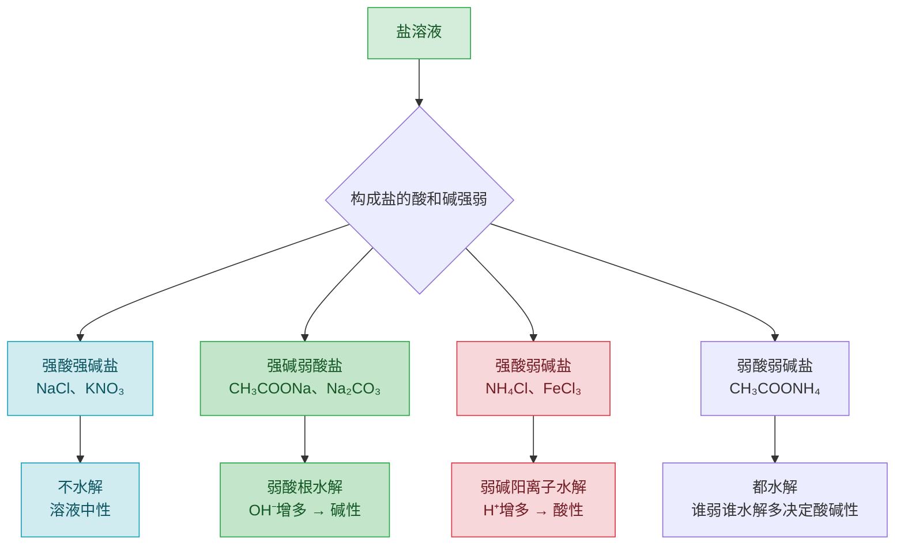

# 第三节 盐类的水解

## 盐类水解分类图

## 概念定义

**盐类的水解**：盐电离出的弱酸根阴离子或弱碱阳离子与水电离出的 H⁺ 或 OH⁻ 结合生成**弱电解质**，破坏水的电离平衡，使溶液显酸性或碱性的反应。

实质：**促进水的电离**。水解是中和反应的逆反应，为**吸热**过程，程度一般很小。

水解常数：$K_h=\dfrac{K_w}{K_a}$（弱酸强碱盐）。Ka 越小（酸越弱），Kh 越大，水解程度越大。

## 知识梳理

| 盐的类型 | 实例 | 溶液酸碱性 | 水解离子方程式示例 |
| --- | --- | --- | --- |
| 强酸强碱盐 | NaCl、KNO3 | 中性（不水解） | — |
| 强碱弱酸盐 | CH3COONa、Na2CO3 | 碱性 | $CH_3COO^-+H_2O\rightleftharpoons CH_3COOH+OH^-$ |
| 强酸弱碱盐 | NH4Cl、FeCl3 | 酸性 | $NH_4^++H_2O\rightleftharpoons NH_3\cdot H_2O+H^+$ |

**规律口诀**：有弱才水解，越弱越水解，都弱都水解，谁强显谁性。

**影响因素**：升温促进水解；加水稀释促进水解（程度增大）；加酸抑制弱碱阳离子水解、促进弱酸根水解（加碱相反）。

**书写要点**：水解用"⇌"，一般不标"↑""↓"；多元弱酸根**分步水解**，以第一步为主：$CO_3^{2-}+H_2O\rightleftharpoons HCO_3^-+OH^-$。

**应用**：明矾净水（Al³⁺ 水解生成 Al(OH)3 胶体）、纯碱去油污（加热促进水解碱性增强）、配制 FeCl3 溶液加盐酸抑制水解、泡沫灭火器（Al³⁺ 与 HCO3⁻ 相互促进水解完全：$Al^{3+}+3HCO_3^-=Al(OH)_3\downarrow+3CO_2\uparrow$）。

## 离子浓度大小比较（三大守恒）

以 0.1 mol/L CH3COONa 溶液为例：
- **电荷守恒**：$c(Na^+)+c(H^+)=c(CH_3COO^-)+c(OH^-)$
- **物料守恒**：$c(Na^+)=c(CH_3COO^-)+c(CH_3COOH)$
- **质子守恒**（两式相减）：$c(OH^-)=c(H^+)+c(CH_3COOH)$
- 大小顺序：$c(Na^+)>c(CH_3COO^-)>c(OH^-)>c(H^+)$

## 典型例题

**例 1**：写出 Na2CO3 溶液显碱性的原因（用离子方程式和文字说明）。

**解**：$CO_3^{2-}+H_2O\rightleftharpoons HCO_3^-+OH^-$（以第一步为主）。CO3²⁻ 结合水电离出的 H⁺ 生成 HCO3⁻，促进水的电离，使 c(OH⁻)>c(H⁺)，溶液显碱性。

**例 2**：比较 0.1 mol/L NH4Cl 溶液中各离子浓度大小，并写出电荷守恒式。

**解**：NH4⁺ 水解使溶液显酸性但水解程度小：
$c(Cl^-)>c(NH_4^+)>c(H^+)>c(OH^-)$。
电荷守恒：$c(NH_4^+)+c(H^+)=c(Cl^-)+c(OH^-)$。

## 易错点

- 水解方程式用"⇌"、不标"↑↓"；但**相互促进水解完全**的（Al³⁺ 与 CO3²⁻/HCO3⁻/S²⁻ 等）用"="并标"↑↓"。
- 多元弱酸根水解必须分步写，不能合并（区别于 Al³⁺ 水解一步写）。
- NaHCO3 溶液：水解程度 > 电离程度，显碱性；NaHSO3 溶液：电离 > 水解，显酸性。
- 配制 FeCl3、AlCl3 溶液需加**相应的酸**抑制水解；蒸干 FeCl3 溶液得 Fe(OH)3（灼烧得 Fe2O3），蒸干 Fe2(SO4)3 得原盐。
- 电荷守恒中离子浓度要**乘电荷数**（如 2c(CO3²⁻)）。

## 背记要点

1. 水解实质：弱离子夺水中 H⁺/OH⁻，促进水电离；谁强显谁性。
2. Kh=Kw/Ka：越弱越水解；升温、稀释促进水解。
3. 三大守恒：电荷守恒、物料守恒、质子守恒，是离子浓度比较的万能工具。
4. 高考视角：离子浓度大小排序与守恒式判断是北京卷选择题压轴高频；水解应用（净水、除杂、配液）常入综合题。

## 自测题

1. 相同浓度的 ①NaCl ②CH3COONa ③Na2CO3 溶液，pH 由大到小的顺序是____。
2. 写出 FeCl3 水解的离子方程式：____。
3. 0.1 mol/L Na2CO3 溶液的物料守恒式为____。
4. 判断：加热蒸干 AlCl3 溶液可得无水 AlCl3。（　）

## 相关知识点

电离平衡与 Ka 见 [[第一节 电离平衡]]；水的电离与 Kw 见 [[第二节 水的电离和溶液的pH]]；水解的实验应用见 [[实验活动3 盐类水解的应用]]；难溶盐的平衡见 [[第四节 沉淀溶解平衡]]。
