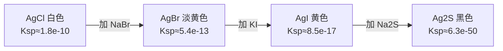

# 第四节 沉淀溶解平衡

## 概念定义

**沉淀溶解平衡**：一定温度下，难溶电解质的溶解速率与沉淀速率相等的动态平衡。如：$AgCl(s)\rightleftharpoons Ag^+(aq)+Cl^-(aq)$。

**溶度积常数 Ksp**：$K_{sp}(AgCl)=c(Ag^+)\cdot c(Cl^-)$；$K_{sp}(Mg(OH)_2)=c(Mg^{2+})\cdot c^2(OH^-)$。只与温度有关。

**溶度积规则**（Q 为离子积）：Q>Ksp 生成沉淀；Q=Ksp 饱和（平衡）；Q<Ksp 沉淀溶解（不饱和）。

## 知识梳理

| 应用 | 原理与实例 |
| --- | --- |
| 沉淀的生成 | 加沉淀剂使 Q>Ksp，如加 Na2S 除废水中 Cu²⁺、Hg²⁺ |
| 沉淀的溶解 | 设法减小离子浓度使 Q<Ksp，如 CaCO3 溶于盐酸（H⁺ 消耗 CO3²⁻） |
| 沉淀的转化 | 向 Ksp 更小（更难溶）的方向转化，如 AgCl→AgBr→AgI→Ag2S |
| 分步沉淀 | Ksp 差异大时可先后沉淀分离离子 |
| 工业应用 | 锅炉水垢 CaSO4 先用 Na2CO3 转化为 CaCO3 再酸溶 |

**沉淀转化示例**：$AgCl(s)+I^-\rightleftharpoons AgI(s)+Cl^-$，$K=\dfrac{K_{sp}(AgCl)}{K_{sp}(AgI)}\gg1$，正向进行程度大。

**注意**：同类型（如均为 AB 型）难溶物可直接比较 Ksp 判断溶解度大小；**不同类型**（AB 与 AB2）不能直接比较。

## 沉淀转化流程

溶解度大的沉淀易转化为溶解度更小的沉淀。

## 典型例题

**例 1**：25 ℃ 时 Ksp(AgCl)=1.8×10⁻¹⁰。求 AgCl 饱和溶液中 c(Ag⁺)；若溶液中 c(Cl⁻)=0.1 mol/L，此时 c(Ag⁺) 最大为多少？

**解**：纯水中 $c(Ag^+)=\sqrt{1.8\times10^{-10}}\approx1.3\times10^{-5}$ mol/L。
c(Cl⁻)=0.1 mol/L 时，$c(Ag^+)=\dfrac{1.8\times10^{-10}}{0.1}=1.8\times10^{-9}$ mol/L（同离子效应抑制溶解）。

**例 2**：Ksp(Mg(OH)2)=5.6×10⁻¹²。0.01 mol/L MgCl2 溶液中开始生成 Mg(OH)2 沉淀所需 c(OH⁻) 至少为多少？

**解**：Q=c(Mg²⁺)·c²(OH⁻)>Ksp 时沉淀：
$c(OH^-)>\sqrt{\dfrac{5.6\times10^{-12}}{0.01}}=\sqrt{5.6\times10^{-10}}\approx2.4\times10^{-5}\ \text{mol/L}$。

## 易错点

- "难溶"≠"不溶"：难溶电解质仍有微量溶解，AgCl 溶解的部分完全电离，仍是强电解质。
- Ksp 表达式中系数作**指数**：Mg(OH)2 的 c(OH⁻) 要平方。
- Ksp 只与温度有关；加水稀释饱和溶液（有固体存在时）离子浓度不变。
- 不同类型难溶物不能直接比 Ksp 定溶解度大小，需换算成溶解度。
- 沉淀转化一般向更难溶方向进行，但**浓度足够大**时也可反向转化（如工业上用饱和 Na2CO3 处理 BaSO4）。

## 背记要点

1. Ksp 表达式书写：浓度幂之积，固体不写入。
2. 溶度积规则：Q 与 Ksp 比较，判断沉淀生成、平衡、溶解。
3. 沉淀转化本质：向 Ksp（溶解度）更小的方向进行。
4. 高考视角：Ksp 计算（求离子浓度、判断沉淀先后）、图像题（−lg c 曲线）是北京卷选择题与大题热点。

## 自测题

1. 写出 Fe(OH)3 的 Ksp 表达式：____。
2. 判断：Ksp(AgCl)>Ksp(Ag2CrO4)，则 AgCl 的溶解度一定大于 Ag2CrO4。（　）
3. 向 AgCl 悬浊液中滴加 KI 溶液，白色沉淀变黄，说明 Ksp(AgI)____Ksp(AgCl)。
4. 已知 Ksp(BaSO4)=1.1×10⁻¹⁰，c(Ba²⁺)=10⁻⁵ mol/L 的溶液中加等体积 2×10⁻⁵ mol/L Na2SO4 溶液，是否产生沉淀？____。

## 相关知识点

化学平衡与 Q、K 的关系见 [[第二节 化学平衡]]；弱电解质电离见 [[第一节 电离平衡]]；盐类水解与守恒思想见 [[第三节 盐类的水解]]。
