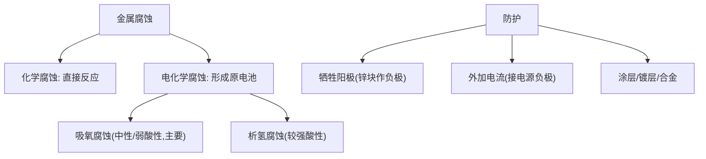

# 第三节 金属的腐蚀与防护

## 概念定义

**金属腐蚀**：金属或合金与周围环境中的物质发生化学反应而被损耗的过程，本质是金属**失电子被氧化**：$M-ne^-=M^{n+}$。

**化学腐蚀**：金属与接触的物质直接反应（无电流产生）。**电化学腐蚀**：不纯金属或合金与电解质溶液接触形成**原电池**而被腐蚀（更普遍、速率更快）。

## 知识梳理

钢铁的电化学腐蚀（负极均为 Fe）：

| 类型 | 条件 | 正极反应 | 负极反应 |
| --- | --- | --- | --- |
| **吸氧腐蚀**（主要） | 中性或弱酸性水膜 | $O_2+2H_2O+4e^-=4OH^-$ | $Fe-2e^-=Fe^{2+}$ |
| 析氢腐蚀 | 较强酸性水膜 | $2H^++2e^-=H_2\uparrow$ | $Fe-2e^-=Fe^{2+}$ |

吸氧腐蚀后续：$Fe^{2+}+2OH^-=Fe(OH)_2$，$4Fe(OH)_2+O_2+2H_2O=4Fe(OH)_3$，脱水得铁锈 Fe2O3·xH2O。

**防护方法**：

| 方法 | 原理 | 实例 |
| --- | --- | --- |
| 牺牲阳极法 | 原电池原理：被保护金属作**正极** | 船体上装锌块 |
| 外加电流法 | 电解原理：被保护金属接电源**负极**作阴极 | 地下钢管接直流电源负极 |
| 加防护层 | 隔绝空气和水 | 刷漆、镀锌/锡、烤蓝 |
| 改变内部结构 | 制成合金 | 不锈钢（加 Cr、Ni） |

**腐蚀快慢**：电解池阳极 > 原电池负极 > 化学腐蚀 > 原电池正极 > 电解池阴极。

## 腐蚀与防护逻辑图

## 典型例题

**例 1**：将洁净铁钉放入含少量食盐水的具支试管中密封，一段时间后导管内液面上升。解释原因并写电极反应。

**解**：中性食盐水膜中铁发生**吸氧腐蚀**：负极 $2Fe-4e^-=2Fe^{2+}$，正极 $O_2+2H_2O+4e^-=4OH^-$。O2 被消耗使管内压强减小，液面上升。

**例 2**：镀锌铁皮与镀锡铁皮的镀层均破损后，哪种铁皮腐蚀更快？为什么？

**解**：**镀锡铁皮**腐蚀更快。破损后均形成原电池：镀锌铁皮中 Zn 比 Fe 活泼，Zn 作负极被腐蚀，Fe 作正极被保护（牺牲阳极）；镀锡铁皮中 Fe 比 Sn 活泼，Fe 作负极加速腐蚀。

## 易错点

- 钢铁在自然环境中以**吸氧腐蚀为主**（水膜多为中性或弱酸性），不要默认析氢腐蚀。
- 吸氧腐蚀正极是 **O2 得电子**，不是 Fe³⁺；负极产物是 **Fe²⁺**，不能写成 Fe³⁺。
- 牺牲阳极法用**原电池**原理（活泼金属作负极/阳极被消耗）；外加电流法用**电解**原理（被保护金属作阴极），两者勿混。
- "阳极"在两种方法中含义不同：牺牲阳极的"阳极"即原电池负极。
- 判断腐蚀快慢先判断装置类型（电解池/原电池/单纯化学腐蚀）。

## 背记要点

1. 电化学腐蚀两类型：吸氧（中性、主要）、析氢（酸性）；负极均为 Fe−2e⁻=Fe²⁺。
2. 铁锈形成链：Fe²⁺→Fe(OH)2→Fe(OH)3→Fe2O3·xH2O。
3. 两大电化学防护：牺牲阳极（原电池）、外加电流（电解，接负极）。
4. 高考视角：具支试管压强变化实验、镀层破损对比、海水中钢闸门防护方案设计是常见情境题。

## 自测题

1. 钢铁吸氧腐蚀的正极反应式为____。
2. 船体镶嵌锌块保护钢制船体的方法叫____保护法，其中锌作原电池的____极。
3. 判断：外加电流保护法中，被保护金属与电源正极相连。（　）
4. 相同条件下，纯铁与生铁（含碳）在稀盐酸中腐蚀较快的是____，原因是____。

## 相关知识点

原电池原理见 [[第一节 原电池]]；电解原理与阴阳极见 [[第二节 电解池]]；镀层防护的动手实验见 [[实验活动4 简单的电镀实验]]。
