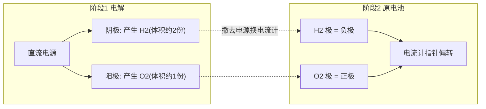

# 实验活动5 制作简单的燃料电池

## 实验目的

1. 利用电解水产生的 H2 和 O2 制作简单的氢氧燃料电池，观察其放电现象。
2. 理解"先电解、后原电池"的能量转化关系，掌握燃料电池电极反应式的书写。

## 实验原理

**第一阶段（电解，电能→化学能）**：电解 Na2SO4（或稀 NaOH）溶液，在两支碳（铂）电极上分别产生气体：
阴极：$2H_2O+2e^-=H_2\uparrow+2OH^-$；阳极：$2H_2O-4e^-=O_2\uparrow+4H^+$。

**第二阶段（原电池，化学能→电能）**：撤去电源，接入电流计（或音乐芯片、发光二极管）。吸附 H2 的电极作**负极**，吸附 O2 的电极作**正极**（中性/碱性介质）：
- 负极：$2H_2-4e^-+4OH^-=4H_2O$
- 正极：$O_2+4e^-+2H_2O=4OH^-$
- 总反应：$2H_2+O_2=2H_2O$

## 装置示意（两阶段）

## 实验步骤

1. 在 U 形管（或烧杯）中加入 Na2SO4 溶液，插入两支洁净碳棒（铂电极），分别接直流电源正、负极。
2. 通电电解 3~5 分钟，观察两极气泡；使产生的气体尽量吸附/滞留在电极附近（可用倒置小试管收集在电极上方）。
3. 断开电源，迅速将两电极改接**灵敏电流计**（或音乐芯片）。
4. 观察电流计指针是否偏转、芯片是否发声，记录电流方向及持续时间。
5. 重复实验，比较电解时间长短对放电时间的影响。

## 现象与结论

- 电解时：两极均产生气泡，阴极（H2）气泡量约为阳极（O2）的 **2 倍**。
- 改接电流计后：指针发生偏转（或芯片发声、二极管发光），说明装置**输出电流**，构成了原电池。
- 电流方向表明：H2 极为负极、O2 极为正极；放电一段时间后电流逐渐减小至零（吸附的气体耗尽）。
- 结论：H2 与 O2 的氧化还原反应可通过电极直接转化为电能；燃料电池能量转化率高、产物为水、清洁环保。

## 注意事项

- 电解液选 Na2SO4/NaOH 等**不引入放电杂质离子**的溶液；勿用 NaCl（阳极产生 Cl2 有毒且干扰）。
- 电解时间要足够，让电极充分吸附气体；换接电流计动作要**迅速**，减少气体逸散。
- 使用灵敏电流计（微安级），普通电流计可能观察不到偏转。
- H2、O2 混合有爆炸风险，装置远离明火，气体量控制在少量。
- 电极须洁净，两电极不可接触。

## 背记要点

1. 本实验能量链：电能→化学能（电解）→电能（原电池）。
2. 燃料电池通式：燃料在负极被氧化，O2 在正极被还原；碱性介质产物为 H2O/OH⁻ 体系。
3. 酸性介质氢氧燃料电池：负极 $H_2-2e^-=2H^+$，正极 $O_2+4e^-+4H^+=2H_2O$。
4. 高考视角：给定新型燃料（CH4、CH3OH、N2H4）与介质写电极反应式，是北京卷电化学的常规命题方式。

## 自测题

1. 本实验电解阶段，与电源负极相连的电极产生的气体是____。
2. 写出酸性介质中氢氧燃料电池的正极反应式：____。
3. 判断：燃料电池放电时，电解质溶液中阳离子移向 O2 电极。（　）
4. 电解阶段转移 0.4 mol 电子，理论上产生 H2____mol、O2____mol。

## 相关知识点

原电池原理与燃料电池电极式见 [[第一节 原电池]]；电解原理见 [[第二节 电解池]]；氢气燃烧的反应热见 [[第一节 反应热]]。
